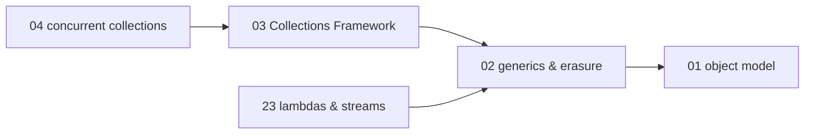
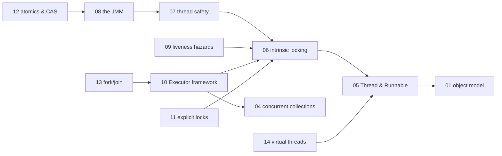
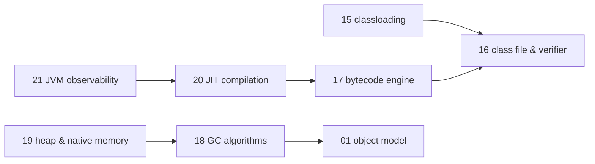

# Java — knowledge graph

*The language, the collections built on it, the concurrency model `java.util.concurrent`
formalized in 2004, and the JVM that executes all three — treated as one subject because a
senior engineer's mental model of "Java" is inseparable from the bytecode machine underneath
it.*

**Nodes:** 23 · **Books:** 7 · **Currency researched:** 2026-08-08
**Requires:** [`02_os`](../02_os/00_knowledge_graph.md) — only `JAVA-19`'s heap and native-memory
tuning node names a hard OS prerequisite (virtual memory and demand paging); the language core
and the JVM-internals cluster require nothing outside this subject
**Feeds:** [`26_spring`](../26_spring/00_knowledge_graph.md) — `SPRG-01` requires `JAVA-01`

---

## §1 Source audit

| Book | Year | Documents | Verdict |
|---|---|---|---|
| Venners, *Inside the Java Virtual Machine*, 2nd ed. | 1999 | JVM architecture, the class file format, bytecode verification, the linking model, garbage collection, and the full bytecode instruction set, chapter by chapter | Still the clearest annotated account of the classic single-threaded-interpreter JVM and the class file it consumes. It predates the module system, `invokedynamic`, every collector newer than mark-sweep, and describes the applet-based network-mobile-code model (its Platform Independence and Network Mobility chapters) that JEP 398 removed from the JDK entirely in Java 17 |
| Oaks & Wong, *Java Threads*, 2nd ed. | January 1999 | The `Thread`/`Runnable` API, synchronization with `synchronized`, `wait`/`notify`, thread scheduling, thread pools built by hand, and thread groups | Sound on the primitives `synchronized`/`wait`/`notify` still rest on today, but it predates `java.util.concurrent` by five years and teaches `Thread.stop`/`suspend`/`resume` as live API; JDK 20 re-specified all three to throw unconditionally |
| Naftalin & Wild, *Java Generics and Collections* | 2006 | Generics and type erasure in Part I; the Collections Framework's core interfaces and implementations in Part II | The erasure model it documents is unchanged and remains the best explanation of the get-and-put principle on this shelf, but it predates Java 9's collection factory methods and Java 8's default interface methods, and its visitor-pattern chapter has a modern, largely superior alternative in sealed types and pattern matching |
| Goetz, Peierls, Bloch, Bowbeer, Holmes & Lea, *Java Concurrency in Practice* | 2006 | Thread safety, the Java Memory Model, the Executor framework, explicit locks, atomic variables and non-blocking algorithms, and testing concurrent code | Still the field's reference on the post-JSR-133 memory model and remains correct as written on everything it covers, but it predates fork/join (2011), `CompletableFuture` (2014), `VarHandle` (2017), and virtual threads (2023) entirely — the whole executor-sizing and thread-safety story it tells needs a virtual-threads coda for any current article |
| Goodrich, Tamassia & Goldwasser, *Data Structures and Algorithms in Java*, 6th ed. | 2014 | A general data-structures-and-algorithms course taught in Java, opening with a Java-language primer and an object-oriented-design chapter | Its language-primer (ch.1) and OOD (ch.2) chapters are the only Java-specific material this graph draws on. Chapters 3–15 are `03_dsa` material that happens to be written in Java — duplicating them here as `JAVA-*` nodes would misfile algorithm content as language content, so this graph cites only the two front chapters |
| Oaks, *Java Performance: The Definitive Guide* | 2014 | JIT compilation and tiered compilation, garbage-collection algorithms and tuning, heap and native-memory tuning, threading and synchronization performance, JVM observability through JFR and JMC, and JDBC/JPA/Java EE performance | The deepest source on this shelf for JVM tuning mechanics, and its methodology chapters on benchmarking are still sound. It was written the same year Java 8 shipped, so it predates G1 becoming the default collector (2017), Metaspace's first year of production use, JFR's open-sourcing (2018), and every collector added since |
| Friesen, *Learn Java for Android Development*, 4th ed. | ~2021 | Seventeen chapters of Java SE language and API material — fundamentals, OOD, generics, collections, functional programming, concurrency utilities, classic and new I/O, JDBC, XML/JSON, date and time — framed for a reader coming from Android | Despite its title, this is a Java SE reference, not an Android APIs book; only its first chapter's brief "Java Meets Android" section touches the platform directly. No node in this graph cites it, because its ground is already covered here by more focused, better-known sources — its real contribution is to `22_android`, which is starved on a single 2011 cookbook and gains two citations from this book's concurrency and networking chapters. Its `.toc.md` stays in this directory's `_toc/` for that reason |

---

## §2 Node index

| ID | Node | Type | Depth | Currency |
|---|---|---|---|---|
| `JAVA-01` | The Java object model: classes, interfaces, and the primitive/reference split | Model | L4 | `stale-minor` |
| `JAVA-02` | Generics and type erasure | Mechanism | L4 | `stale-minor` |
| `JAVA-03` | The Collections Framework: `List`, `Set`, `Map`, and `Queue` implementations | Structure | L4 | `stale-minor` |
| `JAVA-04` | Concurrent collections and the producer-consumer pattern | Structure | L4 | `stale-minor` |
| `JAVA-05` | Threads and the classic `Thread`/`Runnable` API | Mechanism | L4 | `stale-major` |
| `JAVA-06` | Intrinsic locking, `wait`/`notify`, and the monitor pattern | Mechanism | L4 | `stale-minor` |
| `JAVA-07` | Thread safety, visibility, and safe publication | Model | L4 | `current` |
| `JAVA-08` | The Java Memory Model and the happens-before relation | Model | L5 | `stale-minor` |
| `JAVA-09` | Liveness hazards: deadlock, livelock, and starvation | Mechanism | L4 | `stale-minor` |
| `JAVA-10` | The Executor framework and thread-pool sizing | Mechanism | L4 | `stale-major` |
| `JAVA-11` | Explicit locks and the `AbstractQueuedSynchronizer` | Mechanism | L4 | `stale-minor` |
| `JAVA-12` | Atomic variables and non-blocking (CAS-based) algorithms | Algorithm | L4 | `stale-minor` |
| `JAVA-13` | Fork/join and structured parallel decomposition | Mechanism | L4 | `stale-major` |
| `JAVA-14` | Virtual threads and structured concurrency | Mechanism | L5 | `absent` |
| `JAVA-15` | Classloading and the linking model | Mechanism | L4 | `stale-major` |
| `JAVA-16` | The class file format and bytecode verification | Structure | L4 | `stale-major` |
| `JAVA-17` | The bytecode execution engine: frames, the operand stack, and method invocation | Mechanism | L4 | `stale-minor` |
| `JAVA-18` | Garbage collection algorithms and collector selection | Algorithm | L4 | `stale-major` |
| `JAVA-19` | Heap and native memory tuning | Practice | L4 | `stale-major` |
| `JAVA-20` | JIT compilation, tiered compilation, and warm-up | Mechanism | L4 | `stale-minor` |
| `JAVA-21` | JVM observability: JDK Flight Recorder and profiling tools | Tool | L4 | `stale-major` |
| `JAVA-22` | Database access performance: JDBC pooling and JPA tuning | Practice | L4 | `stale-minor` |
| `JAVA-23` | Lambda expressions, method references, and the Streams API | Mechanism | L4 | `stale-minor` |

---

## §3 The graph

### Language and collections

### Concurrency

### JVM internals and performance

---

## §4 Node records

### `JAVA-01` · The Java object model: classes, interfaces, and the primitive/reference split
**Type:** Model · **Depth:** L4
**Covers:** primitive versus reference types, autoboxing and wrapper classes, inheritance, interfaces versus abstract classes, checked versus unchecked exceptions, casting, nested and inner classes
**Sources:** Goodrich, Tamassia & Goldwasser ch.1 (Java Primer, 2014), ch.2 (Object-Oriented Design, 2014)
**Currency:** `stale-minor`
**Δ current:** Records (JEP 395, Java 16, September 2021), sealed classes and interfaces (JEP 409, Java 17, September 2021), and pattern matching for `switch` (JEP 441, Java 21, September 2023) all postdate the book's account of nested classes and `instanceof`-and-cast as the only ways to model a closed hierarchy or destructure an object. An article should teach the book's inheritance and interface model as written, then add records, sealed types, and pattern matching as the modern alternative specifically for the data-carrier and closed-hierarchy cases those chapters exist to address.

### `JAVA-02` · Generics and type erasure
**Type:** Mechanism · **Depth:** L4
**Covers:** generic types and methods, bounded and wildcard type parameters, the get-and-put principle, erasure and bridge methods, reification limits, array covariance versus generic invariance
**Sources:** Naftalin & Wild ch.1–9 (2006)
**Edges:** `requires` [`JAVA-01`] · `contrasts` [`TS-08`]
**Currency:** `stale-minor`
**Δ current:** Type erasure itself is unchanged — Project Valhalla's specialized generics for value types remain unshipped as of JDK 25 (2026) — but `var` (JEP 286, Java 10, March 2018) changes the declaration-site idiom the book uses throughout, and its visitor-pattern chapter (§9.5) is substantially displaced by sealed interfaces plus pattern matching (JEP 409/441) for the closed-hierarchy case the pattern exists to solve.

### `JAVA-03` · The Collections Framework: `List`, `Set`, `Map`, and `Queue` implementations
**Type:** Structure · **Depth:** L4
**Covers:** the `List`/`Set`/`Map`/`Queue`/`Deque` interfaces, `HashMap`/`TreeMap`/`LinkedHashMap`, `HashSet`/`TreeSet`, `ArrayList`/`LinkedList`, `PriorityQueue`, `Comparator` versus `Comparable`, fail-fast iteration
**Sources:** Naftalin & Wild ch.10–17 (2006) · Goodrich, Tamassia & Goldwasser §7.5 (Java Collections Framework, 2014)
**Edges:** `requires` [`JAVA-02`] · `implements` [`DSA-14`, `DSA-07`]
**Currency:** `stale-minor`
**Δ current:** Java 9's `List.of()`/`Set.of()`/`Map.of()` factory methods (JEP 269, September 2017) and Java 8's default `removeIf`/`forEach`/`replaceAll` methods postdate both books' account of how a collection is populated and traversed; the immutable collections JEP 269 produces additionally reject `null` elements and throw `UnsupportedOperationException` on every mutator, a stricter contract than `Collections.unmodifiableList` wraps.

### `JAVA-04` · Concurrent collections and the producer-consumer pattern
**Type:** Structure · **Depth:** L4
**Covers:** synchronized collections and their iteration hazards, `ConcurrentHashMap`, `CopyOnWriteArrayList`/`Set`, `BlockingQueue` implementations, serial thread confinement
**Sources:** Goetz et al. ch.5 (2006)
**Edges:** `requires` [`JAVA-03`]
**Currency:** `stale-minor`
**Δ current:** `ConcurrentHashMap`'s lock-striped `Segment` design, which the book documents in detail down to its `concurrencyLevel` tuning constructor argument, was replaced in Java 8 (March 2014) by a CAS-and-synchronized-bin implementation with no `Segment` class at all; the constructor argument the book tells readers to tune survives only as a capacity hint.

### `JAVA-05` · Threads and the classic `Thread`/`Runnable` API
**Type:** Mechanism · **Depth:** L4
**Covers:** `Thread` versus `Runnable`, the thread lifecycle, thread naming, starting/stopping/joining, thread priorities, native scheduling, thread groups
**Sources:** Oaks & Wong ch.1–2, ch.6–7, ch.10 (1999)
**Edges:** `requires` [`JAVA-01`] · `contrasts` [`CONC-02`]
**Currency:** `stale-major`
**Δ current:** The book predates `java.util.concurrent` entirely — JSR 166 shipped with Java 5 in September 2004, five years after this book — so every coordination primitive it teaches is built from `Thread`, `synchronized`, and hand-rolled polling. `Thread.stop()`, `suspend()`, and `resume()`, which chapter 1 documents as the mechanism for controlling another thread, were deprecated for removal in JDK 18 and re-specified in JDK 20 (March 2023) to throw `UnsupportedOperationException` unconditionally, so the exact call the book teaches no longer functions on any currently supported JDK.

### `JAVA-06` · Intrinsic locking, `wait`/`notify`, and the monitor pattern
**Type:** Mechanism · **Depth:** L4
**Covers:** the `synchronized` keyword, intrinsic locks and reentrancy, `wait`/`notify`/`notifyAll`, spurious wakeup, condition predicates, the monitor pattern, `monitorenter`/`monitorexit` at the bytecode level, false sharing and biased locking
**Sources:** Oaks & Wong ch.3–4, ch.8 (1999) · Goetz et al. ch.14 (2006, condition queues as the AQS-based modern replacement) · Oaks ch.9 (2014, synchronization costs, false sharing, biased locking)
**Edges:** `requires` [`JAVA-05`]
**Currency:** `stale-minor`
**Δ current:** `synchronized` used to pin a virtual thread's carrier platform thread for as long as it was blocked inside the monitor, a limitation that exists only because virtual threads themselves (JEP 444, Java 21, September 2023) postdate every source here; JEP 491 (Java 24, March 2025) changed monitor ownership to be tracked per virtual thread rather than per carrier, removing the pinning behavior for `synchronized` specifically.

### `JAVA-07` · Thread safety, visibility, and safe publication
**Type:** Model · **Depth:** L4
**Covers:** atomicity, visibility, stale data, thread confinement, immutability, safe publication, effectively immutable objects
**Sources:** Goetz et al. ch.2–4 (2006)
**Edges:** `requires` [`JAVA-06`]
**Currency:** `current`

### `JAVA-08` · The Java Memory Model and the happens-before relation
**Type:** Model · **Depth:** L5
**Covers:** the happens-before relation, reordering, piggybacking on synchronization, safe initialization idioms, double-checked locking
**Sources:** Goetz et al. ch.16 (2006)
**Edges:** `requires` [`JAVA-07`] · `contrasts` [`GO-10`]
**Currency:** `stale-minor`
**Δ current:** `VarHandle` (JEP 193, Java 9, September 2017) added plain, opaque, and acquire/release access modes that sit between `volatile` and `synchronized` on the happens-before spectrum the book treats as a binary choice between the two, giving finer control than the chapter's vocabulary has words for.

### `JAVA-09` · Liveness hazards: deadlock, livelock, and starvation
**Type:** Mechanism · **Depth:** L4
**Covers:** lock-ordering deadlock, dynamic lock-order deadlock, open calls, resource deadlocks, timed lock attempts, thread-dump analysis, livelock, starvation
**Sources:** Goetz et al. ch.10 (2006) · Oaks & Wong ch.3, ch.8 (1999)
**Edges:** `requires` [`JAVA-06`] · `contrasts` [`CONC-06`]
**Currency:** `stale-minor`
**Δ current:** Virtual threads (JEP 444, Java 21) introduced a starvation mode neither source anticipated — a `synchronized` block or a blocking native call pins a virtual thread's carrier, and with the JVM's small default carrier-thread pool this can deadlock an entire application under load. JEP 491 (Java 24, March 2025) closed the `synchronized` case specifically, but the general pinning hazard from native calls and legacy blocking I/O remains.

### `JAVA-10` · The Executor framework and thread-pool sizing
**Type:** Mechanism · **Depth:** L4
**Covers:** the `Executor` interface, execution policies, thread-pool lifecycle, `Future`/`Callable`, `CompletionService`, thread-pool sizing, saturation policies, thread factories
**Sources:** Goetz et al. ch.6–8 (2006) · Oaks ch.9 (2014, Thread Pools and ThreadPoolExecutors)
**Edges:** `requires` [`JAVA-06`] · `requires` [`JAVA-04`] · `contrasts` [`GO-08`]
**Currency:** `stale-major`
**Δ current:** `Executors.newVirtualThreadPerTaskExecutor()` (JEP 444, Java 21, September 2023) invalidates the pool-sizing arithmetic both books teach for I/O-bound work — a virtual-thread-per-task executor needs no size cap because the JVM, not a bounded pool, is what limits how many can run, the opposite of the "size the pool to the workload" problem both books treat as this node's central concern.

### `JAVA-11` · Explicit locks and the `AbstractQueuedSynchronizer`
**Type:** Mechanism · **Depth:** L4
**Covers:** `Lock`/`ReentrantLock`, polled and timed acquisition, interruptible acquisition, fairness, `ReentrantReadWriteLock`, `AbstractQueuedSynchronizer`
**Sources:** Goetz et al. ch.13–14 (2006)
**Edges:** `requires` [`JAVA-06`]
**Currency:** `stale-minor`
**Δ current:** `StampedLock`, a third lock option offering an optimistic-read mode with no reader bookkeeping, shipped in Java 8 (March 2014) and postdates the book's comparison of `synchronized` against `ReentrantLock`/`ReentrantReadWriteLock` as the only two choices worth making.

### `JAVA-12` · Atomic variables and non-blocking (CAS-based) algorithms
**Type:** Algorithm · **Depth:** L4
**Covers:** compare-and-swap, the atomic variable classes, the ABA problem, non-blocking stacks and queues, atomic field updaters
**Sources:** Goetz et al. ch.15 (2006)
**Edges:** `requires` [`JAVA-08`]
**Currency:** `stale-minor`
**Δ current:** `LongAdder` and `LongAccumulator`, added in Java 8 (March 2014), outperform a plain `AtomicLong` under the high-contention counter workload the book uses as its running example, by striping the counter across separate cache lines instead of CAS-looping a single field, and are now the JDK's own recommended replacement for that specific case.

### `JAVA-13` · Fork/join and structured parallel decomposition
**Type:** Mechanism · **Depth:** L4
**Covers:** divide-and-conquer parallel task decomposition, `RecursiveTask`/`RecursiveAction`, work stealing, the common `ForkJoinPool`, parallel streams
**Sources:** Goetz et al. §8.5 (2006, a hand-rolled preview of the pattern) · Oaks ch.9 (2014, The ForkJoinPool)
**Edges:** `requires` [`JAVA-10`] · `contrasts` [`CONC-15`]
**Currency:** `stale-major`
**Δ current:** The `ForkJoinPool`/`RecursiveTask` API that the 2006 book's hand-rolled recursive-parallelization pattern anticipates shipped in Java 7 (JSR 166y, July 2011), five years later. Java 8's parallel streams (`Collection.parallelStream()`) are built on `ForkJoinPool.commonPool()` and are the idiom most current code uses instead of subclassing `RecursiveTask` directly, which neither book can describe.

### `JAVA-14` · Virtual threads and structured concurrency
**Type:** Mechanism · **Depth:** L5
**Covers:** virtual threads, the carrier-thread model, `StructuredTaskScope`, scoped values, cancellation propagation across a task tree
**Sources:** —
**Edges:** `requires` [`JAVA-05`] · `contrasts` [`CONC-04`]
**Currency:** `absent`
**Δ current:** None of this shelf's seven books postdates virtual threads, finalized by JEP 444 in Java 21 (September 2023); structured concurrency reached its fifth preview as JEP 505 in JDK 25 (2026) and is not expected to finalize before JDK 27. An article on this node has no book to draw from and must be written from the JEP text and the current `java.lang.Thread` and `java.util.concurrent.StructuredTaskScope` Javadoc directly.

### `JAVA-15` · Classloading and the linking model
**Type:** Mechanism · **Depth:** L4
**Covers:** the bootstrap/extension/system classloader hierarchy, delegation, class initialization order, linking (verification, preparation, resolution), class unloading
**Sources:** Venners ch.7–8 (1999)
**Edges:** `requires` [`JAVA-16`]
**Currency:** `stale-major`
**Δ current:** The extension classloader and the whole `ext`-directory mechanism the book documents were removed by the Java Platform Module System (JEP 261, Java 9, September 2017), which replaced the single-hierarchy delegation model with a platform/application loader split plus module-aware resolution and strong encapsulation that has no counterpart in the book's account.

### `JAVA-16` · The class file format and bytecode verification
**Type:** Structure · **Depth:** L4
**Covers:** the class file's magic number, version, constant pool, fields, methods, and attributes; the bytecode verifier; the security-manager sandbox; code signing
**Sources:** Venners ch.3, ch.6 (1999)
**Edges:** `refines` [`COMP-10`]
**Currency:** `stale-major`
**Δ current:** The data-flow-inferring verifier the book describes was replaced by a type-checking verifier driven by `StackMapTable` attributes (JSR 202, Java 6, December 2006), a structurally different algorithm; the class file format itself later gained the `invokedynamic` instruction and its `BootstrapMethods` attribute (JSR 292, Java 7, July 2011), plus record and sealed-class attributes (Java 16–17). Separately, the `SecurityManager`-based sandbox the book's security chapter centers on was deprecated for removal by JEP 411 (Java 17, September 2021) and permanently disabled by JEP 486 (Java 24, March 2025), so the book's entire security model no longer functions on a current JDK.

### `JAVA-17` · The bytecode execution engine: frames, the operand stack, and method invocation
**Type:** Mechanism · **Depth:** L4
**Covers:** the operand stack and local-variable array per frame, the four classic invocation instructions, arithmetic/logic/control-flow/type-conversion bytecodes, array and object creation bytecodes, exception tables
**Sources:** Venners ch.10–20 (1999)
**Edges:** `requires` [`JAVA-16`] · `implements` [`COMP-11`]
**Currency:** `stale-minor`
**Δ current:** The four invocation instructions the book documents — `invokevirtual`, `invokespecial`, `invokestatic`, `invokeinterface` — gained a fifth, `invokedynamic` (JSR 292, Java 7, July 2011), which resolves its call site through a bootstrap method the first time it executes rather than the constant-pool-driven dispatch the book describes for the other four, and is the mechanism lambda expressions and string concatenation now compile to.

### `JAVA-18` · Garbage collection algorithms and collector selection
**Type:** Algorithm · **Depth:** L4
**Covers:** mark-sweep-compact, generational collection, the CMS and G1 collectors, collector selection, tenuring and survivor spaces
**Sources:** Venners ch.9 (1999) · Oaks ch.5–6 (2014)
**Edges:** `requires` [`JAVA-01`] · `contrasts` [`OS-11`]
**Currency:** `stale-major`
**Δ current:** The CMS collector both later books discuss in depth was deprecated in Java 9 (JEP 291, September 2017) and removed entirely in Java 14 (JEP 363, March 2020); G1 became the default collector the same release CMS was deprecated (JEP 248, September 2017), reversing the 2014 book's own recommendation to prefer CMS or Parallel for latency-sensitive workloads. ZGC and Shenandoah, both production-ready since Java 15 (JEP 377 and JEP 379, September 2020), offer sub-millisecond pause times neither book's collector lineup includes.

### `JAVA-19` · Heap and native memory tuning
**Type:** Practice · **Depth:** L4
**Covers:** heap sizing, heap histograms and dumps, `OutOfMemoryError` diagnosis, object-size reduction, string interning, footprint measurement, native memory tracking, large pages
**Sources:** Oaks ch.7–8 (2014)
**Edges:** `requires` [`JAVA-18`] · `requires` [`OS-10`]
**Currency:** `stale-major`
**Δ current:** PermGen, which the book's class-metadata sizing flags (`-XX:MaxPermSize`) target, was removed and replaced by native-memory-backed Metaspace in Java 8 (JEP 122, March 2014, the same year the book shipped). Separately, container-aware heap sizing — cgroup memory-limit detection, tracked under JDK-8146115 and enabled by default in JDK 10 (March 2018), backported to 8u191 — means a JVM now sizes its heap against a container's memory limit rather than the host's, a deployment model the book's bare-host examples predate.

### `JAVA-20` · JIT compilation, tiered compilation, and warm-up
**Type:** Mechanism · **Depth:** L4
**Covers:** HotSpot's client/server/tiered compilation, compilation thresholds, inlining, escape analysis, deoptimization, code-cache sizing
**Sources:** Oaks ch.4 (2014)
**Edges:** `requires` [`JAVA-17`]
**Currency:** `stale-minor`
**Δ current:** The experimental Java-based AOT/JIT compiler path built on the Graal compiler, which the book gestures toward as an emerging option, was removed in Java 17 (JEP 410, September 2021) after seeing little production use; ahead-of-time class-loading and linking work continues instead under Project Leyden, which had not shipped a finalized JEP as of this pass, so an article cannot yet correct the book's tiered-compilation chapter against a settled AOT successor.

### `JAVA-21` · JVM observability: JDK Flight Recorder and profiling tools
**Type:** Tool · **Depth:** L4
**Covers:** OS-level and JVM monitoring tools, sampling and instrumented profilers, Java Flight Recorder, Java Mission Control, performance-testing methodology (microbenchmarks, macrobenchmarks, mesobenchmarks, throughput versus response time)
**Sources:** Oaks ch.1–3 (2014)
**Edges:** `requires` [`JAVA-20`]
**Currency:** `stale-major`
**Δ current:** The book documents JFR as a paid, license-gated feature of the commercial Oracle JDK, walking through unlocking commercial features with `-XX:+UnlockCommercialFeatures`; JEP 328 (Java 11, September 2018) open-sourced Flight Recorder directly into OpenJDK, and JDK Mission Control became a separate free Eclipse Adoptium project, so the book's entire framing of JFR access as something requiring a commercial license no longer applies to any currently supported JDK.

### `JAVA-22` · Database access performance: JDBC pooling and JPA tuning
**Type:** Practice · **Depth:** L4
**Covers:** JDBC drivers, prepared-statement and connection pooling, JPA transaction handling, entity-manager caching, read-only entities
**Sources:** Oaks ch.11 (2014)
**Edges:** `contrasts` [`SQL-07`]
**Currency:** `stale-minor`
**Δ current:** Nothing about the JDBC driver contract or the JPA provider model has changed structurally, but the book's connection-pooling guidance predates HikariCP becoming Spring Boot's default pool starting with Spring Boot 2 (2018) — documented from the framework side by `26_spring`'s own `SPRG-05` node — and predates reactive database drivers (R2DBC, first released 2018), which the book's blocking-JDBC framing does not anticipate.

### `JAVA-23` · Lambda expressions, method references, and the Streams API
**Type:** Mechanism · **Depth:** L4
**Covers:** functional interfaces, lambda expressions and capture semantics, method references, the Stream API, collectors, parallel streams
**Sources:** Oaks §12.8–12.9 (2014, "Lambdas and Anonymous Classes" and "Stream and Filter Performance" — a dozen pages of performance tips rather than a language-level treatment)
**Edges:** `requires` [`JAVA-02`]
**Currency:** `stale-minor`
**Δ current:** Lambdas and the Stream API shipped in the same release the sole source here was written for (Java 8, March 2014), so the mechanism itself is not stale, but the source's coverage is a dozen pages of performance tips, and it predates `Stream.takeWhile`/`dropWhile` (Java 9, September 2017) and `Collectors.teeing` (Java 12, March 2019). An article on this node draws its performance guidance from the book and everything else from the `java.util.stream` package documentation directly.

---

## §5 Cross-subject edges

| From | Edge | To | Why |
|---|---|---|---|
| `JAVA-02` | `contrasts` | `TS-08` | Two different answers to generic types at compile time: erasure to `Object` plus bridge methods, against a structural type system that erases nothing but checks shapes instead of names |
| `JAVA-03` | `implements` | `DSA-14` | `HashMap`/`HashSet` are a concrete, JDK-specific realisation of the abstract hash-table ADT, with a documented load-factor and resize policy the abstract structure does not specify |
| `JAVA-03` | `implements` | `DSA-07` | `TreeMap`/`TreeSet` are a concrete red-black-tree realisation of the abstract self-balancing search tree |
| `JAVA-05` | `contrasts` | `CONC-02` | Java's threads are preemptively OS-scheduled with no interpreter lock; Python's threads are OS-scheduled too but serialised onto one core by the GIL — the same `Thread` vocabulary hides two different concurrency ceilings |
| `JAVA-16` | `refines` | `COMP-10` | The class file format and its verifier are the concrete, JVM-specific case of the general compiled-versus-interpreted execution split — a portable intermediate form checked once and then interpreted or JIT-compiled |
| `JAVA-17` | `implements` | `COMP-11` | The JVM's per-frame operand stack and local-variable array are a specific, concrete realisation of the abstract call-stack/heap split every managed runtime makes |
| `JAVA-08` | `contrasts` | `GO-10` | Two memory models built to answer the same question — what a compiler and CPU may reorder, and what a lock or channel operation makes visible — with `volatile`/`synchronized`/`VarHandle` on one side and `sync.Mutex`/channel operations plus the Go memory model's happens-before rules on the other |
| `JAVA-09` | `contrasts` | `CONC-06` | The same three liveness failures — deadlock, livelock, starvation — recur in both languages, but Java's virtual-thread carrier-pinning starvation mode has no Python analogue, since Python has no comparable carrier/virtual-thread split |
| `JAVA-10` | `contrasts` | `GO-08` | Java's Executor framework requires sizing a bounded pool of OS threads against the workload; Go's scheduler multiplexes goroutines across a small number of OS threads automatically, so the sizing question the Executor framework exists to answer largely does not arise |
| `JAVA-13` | `contrasts` | `CONC-15` | Fork/join's divide-and-conquer task decomposition and MapReduce-style data-parallel reduction are two different shapes for the same underlying problem — splitting work and combining results — one recursive and CPU-bound, the other typically flat and I/O- or dataset-bound |
| `JAVA-14` | `contrasts` | `CONC-04` | Virtual threads let blocking, synchronous-looking code scale to huge concurrency by making the runtime cheap to schedule; `asyncio` gets the same scale by making the code explicitly non-blocking instead — opposite solutions to the C10K-style problem |
| `JAVA-18` | `contrasts` | `OS-11` | Generational garbage collection and OS page replacement are both "reclaim memory nobody is using anymore" algorithms operating at different layers, one tracking object reachability and the other tracking page access recency |
| `JAVA-19` | `requires` | `OS-10` | Heap and native-memory tuning is meaningless without knowing what virtual memory and demand paging actually do to a process's resident set and page faults |
| `JAVA-22` | `contrasts` | `SQL-07` | JDBC connection pooling and transaction handling are the client-side half of a story `SQL-07` tells from the database's side — isolation levels and concurrency control determine what a pooled connection's transaction is allowed to see |

---

## §6 Coverage gaps

**Two chapters of the 1999 JVM book describe a mechanism the JDK no longer has.** Venners's
Platform Independence and Network Mobility chapters (ch.2, ch.4) document the applet-based
distribution model — code fetched over the network and run inside a browser plugin's sandbox —
that was the JVM's original flagship use case. The Applet API was deprecated for removal in
JEP 289 (Java 9, September 2017) and removed outright in JEP 398 (Java 17, September 2021).
Neither chapter is cited by any node here: the mechanism they describe is not merely stale, it
does not exist in a currently supported JDK, and nothing built today needs an article to explain
it.

**The DSA-in-Java book's algorithmic chapters are intentionally excluded.** Goodrich, Tamassia
& Goldwasser chapters 3–15 — arrays and linked lists, recursion, stacks and queues, trees,
priority queues, hash tables, search trees, sorting, text processing, and graph algorithms — are
`03_dsa` material written in Java rather than Java-specific content. Citing them here would
duplicate that subject's own, better-focused sources. Only the language-primer and
object-oriented-design chapters (1–2) are cited, on `JAVA-01`.

**Nothing on this shelf covers the JDBC/Java-EE-container application-server model at the depth
the Oaks Performance book's own chapter 10 treats it.** That chapter's EJB pool and session-bean
tuning describes a deployment style — application code running inside a full Java EE container —
that has been displaced in most new development by Spring Boot's embedded-server model, which
`26_spring` covers from the framework side. No `JAVA-*` node cites Oaks chapter 10 directly for
that reason; `JAVA-22` cites only its database-access chapter (11), which remains directly
useful regardless of container style.

**Nothing here treats Project Valhalla's value types or Project Panama's foreign-function and
memory API**, both still evolving as of this pass (Valhalla's specialized generics have not
shipped as of JDK 25; the Foreign Function & Memory API finalized in JEP 454, Java 22, March
2024, postdates every book on this shelf and has no node of its own here because no source
describes it and its scope — safely calling native code without JNI or cgo-style boilerplate —
would need to be verified against the current `java.lang.foreign` Javadoc rather than any book).

---

← [repo index](../README.md) · [root graph](../KNOWLEDGE_GRAPH.md) · [writing contract](../AGENTS.md)
