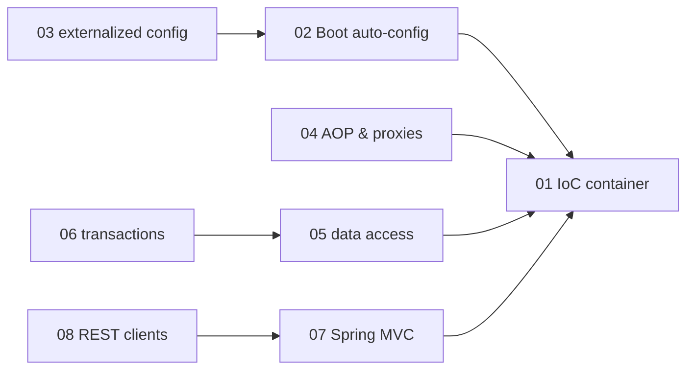
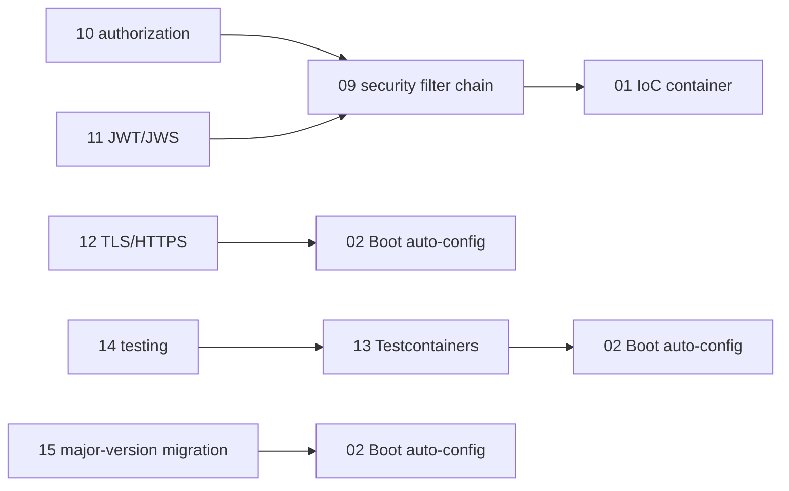

# Spring — knowledge graph

*The dependency-injection container and the ecosystem built on it — Spring MVC, Spring Data,
Spring Security, and Spring Boot's auto-configuration model — treated at the depth a senior
engineer needs to reason about a production Spring Boot service rather than to follow a
tutorial.*

**Nodes:** 17 · **Books:** 3 · **Currency researched:** 2026-08-08
**Requires:** [`25_Java`](../25_Java/00_knowledge_graph.md) — `SPRG-01` requires `JAVA-01`; every
node in this subject assumes the Java object model and, for the concurrency-adjacent nodes, the
JVM's threading primitives
**Feeds:** none yet — no other subject declares a `requires` edge into an `SPRG-*` node

---

## §1 Source audit

| Book | Year | Documents | Verdict |
|---|---|---|---|
| Walls, *Spring in Action*, 3rd ed. | 2011 | Core Spring (IoC, AOP, XML and annotation wiring), data access (JDBC/Hibernate/JPA), transactions, Spring MVC, Spring Web Flow, Spring Security, remoting (RMI/Hessian/Burlap/HttpInvoker), REST with `RestTemplate`, JMS messaging, JMX | Documents Spring 3.0 before Spring Boot existed (Boot shipped in 2014) and while XML configuration was still the default path rather than a legacy one. Its data-access, security, and remoting chapters describe mechanisms current Spring code has since replaced outright — hand-written DAOs, `WebSecurityConfigurerAdapter`'s XML-era ancestor, and RMI/Hessian remoting — but its AOP and transaction-propagation chapters explain mechanisms that have not moved |
| *Java Spring Boot 3 (3 Books in 1)* | undated | Three stacked introductory-to-advanced Spring Boot books, forty-eight chapter titles covering configuration, REST, data access, security, testing, microservices, cloud-native deployment, reactive programming, and DevOps, with no extracted section-level depth | The EPUB's navigation document supplies chapter titles only — no section structure survived extraction. No node here cites it for content: the titles establish that the book exists and roughly what ground it claims to cover, nothing more, per this repository's rule against inferring a chapter's content from its title alone |
| *Enterprise Java (Spring/Spring Boot) Course Notes* | current through Spring Boot 3.3.2 | An exhaustive, current graduate-course treatment: Spring Boot bootstrapping and auto-configuration, dependency injection, externalized configuration, logging, testing, building REST APIs and clients (`RestTemplate`, `WebClient`, `RestClient`, the HTTP Interface), Spring Security (filter chain, authentication, authorization, JWT/JWS, HTTPS), Spring AOP proxies, Testcontainers and Docker Compose integration testing, JDBC/JPA/MongoDB data access and Spring Data repositories, Bean Validation, and a worked Spring Boot 2-to-3 migration | By far the strongest and most current source on this shelf, and the one every current-practice node in this graph leans on. Its own migration chapter, written for the Boot 2-to-3 jump, is itself now one major version behind Boot 4 (June 2026) — the shelf's newest book is already the subject of a `stale-minor` correction on the nodes it anchors |

---

## §2 Node index

| ID | Node | Type | Depth | Currency |
|---|---|---|---|---|
| `SPRG-01` | The Spring IoC container: beans, the application context, and dependency injection | Model | L4 | `stale-major` |
| `SPRG-02` | Spring Boot: auto-configuration, starters, and the executable JAR | Mechanism | L4 | `stale-minor` |
| `SPRG-03` | Externalized configuration: properties, YAML, profiles, and `@ConfigurationProperties` | Mechanism | L4 | `current` |
| `SPRG-04` | Aspect-oriented Spring: proxies, pointcuts, and advice | Mechanism | L4 | `stale-minor` |
| `SPRG-05` | Data access: `JdbcTemplate`, Spring Data repositories, and the DAO pattern | Mechanism | L4 | `stale-major` |
| `SPRG-06` | Transaction management: declarative `@Transactional` and propagation | Mechanism | L4 | `stale-minor` |
| `SPRG-07` | Spring MVC: the `DispatcherServlet`, controllers, and view resolution | Mechanism | L4 | `stale-minor` |
| `SPRG-08` | Building REST clients: `RestTemplate`, `WebClient`, `RestClient`, and HTTP-interface proxies | Mechanism | L4 | `stale-major` |
| `SPRG-09` | Spring Security: the filter chain and authentication configuration | Mechanism | L4 | `stale-major` |
| `SPRG-10` | Authorization: roles, method security, and expression-based access control | Mechanism | L4 | `stale-minor` |
| `SPRG-11` | Token-based authentication: JWT/JWS issuing and verification | Mechanism | L4 | `current` |
| `SPRG-12` | Enabling TLS and HTTPS in an embedded servlet container | Practice | L3 | `current` |
| `SPRG-13` | Container-based integration testing: Testcontainers and Docker Compose | Practice | L4 | `current` |
| `SPRG-14` | Testing a Spring application: JUnit, Mockito, and the Spring test context | Practice | L4 | `stale-minor` |
| `SPRG-15` | Migrating a Spring Boot application across major versions | Practice | L3 | `stale-major` |
| `SPRG-16` | Enterprise messaging: JMS templates and message-driven POJOs | Mechanism | L4 | `stale-minor` |
| `SPRG-17` | Legacy RPC remoting: RMI, Hessian/Burlap, and `HttpInvoker` | Practice | L3 | `stale-major` |

---

## §3 The graph

### The container and its ecosystem

### Security and operations

---

## §4 Node records

### `SPRG-01` · The Spring IoC container: beans, the application context, and dependency injection
**Type:** Model · **Depth:** L4
**Covers:** bean declaration and scoping, constructor versus setter injection, the application context lifecycle, XML wiring, `@Autowired`/`@Inject`, component scanning, `@Configuration`/`@Bean` Java-based configuration
**Sources:** Walls ch.1–3 (2011) · Course Notes "Bean Factory and Dependency Injection", "Value Injection" (2026-current, ch.38–55)
**Edges:** `requires` [`JAVA-01`]
**Currency:** `stale-major`
**Δ current:** Walls documents XML configuration as the default wiring path, with annotation-driven and Java-based `@Configuration` wiring introduced later in the same book as newer alternatives (2011); every example in the course notes uses `@Configuration`/`@Bean`/`@ComponentScan`/`@Value` exclusively, and XML wiring is now a legacy path most teams never touch. Spring Framework 7 (2026) additionally raised the platform baseline to Java 21, which makes constructor-injected records a natural immutable-component idiom neither source demonstrates.

### `SPRG-02` · Spring Boot: auto-configuration, starters, and the executable JAR
**Type:** Mechanism · **Depth:** L4
**Covers:** `@SpringBootApplication`, conditional auto-configuration (`@ConditionalOnClass`/`@ConditionalOnMissingBean`), starter dependencies, the embedded servlet container, the executable JAR layout, excluding and debugging auto-configurations
**Sources:** Course Notes "Simple Spring Boot Application", "Auto Configuration" (ch.26–89)
**Currency:** `stale-minor`
**Δ current:** The course notes describe Spring Boot through 3.3.2 (2026). Spring Boot 4.1 (June 2026) is the current release; it runs on Spring Framework 7 with a Java 21 minimum, replaces the single `spring-boot-autoconfigure` jar with modularized auto-configuration jars per starter, and removed Undertow as an embedded-server option entirely, none of which the source's auto-configuration chapters anticipate.

### `SPRG-03` · Externalized configuration: properties, YAML, profiles, and `@ConfigurationProperties`
**Type:** Mechanism · **Depth:** L4
**Covers:** property-file and YAML sources, `@PropertySource`, profiles, property placeholders, `@ConfigurationProperties` binding, constructor binding, relaxed binding, validation of bound properties
**Sources:** Course Notes "Property Source", "Configuration Properties" (ch.56–75)
**Edges:** `requires` [`SPRG-02`]
**Currency:** `current`

### `SPRG-04` · Aspect-oriented Spring: proxies, pointcuts, and advice
**Type:** Mechanism · **Depth:** L4
**Covers:** JDK dynamic proxies versus CGLIB subclass proxies, pointcut expressions, before/after/around advice, introductions, annotation-driven `@Aspect`/`@Pointcut`
**Sources:** Walls ch.4 (2011) · Course Notes "Spring AOP and Method Proxies" (ch.229–242)
**Edges:** `requires` [`SPRG-01`]
**Currency:** `stale-minor`
**Δ current:** The proxy mechanism itself — a JDK dynamic proxy when the target implements an interface, CGLIB subclassing otherwise — is unchanged and both sources agree on it. Walls's XML-heavy pointcut examples (2011) predate the annotation-driven `@Aspect`/`@Pointcut` style the course notes use exclusively as the current idiom.

### `SPRG-05` · Data access: `JdbcTemplate`, Spring Data repositories, and the DAO pattern
**Type:** Mechanism · **Depth:** L4
**Covers:** the data-access exception hierarchy, `JdbcTemplate`, DAO support classes, Hibernate and JPA integration, `CrudRepository`/`PagingAndSortingRepository`, derived query methods, `@Query` annotations, custom repository queries
**Sources:** Walls ch.5 (2011) · Course Notes "RDBMS", "Java Persistence API (JPA)", "Spring Data JPA Repository" (ch.278–316)
**Edges:** `requires` [`SPRG-01`] · `contrasts` [`SQL-20`]
**Currency:** `stale-major`
**Δ current:** Walls's data-access chapter treats hand-written `JdbcTemplate` DAOs and a manually wired Hibernate `SessionFactory` as the primary pattern, with Spring Data mentioned only in passing; current practice, as the course notes show throughout, inverts this — `CrudRepository`/`PagingAndSortingRepository`/derived-query-method interfaces do what the 2011 book's DAO classes did by hand. JPA itself moved to version 3.2 as part of Jakarta EE 11 under Spring Boot 4 (2026), two Jakarta generations past the `javax.persistence` namespace the 2011 book uses throughout.

### `SPRG-06` · Transaction management: declarative `@Transactional` and propagation
**Type:** Mechanism · **Depth:** L4
**Covers:** transaction managers (JDBC/Hibernate/JPA/JTA), propagation and isolation attributes, programmatic versus declarative transactions, `@Transactional`
**Sources:** Walls ch.6 (2011) · Course Notes §"Java Persistence API (JPA)" ch.292 (Transactions)
**Edges:** `requires` [`SPRG-05`]
**Currency:** `stale-minor`
**Δ current:** The propagation and isolation model itself is unchanged, but Walls presents XML `<tx:advice>` declarations alongside the annotation-driven `@Transactional` style as equally current options (2011); only the annotation style survives in the current course notes and in idiomatic Spring Boot code.

### `SPRG-07` · Spring MVC: the `DispatcherServlet`, controllers, and view resolution
**Type:** Mechanism · **Depth:** L4
**Covers:** the `DispatcherServlet` request-dispatch pipeline, `@Controller`/`@RestController`, handler mapping, view resolution, form processing and validation, controller/service layering, `@ControllerAdvice` exception handling
**Sources:** Walls ch.7 (2011) · Course Notes "Spring MVC", "Controller/Service Interface" (ch.139–158)
**Edges:** `requires` [`SPRG-01`] · `requires` [`HTTP-02`]
**Currency:** `stale-minor`
**Δ current:** The dispatch mechanism (`DispatcherServlet` → `HandlerMapping` → controller → `ViewResolver`) is unchanged, but Spring Boot 4's Jakarta EE 11 baseline moves the underlying servlet contract to Servlet 6.1, and Walls's JSP-centric view-resolution examples describe a rendering style current REST-API-first Spring code — every controller in the course notes returns a JSON DTO, never a view name — has largely abandoned.

### `SPRG-08` · Building REST clients: `RestTemplate`, `WebClient`, `RestClient`, and HTTP-interface proxies
**Type:** Mechanism · **Depth:** L4
**Covers:** `RestTemplate` operations, content negotiation and HTTP message converters, the reactive `WebClient`, the synchronous `RestClient`, declarative HTTP Interface client proxies
**Sources:** Walls ch.11 (2011, `RestTemplate` only) · Course Notes §"Spring MVC" — "Spring Rest Clients" (ch.144–148: RestTemplate, RestClient, WebClient, Spring HTTP Interface)
**Edges:** `requires` [`SPRG-07`] · `contrasts` [`GRPC-01`] · `supersedes` [`SPRG-17`]
**Currency:** `stale-major`
**Δ current:** `RestTemplate`, the only client Walls describes (2011), has been in maintenance mode since Spring 5 (2017) with no new features. The course notes document its two successors: the reactive `WebClient` (Spring 5, 2017) and the synchronous `RestClient` plus declarative HTTP Interface proxies (Spring 6.1, November 2023) — six to twelve years newer than the 2011 book and the two idioms current code actually uses.

### `SPRG-09` · Spring Security: the filter chain and authentication configuration
**Type:** Mechanism · **Depth:** L4
**Covers:** the servlet filter chain, `SecurityFilterChain` configuration, in-memory and database-backed authentication, LDAP authentication, CORS, testing secured endpoints
**Sources:** Walls ch.9 (2011) · Course Notes "Spring Security Introduction", "Spring Security Authentication" (ch.179–199)
**Edges:** `requires` [`SPRG-01`] · `requires` [`HTTP-11`]
**Currency:** `stale-major`
**Δ current:** `WebSecurityConfigurerAdapter`, the class both Walls (2011) and Spring Security's pre-2022 configuration style build on, was deprecated in Spring Security 5.7 (2022) and removed outright in Spring Security 6 (2022). The current pattern, used throughout the course notes, is a `SecurityFilterChain` `@Bean` composed with the `HttpSecurity` DSL — a component-based style with no subclassing at all — and Spring Boot 4 ships on Spring Security 7 built on that model.

### `SPRG-10` · Authorization: roles, method security, and expression-based access control
**Type:** Mechanism · **Depth:** L4
**Covers:** authorities/roles/permissions, path-based authorization constraints, role inheritance, `@Secured`, JSR-250's `@RolesAllowed`, SpEL-based method security
**Sources:** Walls §9.5 (2011) · Course Notes "Authorization" (ch.208–220)
**Edges:** `requires` [`SPRG-09`]
**Currency:** `stale-minor`
**Δ current:** `@Secured` and JSR-250's `@RolesAllowed` both remain supported, but current guidance favors `@PreAuthorize`/`@PostAuthorize` with SpEL, which the course notes cover as the primary mechanism where the 2011 book presents all three as roughly equivalent options with no stated preference.

### `SPRG-11` · Token-based authentication: JWT/JWS issuing and verification
**Type:** Mechanism · **Depth:** L4
**Covers:** identity and authorities as claims, token issuing, `JwtAuthenticationFilter`/`JwtAuthorizationFilter`, API security configuration for stateless authentication
**Sources:** Course Notes "JWT/JWS Token Authn/Authz" (ch.407–418)
**Edges:** `requires` [`SPRG-09`]
**Currency:** `current`

### `SPRG-12` · Enabling TLS and HTTPS in an embedded servlet container
**Type:** Practice · **Depth:** L3
**Covers:** keystore configuration, `server.ssl.*` properties, enabling HTTPS on an embedded container, handling untrusted-certificate errors, HTTP-to-HTTPS redirection
**Sources:** Course Notes "Enabling HTTPS" (ch.221–228)
**Edges:** `requires` [`SPRG-02`]
**Currency:** `current`

### `SPRG-13` · Container-based integration testing: Testcontainers and Docker Compose
**Type:** Practice · **Depth:** L4
**Covers:** the Testcontainers JUnit extension, Postgres/MongoDB test containers, Docker Compose-driven integration testing, CI/CD test execution against real dependencies
**Sources:** Course Notes "Docker Integration Testing", "Docker Compose", "Docker Compose Integration Testing", "Testcontainers Unit Integration Testing" (ch.251–277)
**Edges:** `requires` [`SPRG-02`] · `requires` [`COMP-16`]
**Currency:** `current`

### `SPRG-14` · Testing a Spring application: JUnit, Mockito, and the Spring test context
**Type:** Practice · **Depth:** L4
**Covers:** JUnit Jupiter with a JUnit Vintage bridge, Mockito basics, `@SpringBootTest` application-context tests, mocking Spring Boot integration tests, test suites
**Sources:** Course Notes "Testing" (ch.106–124)
**Edges:** `requires` [`SPRG-13`]
**Currency:** `stale-minor`
**Δ current:** The course notes teach JUnit Jupiter (JUnit 5) as primary with a JUnit Vintage bridge for legacy tests, which remains the current standard, but predate Spring Framework 7's JSpecify null-safety annotations, which change how a strict test suite should treat a mocked bean's nullability contract.

### `SPRG-15` · Migrating a Spring Boot application across major versions
**Type:** Practice · **Depth:** L3
**Covers:** dependency and package changes across a major version, namespace migration, security configuration migration, JPA and messaging-broker changes across the jump
**Sources:** Course Notes "Porting to Spring Boot 3 / Spring 6" (ch.382–406)
**Edges:** `requires` [`SPRG-02`]
**Currency:** `stale-major`
**Δ current:** The chapter documents the `javax.*`-to-`jakarta.*` namespace migration for the Boot 2-to-3 jump (2022) and its own worked example already shows `WebSecurityConfigurerAdapter` as the thing being removed. The next major migration, Boot 3-to-4 (2026), is a comparable break this chapter does not cover: a Java 21 floor, Jakarta EE 11, a Jackson 3 package relocation, and the removal of Undertow as an embedded-server option.

### `SPRG-16` · Enterprise messaging: JMS templates and message-driven POJOs
**Type:** Mechanism · **Depth:** L4
**Covers:** `JmsTemplate`, connection factories and message destinations, message listeners and message-driven POJOs, message-based RPC
**Sources:** Walls ch.12 (2011) · Course Notes §"Unit Integration Testing" — "ActiveMQ Integration" (ch.423)
**Edges:** `requires` [`SPRG-01`]
**Currency:** `stale-minor`
**Δ current:** The `JmsTemplate`/`MessageListener` mechanism itself is largely unchanged, but the 2011 book's broker of choice, ActiveMQ "Classic," has a modern successor in ActiveMQ Artemis — named directly in the course notes' own migration chapter ("ActiveMQ/Artemis," ch.404) as the replacement current Spring Boot starters default to.

### `SPRG-17` · Legacy RPC remoting: RMI, Hessian/Burlap, and `HttpInvoker`
**Type:** Practice · **Depth:** L3
**Covers:** exporting and wiring RMI services, Hessian/Burlap binary remoting, Spring's `HttpInvoker` protocol, publishing and consuming JAX-WS web services
**Sources:** Walls ch.10 (2011)
**Currency:** `stale-major`
**Δ current:** None of RMI-based remoting, Hessian/Burlap, or Spring's proprietary `HttpInvoker` protocol appear anywhere in the course notes' otherwise exhaustive current curriculum. Spring's own reference documentation dropped active guidance on this chapter's mechanisms years ago in favor of REST (`SPRG-08`) or, as of Spring Boot 4.1 (June 2026), first-party gRPC auto-configuration; this node exists to record what a 2011-era Spring service used for cross-process calls before REST and gRPC won.

---

## §5 Cross-subject edges

| From | Edge | To | Why |
|---|---|---|---|
| `SPRG-01` | `requires` | `JAVA-01` | Bean declaration, constructor injection, and annotation-driven configuration all assume the reader already has Java's class/interface/annotation model |
| `SPRG-05` | `contrasts` | `SQL-20` | Spring Data repositories are a concrete instance of the ORM boundary `SQL-20` already treats generally — the same query-performance-versus-abstraction trade-off, seen from the framework side that builds the queries |
| `SPRG-07` | `requires` | `HTTP-02` | A `@RestController` method signature is a direct expression of request/response message semantics; status codes, methods, and headers have to mean something before Spring's annotations over them do |
| `SPRG-08` | `contrasts` | `GRPC-01` | The same remote call exposed as REST through `RestClient`/`WebClient` against a schema-first RPC contract — the REST-versus-gRPC comparison `GRPC-01` exists to make, seen from the Spring client side |
| `SPRG-09` | `requires` | `HTTP-11` | Spring Security's filter chain configures and extends HTTP's own challenge/response authentication schemes; the framework mechanism is opaque without the protocol mechanism underneath it |
| `SPRG-13` | `requires` | `COMP-16` | Testcontainers and Docker Compose integration testing assumes the reader already knows what a container is and how it isolates a process, which `COMP-16` establishes |

---

## §6 Coverage gaps

**Reactive Spring has no node of its own.** The course notes' "Reactive Programming with Spring
Boot" material exists only as a bare chapter title in the chapter-title-only EPUB (no section
depth survived extraction), and the exhaustive course-notes source, despite covering `WebClient`
in depth as an HTTP *client*, does not treat building a reactive service with WebFlux or
`Mono`/`Flux` server-side. An article on reactive Spring would need to be written primarily from
the Spring Framework reference documentation's WebFlux chapter rather than from any source in
this directory.

**Spring Cloud and microservice-platform concerns are absent.** Service discovery, client-side
load balancing, distributed configuration, and circuit breakers — all part of the historical
Spring Cloud umbrella — appear only as chapter titles in the thin EPUB source ("Working with
Microservices," "Spring Boot with Cloud Services") with no verifiable content behind them. This
graph does not manufacture a node from a title alone; a future pass would need a source that
actually treats the mechanism.

**The 48-chapter EPUB is cited nowhere in §4 by design.** Its navigation document supplies
chapter titles only, with no section-level structure, so per this repository's honesty rule a
node cannot claim to know what any of its chapters actually cover. It remains in the source audit
as a record of what exists on the shelf, not as a citation.

**Spring's GraphQL support, gRPC auto-configuration (new in Boot 4.1, June 2026), and the
`spring-modulith` project for enforcing module boundaries inside a single deployable are all
absent from every source here** — the two-source current material (course notes and Walls) both
predate or simply never mention them. `SPRG-08`'s `Δ current` line names gRPC auto-configuration
as a fact but the mechanism itself is not described anywhere in this graph and would need Spring's
own reference documentation.

---

← [repo index](../README.md) · [root graph](../KNOWLEDGE_GRAPH.md) · [writing contract](../AGENTS.md)
