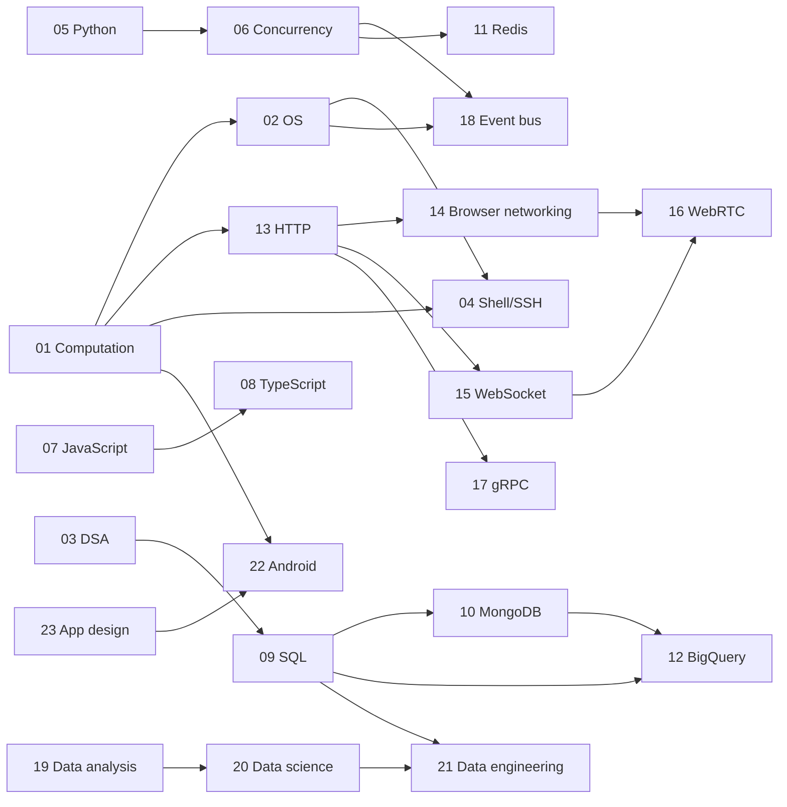

# no_weakness — the knowledge graph

*The single index into this repository. Twenty-three subjects, 413 nodes, one directed
edge-labelled graph in the sense of Hogan et al., "Knowledge Graphs" (ACM Computing Surveys,
2021) — the method source is [`knowledge_graph_theory.pdf`](knowledge_graph_theory.pdf). Each
subject's own graph lives in its `00_knowledge_graph.md`; this file assembles them into one
map, states how the subjects depend on each other, and reports where the underlying books have
gone stale against what is true now.*

**No articles have been written from this graph yet.** It is the structural layer this
directory needed before any could be — see `AGENTS.md` for what a written module owes the
reader once one exists.

---

## §1 The subjects

Directory numbers encode prerequisite order, established from the `requires` edges below —
not the order the subjects were written in.

| # | Subject | Prefix | Nodes | Books | Requires |
|---|---|---|---|---|---|
| 01 | [Computation](01_computation/00_knowledge_graph.md) | `COMP` | 18 | 1 | — |
| 02 | [Operating Systems](02_os/00_knowledge_graph.md) | `OS` | 21 | 1 | 01 |
| 03 | [Data Structures & Algorithms](03_dsa/00_knowledge_graph.md) | `DSA` | 24 | 4 | — |
| 04 | [Shell and SSH](04_sh/00_knowledge_graph.md) | `SH` | 19 | 2 | 01, 02 |
| 05 | [Python](05_python/00_knowledge_graph.md) | `PY` | 20 | 4 | — |
| 06 | [Concurrency](06_concurrency/00_knowledge_graph.md) | `CONC` | 17 | 5 | 05 |
| 07 | [JavaScript](07_javascript/00_knowledge_graph.md) | `JS` | 20 | 3 | — |
| 08 | [TypeScript](08_typescript/00_knowledge_graph.md) | `TS` | 20 | 1 | 07 |
| 09 | [SQL](09_sql/00_knowledge_graph.md) | `SQL` | 20 | 6 | 03 |
| 10 | [MongoDB](10_mongodb/00_knowledge_graph.md) | `MDB` | 17 | 1 | 09 |
| 11 | [Redis and caching](11_redis_caching/00_knowledge_graph.md) | `RDS` | 18 | 2 | 06 |
| 12 | [BigQuery](12_bigquery/00_knowledge_graph.md) | `BQ` | 20 | 2 | 09, 10 |
| 13 | [HTTP](13_http/00_knowledge_graph.md) | `HTTP` | 18 | 1 | 01 |
| 14 | [Browser networking](14_browser_networking/00_knowledge_graph.md) | `BNET` | 15 | 1 | 01, 13 |
| 15 | [WebSocket](15_websocket/00_knowledge_graph.md) | `WS` | 13 | 1 | 13 |
| 16 | [WebRTC](16_webrtc/00_knowledge_graph.md) | `RTC` | 14 | 1 | 14, 15 |
| 17 | [gRPC](17_grpc/00_knowledge_graph.md) | `GRPC` | 16 | 1 | 13 |
| 18 | [Event bus and messaging](18_eventbus/00_knowledge_graph.md) | `BUS` | 25 | 6 | 02, 06 |
| 19 | [Data analysis](19_data_analysis/00_knowledge_graph.md) | `STAT` | 21 | 3 | — |
| 20 | [Data science](20_datascience/00_knowledge_graph.md) | `DS` | 15 | 3 | 19 |
| 21 | [Data engineering](21_dataengineering/00_knowledge_graph.md) | `DE` | 13 | 2 | 09, 20 |
| 22 | [Android](22_android/00_knowledge_graph.md) | `AND` | 17 | 1 | 01, 23 |
| 23 | [App design](23_app_dev/00_knowledge_graph.md) | `APPD` | 12 | 1 | — |

**413 nodes across 23 subjects, from 53 books.** Four subjects — Computation, DSA, Python, and
JavaScript, plus App design at the design-methodology end — carry no hard prerequisite and can
be entered directly.

---

## §2 The subject-level graph

Edges below are `requires` unless labelled otherwise, collapsed from the node-level `requires`
edges each subject declares against another. A subject-level arrow means at least one node in
the source subject names a node in the target as a hard prerequisite; it does not mean every
node does.

Two structural notes worth stating in prose rather than leaving to the diagram alone. The
networking cluster (13 through 17) is the widest fan-out in the repository — HTTP is a direct
prerequisite of four other subjects, which matches its role as the protocol every later
transport either rides on top of or defines itself in contrast to. And Concurrency sits at
position 06 rather than immediately after Python because two later subjects — the JavaScript
event loop and SQL's transaction-isolation chapter — both need "a race condition" and "two
things happening at once" to already mean something precise; Concurrency is early because it is
a dependency of chapters far from Python, not because Python needs it first.

---

## §3 Currency dashboard

Every node in every subject carries one of four tags, assigned during a web-researched
currency pass against each book's publication date. This table is the fastest way to see which
subjects' source material has drifted furthest from what is true now.

| Subject | Nodes | current | stale-minor | stale-major | absent | % needing correction |
|---|---|---|---|---|---|---|
| 13 HTTP | 18 | 0 | 9 | 7 | 2 | **100%** |
| 14 Browser networking | 15 | 1 | 9 | 4 | 1 | 93% |
| 16 WebRTC | 14 | 2 | 6 | 5 | 1 | 86% |
| 10 MongoDB | 17 | 3 | 6 | 4 | 4 | 82% |
| 15 WebSocket | 13 | 3 | 7 | 1 | 2 | 77% |
| 11 Redis and caching | 18 | 5 | 6 | 3 | 4 | 72% |
| 8 TypeScript | 20 | 7 | 8 | 4 | 1 | 65% |
| 21 Data engineering | 13 | 5 | 3 | 4 | 1 | 62% |
| 22 Android | 17 | 8 | 3 | 5 | 1 | 53% |
| 9 SQL | 20 | 10 | 7 | 2 | 1 | 50% |
| 17 gRPC | 16 | 8 | 6 | 0 | 2 | 50% |
| 6 Concurrency | 17 | 9 | 5 | 1 | 2 | 47% |
| 5 Python | 20 | 11 | 7 | 2 | 0 | 45% |
| 4 Shell and SSH | 19 | 11 | 6 | 2 | 0 | 42% |
| 7 JavaScript | 20 | 12 | 6 | 1 | 1 | 40% |
| 1 Computation | 18 | 11 | 5 | 2 | 0 | 39% |
| 2 Operating Systems | 21 | 13 | 6 | 2 | 0 | 38% |
| 12 BigQuery | 20 | 13 | 3 | 3 | 1 | 35% |
| 19 Data analysis | 21 | 14 | 5 | 2 | 0 | 33% |
| 18 Event bus | 25 | 17 | 4 | 2 | 2 | 32% |
| 3 DSA | 24 | 18 | 6 | 0 | 0 | 25% |
| 23 App design | 12 | 9 | 2 | 1 | 0 | 25% |
| 20 Data science | 15 | 12 | 1 | 2 | 0 | 20% |
| **Total** | **413** | **202** | **126** | **59** | **26** | **51%** |

**HTTP is the extreme case, deliberately: zero nodes are `current`.** Its sole source,
Gourley & Totty's *HTTP: The Definitive Guide*, is a 2002 book describing RFC 2616 — a
specification obsoleted twice since, first by RFC 7230–7235 in 2014 and again by RFC 9110–9114
in 2022. Every node in that subject needed a sourced correction, most commonly against the
HTTP/2 and HTTP/3 RFCs, TLS 1.3 (RFC 8446), or a browser vendor's changelog for a feature
removed since (pipelining, in particular, is dead in every shipping browser). Browser
networking and WebRTC are close behind for the same reason: the whole networking cluster sits
on decade-plus-old source material describing a protocol landscape that changed twice over.

The other end of the table is instructive too. DSA and Data science sit near 20–25% not because
their books are new — Karumanchi's DSA text is from 2016 — but because mathematics and
first-principles algorithms genuinely age slower than APIs and wire protocols. A `current` tag
on a DSA node is not a weaker finding than a `stale-major` tag on an HTTP node; both are the
currency pass doing its job.

---

## §4 Cross-subject edges

Every declared edge whose two ends sit in different subjects, deduplicated (a `contrasts` pair
is symmetric and declared on both sides in the subject files; it appears once here). The
reasoning for each edge lives in the `§5 Cross-subject edges` table of whichever subject file
declared it — this table exists to make the *shape* of the interconnection visible at a glance,
not to repeat 78 explanations.

| From | Edge | To | From | Edge | To |
|---|---|---|---|---|---|
| `COMP-13` | `contrasts` | `HTTP-03` | `SQL-01` | `contrasts` | `AND-11` |
| `OS-05` | `contrasts` | `AND-15` | `SQL-05` | `contrasts` | `MDB-08` |
| `OS-19` | `contrasts` | `WS-08` | `SQL-06` | `contrasts` | `BQ-04` |
| `DSA-10` | `contrasts` | `DS-04` | `SQL-07` | `contrasts` | `RDS-07` |
| `PY-01` | `contrasts` | `JS-10` | `SQL-07` | `contrasts` | `BUS-05` |
| `PY-03` | `contrasts` | `JS-07` | `SQL-08` | `contrasts` | `STAT-21` |
| `PY-04` | `contrasts` | `JS-14` | `SQL-11` | `contrasts` | `MDB-02` |
| `PY-06` | `contrasts` | `TS-01` | `SQL-11` | `contrasts` | `BQ-13` |
| `PY-07` | `contrasts` | `JS-11` | `SQL-17` | `contrasts` | `BQ-01` |
| `PY-14` | `requires` | `CONC-04` | `SQL-17` | `contrasts` | `DE-07` |
| `PY-16` | `requires` | `CONC-04` | `MDB-12` | `contrasts` | `RDS-06` |
| `PY-16` | `contrasts` | `SQL-20` | `MDB-13` | `contrasts` | `BUS-12` |
| `CONC-01` | `requires` | `PY-05` | `MDB-14` | `contrasts` | `RDS-13` |
| `CONC-02` | `contrasts` | `AND-05` | `MDB-17` | `contrasts` | `BQ-20` |
| `CONC-03` | `requires` | `PY-08` | `BQ-10` | `contrasts` | `DE-12` |
| `CONC-04` | `requires` | `PY-07` | `HTTP-02` | `contrasts` | `AND-10` |
| `CONC-04` | `contrasts` | `JS-12` | `HTTP-12` | `contrasts` | `BNET-04` |
| `CONC-04` | `contrasts` | `TS-15` | `BNET-07` | `requires` | `HTTP-04` |
| `CONC-04` | `contrasts` | `BUS-25` | `BNET-08` | `requires` | `HTTP-17` |
| `CONC-08` | `requires` | `PY-07` | `BNET-12` | `refines` | `WS-01` |
| `CONC-11` | `contrasts` | `HTTP-05` | `BNET-13` | `refines` | `RTC-01` |
| `CONC-14` | `contrasts` | `GRPC-11` | `BNET-15` | `requires` | `HTTP-18` |
| `CONC-15` | `contrasts` | `BQ-01` | `WS-01` | `requires` | `HTTP-02` |
| `CONC-16` | `composes` | `PY-18` | `WS-01` | `contrasts` | `GRPC-15` |
| `CONC-16` | `contrasts` | `BUS-21` | `WS-12` | `requires` | `HTTP-17` |
| `CONC-17` | `contrasts` | `SQL-07` | `WS-13` | `requires` | `HTTP-18` |
| `CONC-17` | `contrasts` | `MDB-12` | `RTC-06` | `requires` | `BNET-03` |
| `JS-01` | `composes` | `COMP-15` | `RTC-07` | `requires` | `WS-01` |
| `TS-01` | `requires` | `JS-02` | `RTC-08` | `requires` | `BNET-04` |
| `TS-07` | `requires` | `JS-09` | `GRPC-04` | `requires` | `HTTP-17` |
| `TS-09` | `requires` | `JS-10` | `GRPC-09` | `requires` | `BNET-04` |
| `TS-15` | `requires` | `JS-12` | `STAT-09` | `contrasts` | `DS-14` |
| `TS-16` | `requires` | `JS-13` | `STAT-12` | `contrasts` | `DS-03` |
| `TS-19` | `requires` | `JS-16` | `STAT-14` | `contrasts` | `DS-08` |
| `TS-19` | `requires` | `JS-17` | `STAT-15` | `contrasts` | `DS-11` |
| `DS-05` | `requires` | `STAT-06` | `STAT-19` | `contrasts` | `DS-10` |
| `DS-06` | `requires` | `STAT-08` | `STAT-21` | `contrasts` | `DE-11` |
| `DS-15` | `requires` | `STAT-01` | `DE-10` | `requires` | `DS-07` |
| `AND-06` | `requires` | `APPD-05` | `AND-07` | `contrasts` | `APPD-06` |

78 edges. The densest single-pair connections are TypeScript↔JavaScript (7 — nearly every
TypeScript node has a JavaScript node underneath it, which is the expected shape of a language
built as a typed superset) and Concurrency↔Python (5, both directions — the two subjects were
built together and cross-reference at the mechanism level in both directions: Python's async
web-service nodes require asyncio internals, while asyncio internals requires Python's bytecode
and generator nodes).

---

## §5 Coverage gaps

Each subject file's own `§6 Coverage gaps` records what that subject's books do not cover.
Collected here are the gaps that recur across subjects or that shape what a future article pass
will need to do beyond writing from the books on the shelf.

**Concurrency has two `absent` nodes with no book coverage at all**: free-threading and
subinterpreters (PEP 703, PEP 734 — no book on that shelf postdates the feature), and
concurrency at the database and connection-pool layer. The second gap is echoed independently
in SQL, MongoDB, and BigQuery's own `absent` nodes, which suggests a genuine hole in the
repository's source material around what actually limits a concurrent application at the data
layer, rather than an artifact of one subject's book selection.

**MongoDB carries the highest concentration of `absent` nodes in the repository (4 of 17)**:
multi-document ACID transactions, change streams, time-series collections, and the
MongoDB-to-warehouse ingestion boundary are all features the 2.x-era source book predates
entirely. An article pass on this subject will lean more heavily on primary documentation than
any other subject except HTTP.

**Redis shows the same pattern for the same reason** — Streams, the ACL system, RESP3, and the
2024 BSD-to-RSALv2 licensing change (and the Valkey fork that followed it) are all `absent`,
sourced from *Redis in Action* (2013), a book that predates all four by most of a decade.

**The RDBMS course pack in `09_sql`'s source shelf carries no usable structure** — its TOC
extraction yielded only generic filenames (`Unit 1.pdf` … `Unit 14.pdf`) with no recoverable
chapter headings, so nothing in that graph cites it directly. Whatever content it holds beyond
what the other five SQL books already cover would require opening the PDF directly, which every
subject in this pass deliberately avoided for context reasons.

**Two extraction gaps are noted rather than silently absorbed**: Ullman & Widom's TOC
extraction stops around chapter 10 despite the book's own preface describing storage, indexing,
optimization, and distributed-database chapters beyond that point; and Miller & Ranum's TOC
extraction stops mid-book at a "JSON" chapter, short of its own graph-algorithms chapter. Both
subjects (`09_sql`, `03_dsa`) flag this explicitly in their own `§6` rather than guessing at
what the missing pages contain.

**The Apache Beam source in Data engineering is an 11-slide, title-only course deck** — its
`DE-11` node is written against Beam's current public programming guide rather than the deck's
uncaptured slide content, and says so plainly.

---

## §6 Reading paths

Four defensible entry points, each following the `requires` DAG in §2 without doubling back.

**Systems-first.** `01_computation` → `02_os` → `04_sh` establishes the machine before anything
else; from there `03_dsa` and `05_python` → `06_concurrency` are the natural next two, since
concurrency's node-level edges reach into both the OS process model and Python's bytecode
without requiring either subject to be re-derived.

**Data-first.** `03_dsa` → `09_sql` → {`10_mongodb`, `12_bigquery`} covers the relational
model, its principal NoSQL contrast, and its cloud-analytical descendant in sequence; a
detour through `19_data_analysis` → `20_datascience` → `21_dataengineering` covers the
statistics-to-pipeline path that shares only its endpoint with the database path.

**Web-first.** `13_http` is the hinge: everything in the networking cluster (`14` through
`17`) requires it directly, and `07_javascript` → `08_typescript` can be read in parallel since
neither has a hard dependency on the networking cluster despite `07_javascript`'s node-level
`composes` edge back into `01_computation`.

**Narrow and applied.** `23_app_dev` → `22_android` is self-contained relative to the rest of
the repository, sharing only a `requires` edge on `01_computation` with everything else; it is
the one path that can be read start-to-finish without visiting any other cluster first.

---

← [repo index](README.md) · [writing contract](AGENTS.md) · [measurement ledger](MEASUREMENTS.md)
