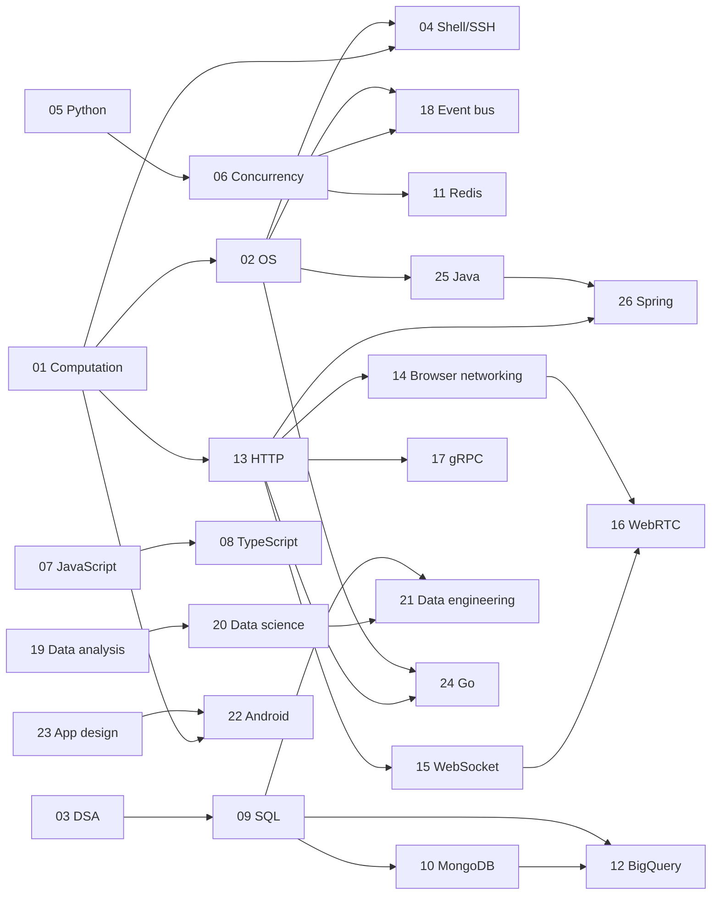

# no_weakness — the knowledge graph

*The single index into this repository. Twenty-six subjects, 482 nodes, one directed
edge-labelled graph in the sense of Hogan et al., "Knowledge Graphs" (ACM Computing Surveys,
2021) — the method source is [`knowledge_graph_theory.pdf`](knowledge_graph_theory.pdf). Each
subject's own graph lives in its `00_knowledge_graph.md`; this file assembles them into one
map, states how the subjects depend on each other, and reports where the underlying books have
gone stale against what is true now.*

**Eleven written modules exist, all of them in Python and Concurrency, and all written before this
graph did.** The graph is the structural layer the directory needed, not a record of what has been
written: a node's `**Article:**` line is that record, and 471 of the 482 nodes do not carry one.
See `AGENTS.md` §9 for what remains and what is blocked on environment.

---

## §1 The subjects

Directory numbers encode prerequisite order, established from the `requires` edges below —
not the order the subjects were written in.

| # | Subject | Prefix | Nodes | Books | Requires |
|---|---|---|---|---|---|
| 01 | [Computation](01_computation/00_knowledge_graph.md) | `COMP` | 18 | 1 | — |
| 02 | [Operating Systems](02_os/00_knowledge_graph.md) | `OS` | 21 | 1 | 01 |
| 03 | [Data Structures & Algorithms](03_dsa/00_knowledge_graph.md) | `DSA` | 24 | 4 | — |
| 04 | [Shell and SSH](04_sh/00_knowledge_graph.md) | `SH` | 19 | 2 | 01, 02 |
| 05 | [Python](05_python/00_knowledge_graph.md) | `PY` | 24 | 5 | — |
| 06 | [Concurrency](06_concurrency/00_knowledge_graph.md) | `CONC` | 17 | 5 | 05 |
| 07 | [JavaScript](07_javascript/00_knowledge_graph.md) | `JS` | 22 | 4 | — |
| 08 | [TypeScript](08_typescript/00_knowledge_graph.md) | `TS` | 20 | 1 | 07 |
| 09 | [SQL](09_sql/00_knowledge_graph.md) | `SQL` | 20 | 6 | 03 |
| 10 | [MongoDB](10_mongodb/00_knowledge_graph.md) | `MDB` | 17 | 1 | 09 |
| 11 | [Redis and caching](11_redis_caching/00_knowledge_graph.md) | `RDS` | 18 | 2 | 06 |
| 12 | [BigQuery](12_bigquery/00_knowledge_graph.md) | `BQ` | 20 | 3 | 09, 10 |
| 13 | [HTTP](13_http/00_knowledge_graph.md) | `HTTP` | 18 | 1 | 01 |
| 14 | [Browser networking](14_browser_networking/00_knowledge_graph.md) | `BNET` | 15 | 1 | 01, 13 |
| 15 | [WebSocket](15_websocket/00_knowledge_graph.md) | `WS` | 13 | 1 | 13 |
| 16 | [WebRTC](16_webrtc/00_knowledge_graph.md) | `RTC` | 14 | 1 | 14, 15 |
| 17 | [gRPC](17_grpc/00_knowledge_graph.md) | `GRPC` | 16 | 1 | 13 |
| 18 | [Event bus and messaging](18_eventbus/00_knowledge_graph.md) | `BUS` | 25 | 6 | 02, 06 |
| 19 | [Data analysis](19_data_analysis/00_knowledge_graph.md) | `STAT` | 21 | 3 | — |
| 20 | [Data science](20_datascience/00_knowledge_graph.md) | `DS` | 15 | 3 | 19 |
| 21 | [Data engineering](21_dataengineering/00_knowledge_graph.md) | `DE` | 13 | 2 | 09, 20 |
| 22 | [Android](22_android/00_knowledge_graph.md) | `AND` | 17 | 1 | 01, 23 |
| 23 | [App design](23_app_dev/00_knowledge_graph.md) | `APPD` | 12 | 1 | — |
| 24 | [Go](24_golang/00_knowledge_graph.md) | `GO` | 23 | 9 | 02, 13 |
| 25 | [Java](25_Java/00_knowledge_graph.md) | `JAVA` | 23 | 7 | 02 |
| 26 | [Spring](26_spring/00_knowledge_graph.md) | `SPRG` | 17 | 3 | 25 |

**482 nodes across 26 subjects, from 75 source files in `_toc/`.** That is a file count rather
than a bibliography: `12_bigquery` holds three extractions of one O'Reilly title and says so in its
own source audit, so the number of *distinct* books is 73.

Four subjects — Computation, DSA, Python, and JavaScript, plus App design at the
design-methodology end — carry no hard prerequisite and can be entered directly.

Go is a near-root: nothing in its language core requires another subject, and its two incoming
prerequisites are both application-layer, `GO-22` on the system-call interface and `GO-21` on HTTP
message semantics. Its directory number is 24 because it was added last, not because it sits deepest
in the DAG — see `AGENTS.md` §8 on the append rule.

Java and Spring were added in the same pass as a two-subject split of one shelf of ten books: Java
for the language, the JVM, and its concurrency story; Spring downstream of it for the framework built
on top. Java's own core requires nothing outside itself except one node — `JAVA-19`'s heap and
native-memory tuning names `02_os`'s virtual-memory node as a hard prerequisite — so Java sits, like
Go, close to the root of the DAG despite its high directory number. Spring is the one genuinely
non-root subject among the three latest additions: every `SPRG-*` node assumes Java's object model,
and several reach further out into `13_http`, `09_sql`, and `17_grpc`.

---

## §2 The subject-level graph

Edges below are `requires` unless labelled otherwise, collapsed from the node-level `requires`
edges each subject declares against another. A subject-level arrow means at least one node in
the source subject names a node in the target as a hard prerequisite; it does not mean every
node does.

Two structural notes worth stating in prose rather than leaving to the diagram alone. HTTP is the
widest fan-out point in the repository — a direct prerequisite of five other subjects: the
networking cluster it anchors (14, 15, 17), Go's `net/http` node, and now Spring MVC's controller
and REST-client nodes — which matches its role as the protocol every later transport either rides
on top of or defines itself in contrast to.
And Concurrency sits at position 06 rather than immediately after Python because two later
subjects — the JavaScript event loop and SQL's transaction-isolation chapter — both need "a race condition" and "two
things happening at once" to already mean something precise; Concurrency is early because it is
a dependency of chapters far from Python, not because Python needs it first.

---

## §3 Currency dashboard

Every node in every subject carries one of four tags, assigned during a web-researched
currency pass against each book's publication date. This table is the fastest way to see which
subjects' source material has drifted furthest from what is true now.

| Subject | Nodes | current | stale-minor | stale-major | absent | % needing correction |
|---|---|---|---|---|---|---|
| 13 HTTP | 18 | 0 | 9 | 7 | 2 | **100%** |
| 24 Go | 23 | 1 | 12 | 9 | 1 | 96% |
| 25 Java | 23 | 1 | 13 | 8 | 1 | 96% |
| 14 Browser networking | 15 | 1 | 9 | 4 | 1 | 93% |
| 16 WebRTC | 14 | 2 | 6 | 5 | 1 | 86% |
| 10 MongoDB | 17 | 3 | 6 | 4 | 4 | 82% |
| 15 WebSocket | 13 | 3 | 7 | 1 | 2 | 77% |
| 26 Spring | 17 | 4 | 7 | 6 | 0 | 76% |
| 11 Redis and caching | 18 | 5 | 6 | 3 | 4 | 72% |
| 8 TypeScript | 20 | 7 | 8 | 4 | 1 | 65% |
| 21 Data engineering | 13 | 5 | 3 | 4 | 1 | 62% |
| 22 Android | 17 | 8 | 3 | 5 | 1 | 53% |
| 5 Python | 24 | 12 | 9 | 3 | 0 | 50% |
| 9 SQL | 20 | 10 | 7 | 2 | 1 | 50% |
| 17 gRPC | 16 | 8 | 6 | 0 | 2 | 50% |
| 6 Concurrency | 17 | 9 | 5 | 1 | 2 | 47% |
| 4 Shell and SSH | 19 | 11 | 6 | 2 | 0 | 42% |
| 7 JavaScript | 22 | 13 | 7 | 1 | 1 | 41% |
| 1 Computation | 18 | 11 | 5 | 2 | 0 | 39% |
| 2 Operating Systems | 21 | 13 | 6 | 2 | 0 | 38% |
| 12 BigQuery | 20 | 13 | 3 | 3 | 1 | 35% |
| 19 Data analysis | 21 | 14 | 5 | 2 | 0 | 33% |
| 18 Event bus | 25 | 17 | 4 | 2 | 2 | 32% |
| 3 DSA | 24 | 18 | 6 | 0 | 0 | 25% |
| 23 App design | 12 | 9 | 2 | 1 | 0 | 25% |
| 20 Data science | 15 | 12 | 1 | 2 | 0 | 20% |
| **Total** | **482** | **210** | **161** | **83** | **28** | **56%** |

**Go arrives as the second-worst subject in the table and the worst by concentration of
`stale-major`.** Nine of its twenty-three nodes carry that tag, more than any other subject in the
repository, and only one node — channels and `select`, whose semantics have not moved since Go 1 —
is `current`. The cause is a shelf that stops before the language's four most consequential changes:
the newest of the nine books is Bodner's first edition (2021), whose final chapter previews generics
against a design that changed before shipping, and nine releases have landed since. Generics in Go
1.18, `log/slog` in Go 1.21, per-iteration loop variables in Go 1.22, and range-over-function
iterators in Go 1.23 each invalidate something a book here teaches as settled. This is a different
failure from HTTP's: the HTTP shelf is old, while the Go shelf is merely *not new enough*, and one
book purchase — the 2024 second edition of *Learning Go* — would close most of it.

**Java ties Go for second-worst by the same fraction, 22 of 23 nodes, but for a different
reason.** Where the Go shelf is a few years behind, three of Java's seven books are decades
behind: *Java Threads* (1999) predates `java.util.concurrent` by five years, *Inside the Java
Virtual Machine* (1999) describes a JVM before HotSpot's modern JIT and before modularization,
and *Java Concurrency in Practice* (2006) predates fork/join, `CompletableFuture`, and virtual
threads entirely. Virtual threads (JEP 444, Java 21, 2023) are the single biggest correction in
the subject — no book on the shelf postdates them, which is why `JAVA-14` is the graph's other
`absent` node alongside `10_mongodb`'s and `11_redis_caching`'s multi-document and Streams gaps.
**Spring, built in the same pass and dependent on Java, sits mid-table at 76% needing
correction** — better than Java because two-thirds of its citations come from an unusually
current 2026 course-notes source, and worse than a shelf this new "should" be because its other
book, *Spring in Action* (2011), predates Spring Boot itself by three years and documents
`WebSecurityConfigurerAdapter`, removed from Spring Security in 2022, as the way to configure
security.

**HTTP is still the extreme case, deliberately: zero nodes are `current`.** Its sole source,
Gourley & Totty's *HTTP: The Definitive Guide*, is a 2002 book describing RFC 2616 — a
specification obsoleted twice since, first by RFC 7230–7235 in 2014 and again by RFC 9110–9114
in 2022. Every node in that subject needed a sourced correction, most commonly against the
HTTP/2 and HTTP/3 RFCs, TLS 1.3 (RFC 8446), or a browser vendor's changelog for a feature
removed since (pipelining, in particular, is dead in every shipping browser). Browser
networking and WebRTC are close behind for the same reason: the whole networking cluster sits
on decade-plus-old source material describing a protocol landscape that changed twice over.

The other end of the table is instructive too. DSA and Data science sit near 20–25% not because
their books are new — Karumanchi's DSA text is from 2016 — but because mathematics and
first-principles algorithms genuinely age slower than APIs and wire protocols. A `current` tag
on a DSA node is not a weaker finding than a `stale-major` tag on an HTTP node; both are the
currency pass doing its job.

---

## §4 Cross-subject edges

Every declared edge whose two ends sit in different subjects, deduplicated (a `contrasts` pair
is symmetric and declared on both sides in the subject files; it appears once here). The
reasoning for each edge lives in the `§5 Cross-subject edges` table of whichever subject file
declared it — this table exists to make the *shape* of the interconnection visible at a glance,
not to repeat 78 explanations.

| From | Edge | To | From | Edge | To |
|---|---|---|---|---|---|
| `COMP-13` | `contrasts` | `HTTP-03` | `SQL-08` | `contrasts` | `STAT-21` |
| `OS-05` | `contrasts` | `AND-15` | `SQL-11` | `contrasts` | `MDB-02` |
| `OS-19` | `contrasts` | `WS-08` | `SQL-11` | `contrasts` | `BQ-13` |
| `DSA-10` | `contrasts` | `DS-04` | `SQL-17` | `contrasts` | `BQ-01` |
| `PY-01` | `contrasts` | `JS-10` | `SQL-17` | `contrasts` | `DE-07` |
| `PY-03` | `contrasts` | `JS-07` | `MDB-12` | `contrasts` | `RDS-06` |
| `PY-04` | `contrasts` | `JS-14` | `MDB-13` | `contrasts` | `BUS-12` |
| `PY-04` | `contrasts` | `GO-18` | `MDB-14` | `contrasts` | `RDS-13` |
| `PY-06` | `contrasts` | `TS-01` | `MDB-17` | `contrasts` | `BQ-20` |
| `PY-07` | `contrasts` | `JS-11` | `BQ-10` | `contrasts` | `DE-12` |
| `PY-14` | `requires` | `CONC-04` | `HTTP-02` | `contrasts` | `AND-10` |
| `PY-16` | `requires` | `CONC-04` | `HTTP-12` | `contrasts` | `BNET-04` |
| `PY-16` | `contrasts` | `SQL-20` | `BNET-12` | `refines` | `WS-01` |
| `CONC-01` | `requires` | `PY-05` | `BNET-13` | `refines` | `RTC-01` |
| `CONC-01` | `contrasts` | `GO-08` | `WS-01` | `requires` | `HTTP-02` |
| `CONC-02` | `contrasts` | `AND-05` | `WS-01` | `contrasts` | `GRPC-15` |
| `CONC-03` | `requires` | `PY-08` | `WS-12` | `requires` | `HTTP-17` |
| `CONC-04` | `requires` | `PY-07` | `WS-13` | `requires` | `HTTP-18` |
| `CONC-04` | `contrasts` | `JS-12` | `RTC-06` | `requires` | `BNET-03` |
| `CONC-04` | `contrasts` | `TS-15` | `RTC-07` | `requires` | `WS-01` |
| `CONC-04` | `contrasts` | `BUS-25` | `RTC-08` | `requires` | `BNET-04` |
| `CONC-08` | `requires` | `PY-07` | `GRPC-01` | `contrasts` | `GO-21` |
| `CONC-11` | `contrasts` | `HTTP-05` | `GRPC-04` | `requires` | `HTTP-17` |
| `CONC-14` | `contrasts` | `GRPC-11` | `GRPC-09` | `requires` | `BNET-04` |
| `CONC-15` | `contrasts` | `BQ-01` | `STAT-09` | `contrasts` | `DS-14` |
| `CONC-16` | `composes` | `PY-18` | `STAT-12` | `contrasts` | `DS-03` |
| `CONC-16` | `contrasts` | `BUS-21` | `STAT-14` | `contrasts` | `DS-08` |
| `CONC-17` | `contrasts` | `SQL-07` | `STAT-15` | `contrasts` | `DS-11` |
| `CONC-17` | `contrasts` | `MDB-12` | `STAT-19` | `contrasts` | `DS-10` |
| `JS-01` | `composes` | `COMP-15` | `STAT-21` | `contrasts` | `DE-11` |
| `TS-01` | `requires` | `JS-02` | `DS-05` | `requires` | `STAT-06` |
| `TS-07` | `requires` | `JS-09` | `DS-06` | `requires` | `STAT-08` |
| `TS-09` | `requires` | `JS-10` | `DS-15` | `requires` | `STAT-01` |
| `TS-15` | `requires` | `JS-12` | `DE-10` | `requires` | `DS-07` |
| `TS-16` | `requires` | `JS-13` | `AND-06` | `requires` | `APPD-05` |
| `TS-19` | `requires` | `JS-16` | `AND-07` | `contrasts` | `APPD-06` |
| `TS-19` | `requires` | `JS-17` | `GO-02` | `implements` | `DSA-04` |
| `SQL-01` | `contrasts` | `AND-11` | `GO-02` | `implements` | `DSA-14` |
| `SQL-05` | `contrasts` | `MDB-08` | `GO-03` | `refines` | `COMP-11` |
| `SQL-06` | `contrasts` | `BQ-04` | `GO-09` | `implements` | `CONC-13` |
| `SQL-07` | `contrasts` | `RDS-07` | `GO-21` | `requires` | `HTTP-02` |
| `SQL-07` | `contrasts` | `BUS-05` | `GO-22` | `requires` | `OS-01` |
| `JAVA-02` | `contrasts` | `TS-08` | `JAVA-03` | `implements` | `DSA-14` |
| `JAVA-03` | `implements` | `DSA-07` | `JAVA-05` | `contrasts` | `CONC-02` |
| `JAVA-08` | `contrasts` | `GO-10` | `JAVA-09` | `contrasts` | `CONC-06` |
| `JAVA-10` | `contrasts` | `GO-08` | `JAVA-13` | `contrasts` | `CONC-15` |
| `JAVA-14` | `contrasts` | `CONC-04` | `JAVA-16` | `refines` | `COMP-10` |
| `JAVA-17` | `implements` | `COMP-11` | `JAVA-18` | `contrasts` | `OS-11` |
| `JAVA-19` | `requires` | `OS-10` | `JAVA-22` | `contrasts` | `SQL-07` |
| `SPRG-01` | `requires` | `JAVA-01` | `SPRG-05` | `contrasts` | `SQL-20` |
| `SPRG-07` | `requires` | `HTTP-02` | `SPRG-08` | `contrasts` | `GRPC-01` |
| `SPRG-09` | `requires` | `HTTP-11` | `SPRG-13` | `requires` | `COMP-16` |

104 edges. The densest single-pair connections are TypeScript↔JavaScript (7 — nearly every
TypeScript node has a JavaScript node underneath it, which is the expected shape of a language
built as a typed superset) and Concurrency↔Python (5, both directions — the two subjects were
built together and cross-reference at the mechanism level in both directions: Python's async
web-service nodes require asyncio internals, while asyncio internals requires Python's bytecode
and generator nodes).

Go contributed nine of the eighty-four and they fan out unusually widely for a new subject, reaching
six others: two `implements` edges into DSA, where the slice and the map are concrete realisations
of the dynamic-array and hash-table abstractions; a `refines` edge into Computation, where escape
analysis is the compiler-decided case of the stack-and-heap split; an `implements` edge into
Concurrency, where channels and `select` are the shipped form of the CSP algebra that subject treats
formally; `requires` edges into OS and HTTP from the two application-layer nodes; and three
`contrasts` pairs that exist to be read against each other — the goroutine scheduler against the
GIL, Go's concurrent collector against CPython's reference counting, and a `net/http` service
against a generated gRPC stub. The three reciprocal halves of those pairs were added to
`06_concurrency`, `05_python` and `17_grpc` as part of the same pass.

Java and Spring together contributed twenty of the twenty new edges in this pass. Java's own
nine `contrasts` pairs are almost all language- or runtime-versus-language-or-runtime
comparisons — its threading model against Python's GIL and Go's goroutines, its memory model
against Go's, its liveness hazards against `06_concurrency`'s, and its garbage collector against
OS-level page replacement — plus two `implements` edges into DSA (`HashMap`/`TreeMap` as concrete
realisations of the hash-table and balanced-search-tree ADTs), a `refines` edge and an
`implements` edge into Computation (the class file format as the JVM's concrete case of the
compiled-versus-interpreted split, and the bytecode frame as a concrete call-stack/heap
implementation), and one `requires` edge into OS for heap tuning. Spring's edges are almost all
`requires`, which fits its position as a framework built on top of a language rather than a peer
to compare against: into Java itself, into HTTP twice (Spring MVC and Spring Security both build
directly on HTTP mechanics), and into Computation for container-based testing, plus two
`contrasts` pairs — Spring Data against the SQL ORM-boundary node, and Spring's REST clients
against gRPC — that make the same REST-versus-alternative comparisons Go's edges into the same
two subjects already make from a different language's implementation. The reciprocal halves of
all eleven `contrasts` pairs were added to `08_typescript`, `06_concurrency`, `24_golang`,
`02_os`, `09_sql`, and `17_grpc` as part of the same pass.

---

## §5 Coverage gaps

Each subject file's own `§6 Coverage gaps` records what that subject's books do not cover.
Collected here are the gaps that recur across subjects or that shape what a future article pass
will need to do beyond writing from the books on the shelf.

**Concurrency has two `absent` nodes with no book coverage at all**: free-threading and
subinterpreters (PEP 703, PEP 734 — no book on that shelf postdates the feature), and
concurrency at the database and connection-pool layer. The second gap is echoed independently
in SQL, MongoDB, and BigQuery's own `absent` nodes, which suggests a genuine hole in the
repository's source material around what actually limits a concurrent application at the data
layer, rather than an artifact of one subject's book selection.

**MongoDB carries the highest concentration of `absent` nodes in the repository (4 of 17)**:
multi-document ACID transactions, change streams, time-series collections, and the
MongoDB-to-warehouse ingestion boundary are all features the 2.x-era source book predates
entirely. An article pass on this subject will lean more heavily on primary documentation than
any other subject except HTTP.

**Redis shows the same pattern for the same reason** — Streams, the ACL system, RESP3, and the
2024 BSD-to-RSALv2 licensing change (and the Valkey fork that followed it) are all `absent`,
sourced from *Redis in Action* (2013), a book that predates all four by most of a decade.

**The RDBMS course pack in `09_sql`'s source shelf carries no usable structure** — its TOC
extraction yielded only generic filenames (`Unit 1.pdf` … `Unit 14.pdf`) with no recoverable
chapter headings, so nothing in that graph cites it directly. Whatever content it holds beyond
what the other five SQL books already cover would require opening the PDF directly, which every
subject in this pass deliberately avoided for context reasons.

**Two extraction gaps are noted rather than silently absorbed**: Ullman & Widom's TOC
extraction stops around chapter 10 despite the book's own preface describing storage, indexing,
optimization, and distributed-database chapters beyond that point; and Miller & Ranum's TOC
extraction stops mid-book at a "JSON" chapter, short of its own graph-algorithms chapter. Both
subjects (`09_sql`, `03_dsa`) flag this explicitly in their own `§6` rather than guessing at
what the missing pages contain.

**The Apache Beam source in Data engineering is an 11-slide, title-only course deck** — its
`DE-11` node is written against Beam's current public programming guide rather than the deck's
uncaptured slide content, and says so plainly.

**Go's gap is a date rather than a subject.** Nine books cover the language broadly and several
cover it well, but the newest is from 2021 and three `GO` nodes — generics, iterators, and
structured logging — cannot be written from the shelf at all, with a fourth, closures and `defer`,
unwritable safely because the Go 1.22 loop-variable change invalidates the fix every book
prescribes. Their sources are the Go release notes, one page per release at `go.dev/doc/go1.NN`.
The second edition of *Learning Go* (January 2024) would close most of it in one purchase: it
covers generics as shipped and postdates `log/slog`, though it still predates iterators. Separately,
no book here treats profiling at the depth `GO-18` needs, and profile-guided optimization — a build
input since Go 1.21 rather than a diagnostic — appears in none of them.

**Two subjects gained a source of a different kind, and it changed one finding.** Wilson's
*Software Design by Example*, in its Python and JavaScript editions, is an open-licensed,
continuously revised web book rather than a fixed printed edition, and it teaches by building
working miniatures rather than by describing an implementation. Its arrival closed a gap
`07_javascript` had recorded explicitly: `JS-12`, the event loop and microtasks, previously cited
only the WHATWG and Node documentation because none of the three surveyed books treated the
mechanism as a dedicated chapter, and the JavaScript edition's "Asynchronous Programming" chapter
is exactly that treatment. It also opened a smaller one. Three chapters of the Python edition —
"Observers", "Concurrency", and, partially, "Generating Documentation" — are unfinished stubs
carrying `FIXME` abstracts in the source repository, so they are cited nowhere; the concurrency
stub is the more costly of the two, since a finished version would have been the only account on
that shelf of greenlet-style cooperative scheduling.

**Java's applet-era chapters describe a mechanism the JDK no longer has, and are excluded rather
than corrected.** `Inside the Java Virtual Machine`'s Platform Independence and Network Mobility
chapters document the browser-plugin-and-applet distribution model that was the JVM's original
flagship use case; the Applet API was removed outright in JDK 17 (2021), so nothing in `25_Java`
cites either chapter. Separately, `JAVA-14` (virtual threads and structured concurrency) is
`absent` for the same reason `06_concurrency`'s free-threading node is: the feature postdates
every book on the shelf, and structured concurrency specifically is still in preview upstream
(fifth preview as of JDK 25) rather than finalized, so even a from-scratch article would be
writing against a moving target.

**Spring's reactive and cloud-native chapters exist only as titles.** The one EPUB source that
covers Spring Boot's reactive (`WebFlux`) and Spring Cloud material extracted as chapter titles
with no section-level depth, so `26_spring` cites it nowhere in §4 — per this repository's rule
against inferring content from a title — and records the resulting gap explicitly in its own
§6 rather than manufacturing a node from a title alone.

---

## §6 Reading paths

Six defensible entry points, each following the `requires` DAG in §2 without doubling back.

**Systems-first.** `01_computation` → `02_os` → `04_sh` establishes the machine before anything
else; from there `03_dsa` and `05_python` → `06_concurrency` are the natural next two, since
concurrency's node-level edges reach into both the OS process model and Python's bytecode
without requiring either subject to be re-derived.

**Data-first.** `03_dsa` → `09_sql` → {`10_mongodb`, `12_bigquery`} covers the relational
model, its principal NoSQL contrast, and its cloud-analytical descendant in sequence; a
detour through `19_data_analysis` → `20_datascience` → `21_dataengineering` covers the
statistics-to-pipeline path that shares only its endpoint with the database path.

**Web-first.** `13_http` is the hinge: everything in the networking cluster (`14` through
`17`) requires it directly, and `07_javascript` → `08_typescript` can be read in parallel since
neither has a hard dependency on the networking cluster despite `07_javascript`'s node-level
`composes` edge back into `01_computation`.

**Narrow and applied.** `23_app_dev` → `22_android` is self-contained relative to the rest of
the repository, sharing only a `requires` edge on `01_computation` with everything else; it is
the one path that can be read start-to-finish without visiting any other cluster first.

**Concurrency-first, across two languages.** `24_golang` nodes `GO-01` through `GO-13` can be read
without leaving the subject, and the pairing with `06_concurrency` is the point: `GO-08` and
`CONC-01` are declared as contrasting nodes because an M:N scheduler and an interpreter lock are
opposite answers to the same question, and `GO-09` `implements` the CSP model `CONC-13` treats
formally. Reading the two together in either order works, since neither declares a `requires` edge
on the other. Go's remaining ten nodes do reach outward, `GO-22` into `02_os` and `GO-21` into
`13_http`, so a reader following this path start-to-finish visits the systems and web clusters at
the end rather than the beginning.

**One language into its framework.** `25_Java` can be read start-to-finish without leaving the
subject except for one node (`JAVA-19` into `02_os`'s virtual-memory node), and `26_spring`
follows it directly, since every `SPRG-*` node requires Java and several reach into `13_http` and
`09_sql` along the way — the one path in this list where a whole second subject exists
specifically to be read immediately after the first.

---

← [repo index](README.md) · [writing contract](AGENTS.md) · [measurement ledger](MEASUREMENTS.md)
