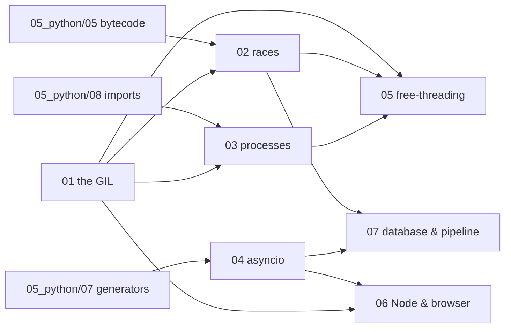

# Concurrency — syllabus

**Modules:** 7 · **Target length:** ~53,000 words · **Ladder target:** L4 across, L5 on the GIL and on structured concurrency
**Prerequisites:** [`05_python/05` bytecode](05_python_00_syllabus.md) is a hard prerequisite of module 02; [`05_python/07` generators](05_python_00_syllabus.md) precedes module 04
**Feeds:** [`07_javascript/03`](07_javascript_00_syllabus.md), [`09_sql/03`](09_sql_00_syllabus.md), [`12_bigquery/05`](12_bigquery_00_syllabus.md)
**Measurement status:** fully measurable on `ENV-A`, including a free-threaded comparison once `uv python install 3.14t` is run
**Roles:** Data Engineer ●●● · Fullstack SWE ●●● · Data Analyst ○○○

---

## 1. Competencies

Thirty competencies. This is the densest topic in the repo and the one where the shallow answers are most widely believed.

| ID | Competency | L | Probe | Tell | Roles | Module |
|---|---|---|---|---|---|---|
| `CONC-01` | Explain what the GIL protects and why CPython needs one at all | L4 | "What is the GIL?" | Shallow: *"a lock that stops Python using multiple cores."* Senior: it protects interpreter state — chiefly non-atomic reference counts, so two threads decrementing the same refcount cannot corrupt the heap; the single-core consequence is a side effect of that choice, not its purpose | DE ● FS ● | `01` |
| `CONC-02` | State exactly when CPython releases the GIL | L4 | "When is the GIL released?" | Shallow: *"on I/O."* Senior: around blocking syscalls, at bytecode boundaries every `sys.getswitchinterval()` (default 5 ms), and explicitly by C extensions — NumPy, Polars and DuckDB release it around their compute loops, which is why vectorising often beats parallelising | DE ● FS ● | `01` |
| `CONC-03` | Predict and measure whether threads help a given workload | L4 | "I added threads and it got slower. Why?" | Shallow: *"thread overhead."* Senior: for CPU-bound work the threads serialise on the GIL and you pay context-switching on top, so it is slower than serial — quotes the measured figure and names the I/O-bound case where the same code wins hugely | DE ● FS ● | `01` |
| `CONC-04` | Explain why the GIL is not a correctness guarantee | L5 | "So Python's built-in types are thread-safe?" | Shallow: *"yes, because of the GIL."* Senior: individual bytecodes are atomic, operations are not; `list.append` happens to be safe because it is one C call, `+=` is not because it is several bytecodes — and thread safety by accident of implementation is not a contract you should rely on | DE ● FS ● | `01` |
| `CONC-05` | Compare CPython's GIL to runtimes without one and say what they pay instead | L5 | "How do other languages avoid this?" | Shallow: *"they're just better designed."* Senior: the GIL buys fast single-threaded refcounting and a simple C API; the alternatives pay with atomic refcounts, tracing GC, or enforced isolation as in JavaScript workers and Erlang processes — every design pays somewhere | FS ● | `01` |
| `CONC-06` | Demonstrate a lost update and explain it at the bytecode level | L4 | "Is `x += 1` thread-safe?" | Shallow: *"probably."* Senior: disassembles to show load/add/store, reproduces the lost updates with a lowered switch interval, then reports that a tight loop lost nothing across five runs — the race is **rare, not impossible**, which is what makes it a two-a-year unreproducible production bug | DE ● FS ● | `02` |
| `CONC-07` | Choose correctly among `Lock`, `RLock`, `Semaphore`, `Event` and `Condition` | L4 | "What's the difference between a Lock and an RLock?" | Shallow: *"RLock can be locked twice."* Senior: `RLock` is re-entrant *by the owning thread*, which matters when a locked method calls another locked method on the same object; and notes that needing an `RLock` is often a design smell | FS ● | `02` |
| `CONC-08` | Reproduce a deadlock and state the four conditions plus the practical fix | L4 | "How do you prevent deadlock?" | Shallow: *"use timeouts."* Senior: reproduces inconsistent lock ordering live, names mutual exclusion, hold-and-wait, no preemption and circular wait, then gives the fix that actually ships — a global lock ordering — and notes timeouts convert a hang into an error without fixing the bug | DE ● FS ● | `02` |
| `CONC-09` | Argue for `queue.Queue` over shared state plus locks | L5 | "How would you structure a producer-consumer pipeline?" | Shallow: shared list plus a lock. Senior: a queue moves the synchronisation into a tested primitive, gives back-pressure through `maxsize`, and makes shutdown expressible via sentinels — *"don't communicate by sharing memory"* applied to Python | DE ● FS ● | `02` |
| `CONC-10` | Explain `threading.local` and when thread-affine state is the right answer | L3 | "How do you give each thread its own database connection?" | Shallow: *"a global dict keyed by thread id."* Senior: `threading.local`, and immediately notes it breaks under asyncio because many coroutines share one thread — `contextvars` is the async-safe equivalent, which is what request-scoped context in a framework uses | FS ● | `02` |
| `CONC-11` | Explain the difference between a process and a thread in terms of what is and is not shared | L3 | "Process versus thread?" | Shallow: *"processes are heavier."* Senior: a process has its own address space and therefore its own interpreter and its own GIL, which is why it achieves real parallelism; a thread shares the heap and has only its own stack, which is why it is cheap and why it needs locks | DE ● FS ● | `03` |
| `CONC-12` | Distinguish `fork`, `spawn` and `forkserver` and name the platform defaults | L4 | "Why does my multiprocessing code work on my colleague's Linux box and hang on my Mac?" | Shallow: *"a platform bug."* Senior: macOS defaults to `spawn`, Linux historically to `fork`; `spawn` re-imports the module in the child, so module-level side effects run again and the `if __name__ == "__main__"` guard becomes mandatory, while `fork` inherits everything including locks held at fork time | DE ● FS ● | `03` |
| `CONC-13` | Explain the pickling constraint and predict what will fail to cross a process boundary | L4 | "Why does this lambda fail in a `ProcessPoolExecutor`?" | Shallow: *"lambdas can't be pickled."* Senior: everything crossing the boundary is serialised, so lambdas, local closures, open sockets and database connections all fail — and the serialisation cost itself is why fine-grained tasks can make a process pool slower than serial | DE ● FS ● | `03` |
| `CONC-14` | Show that child processes mutate copies, and choose the right sharing primitive | L4 | "My worker updated the counter but the parent still sees zero." | Shallow: *"you need a lock."* Senior: the child mutated a copy in its own address space and failed **silently, with no error**; then distinguishes `Value`/`Array` (shared memory, still not atomic — needs `get_lock()`), `Manager` (a proxy server process, correct but slow), and `shared_memory` (zero-copy, best for large buffers) | DE ●● | `03` |
| `CONC-15` | Explain why forking with open database connections corrupts them | L4 | "We forked workers and started getting weird database errors." | Shallow: *"connection limits."* Senior: the child inherits the socket file descriptor, so two processes now interleave on one connection; the fix is to create the pool inside the worker after the fork, which is why frameworks expose a post-fork hook | DE ●● | `03` |
| `CONC-16` | Explain what calling an `async def` actually returns | L4 | "What does calling an async function do?" | Shallow: *"it runs it asynchronously."* Senior: it returns a coroutine object and **executes nothing**; something must drive it — and contrasts this with JavaScript, where calling an async function runs the body up to the first `await` immediately | DE ● FS ● | `04` |
| `CONC-17` | Trace how a coroutine suspends and resumes, in terms of `send` and the event loop | L5 | "How does `await` actually work?" | Shallow: *"it waits for the result."* Senior: the coroutine is driven by `.send()`, `await` yields control back to the loop with the frame preserved, the loop registers interest in a file descriptor via the selector, and the frame resumes on the same line when the callback fires — the return value arriving inside `StopIteration` | DE ● FS ● | `04` |
| `CONC-18` | Diagnose a blocking call inside an async endpoint | L4 | "One endpoint got slow and now everything is slow. Where do you look?" | Shallow: *"check the database."* Senior: names the signature — **unrelated endpoints degrading together** means the loop is blocked, not the dependency — then quotes the measured before/after and the counterintuitive result that deleting the word `async` made the same code ten times faster because Starlette offloads plain `def` to a threadpool | DE ● FS ●● | `04` |
| `CONC-19` | Choose between `gather`, `TaskGroup` and a bounded semaphore | L4 | "You need to call an API for ten thousand records." | Shallow: *"`asyncio.gather`."* Senior: unbounded `gather` opens ten thousand connections and gets you rate-limited or out of file descriptors; bound it with a semaphore, and prefer `TaskGroup` because it cancels siblings on failure rather than leaving them running | DE ●● FS ● | `04` |
| `CONC-20` | Explain cancellation, shielding and why fire-and-forget tasks vanish | L5 | "What happens to a task nobody holds a reference to?" | Shallow: *"it runs to completion."* Senior: the loop holds only a weak reference, so it can be garbage-collected mid-flight; reports honestly that this could not be reproduced on demand, which is evidence the failure is **nondeterministic rather than absent** — and that is precisely what makes it dangerous | FS ● | `04` |
| `CONC-21` | Explain structured concurrency and what nurseries fix | L5 | "What problem does structured concurrency solve?" | Shallow: *"cleaner async code."* Senior: it makes task lifetime lexically scoped so no task outlives its block, which converts silent orphaned tasks and swallowed exceptions into ordinary control flow — the trio nursery idea that arrived in the standard library as `TaskGroup` | FS ● | `04` |
| `CONC-22` | Explain what PEP 703 free-threading changes and what it costs | L5 | "Is the GIL going away?" | Shallow: *"yes, in a future version."* Senior: free-threaded builds ship alongside the default; they need biased reference counting and per-object locking, immortal objects from PEP 683 reduce contention on shared singletons, and single-threaded code pays a measurable penalty while the C extension ecosystem needs rebuilding | DE ● FS ● | `05` |
| `CONC-23` | Measure the same CPU-bound job under 3.14 and 3.14t | L5 | "Have you actually tried the free-threaded build?" | Shallow: *"I've read about it."* Senior: quotes his own measurement of both interpreters on identical work, and notes that the naive race that was rare under the GIL becomes reliable without it — almost no candidate has run this | DE ● FS ● | `05` |
| `CONC-24` | Explain subinterpreters as the third concurrency path | L4 | "What's the difference between subinterpreters and multiprocessing?" | Shallow: *"never heard of them."* Senior: PEP 734 gives isolated interpreters in one process, each with its own GIL, so you get parallelism without process startup cost — but with the same no-shared-objects constraint, which puts it between threads and processes rather than replacing either | DE ● | `05` |
| `CONC-25` | Explain libuv's phases and what the threadpool actually handles | L4 | "Is Node single-threaded?" | Shallow: *"yes."* Senior: the *event loop* is single-threaded; libuv keeps a threadpool of four by default (`UV_THREADPOOL_SIZE`) for filesystem, DNS, crypto and zlib — but network I/O never touches it because the OS provides async sockets natively | FS ●● | `06` |
| `CONC-26` | Show that `worker_threads` achieve real parallelism and explain why | L5 | "Can JavaScript do real multithreading?" | Shallow: *"no, it's single-threaded."* Senior: `worker_threads` are isolated V8 heaps with no shared interpreter state, so there is nothing for a GIL to protect; quotes the measured speedup and pays the isolation tax in structured clone — the mirror image of Python's pickle | FS ●● | `06` |
| `CONC-28` | Explain MVCC and how a database achieves concurrency without locking readers | L4 | "How do two transactions read the same row at once?" | Shallow: *"row locks."* Senior: each transaction sees a snapshot, readers never block writers and writers never block readers, and the cost is version accumulation that vacuum has to reclaim — which is why a long-running transaction bloats the table | DE ●● DA ● | `07` |
| `CONC-29` | Identify the connection pool as the real concurrency ceiling of an async service | L5 | "Your async API handles ten thousand concurrent requests. What breaks first?" | Shallow: *"the event loop."* Senior: the pool — the loop will happily accept ten thousand requests that all queue behind twenty connections, so the async gain is invisible and latency climbs; sizing the pool against the database's own limit is the actual constraint | DE ●● FS ●● | `07` |
| `CONC-30` | Explain idempotency and delivery semantics in a streaming pipeline | L5 | "Your pipeline reprocessed a batch. What happens to the warehouse?" | Shallow: *"we'd have duplicates."* Senior: at-least-once is the default almost everywhere, so the sink must be idempotent — a deterministic key plus `MERGE`, or dedup on a natural key; exactly-once is a property of the sink contract, not a promise the runner can make alone | DE ●●● | `07` |

---

## 2. Prerequisite graph

Module 01 is the root: every other module in the topic either extends it or contrasts with it. Modules 06 and 07 are the cross-cutting capstones, and they live here as the last two files rather than in a separate folder because **a capstone that is its own directory never gets written, while a capstone that is the last file in a folder you are already building does.**

---

## 3. Module manifest

| # | File | Scope | Words | Competencies | Status | Measurement |
|---|---|---|---|---|---|---|
| 01 | [`01_the_gil_what_it_protects_and_when_it_lets_go.md`](../../06_concurrency/01_the_gil_what_it_protects_and_when_it_lets_go.md) | Why non-atomic refcounts require it, bytecode-boundary switching, `sys.getswitchinterval`, release around syscalls, C extensions releasing it explicitly, the measured serial/threads/processes table. *Diagram: GIL handoff versus true parallelism* | ~7,500 | `CONC-01`–`CONC-05` | ✅ **written** | `measured` — 6 IDs (`CONC-GIL-*`) |
| 02 | [`02_threads_races_and_synchronisation.md`](../../06_concurrency/02_threads_races_and_synchronisation.md) | Lost updates measured, the lock family, `queue.Queue` as the answer that avoids locks, a reproduced deadlock from inconsistent lock ordering, `threading.local` versus `contextvars`, why built-in thread safety is an accident rather than a guarantee | ~7,500 | `CONC-06`–`CONC-10` | ✅ **written** | `measured` — 5 IDs (`CONC-THR-*`) |
| 03 | [`03_multiprocessing_and_the_process_boundary.md`](../../06_concurrency/03_multiprocessing_and_the_process_boundary.md) | `fork`/`spawn`/`forkserver` and the macOS default, pickling constraints, `Value`/`Array`/`Manager`/`shared_memory`, chunk-size cost, the fork-inherits-connections hazard, measured scaling to 8 cores. *Diagram: address-space copy versus shared heap* | ~7,500 | `CONC-11`–`CONC-15` | ✅ **written** | `measured` — 5 IDs (`CONC-MP-*`) |
| 04 | [`04_asyncio_internals.md`](../../06_concurrency/04_asyncio_internals.md) | Coroutine objects and `.send()`, `Task`/`Future`, the selector loop, `gather` versus `TaskGroup`, cancellation and shielding, `asyncio.timeout`, bounded concurrency, `to_thread`, debug mode, structured concurrency. *Diagram: one request suspending and resuming* | ~8,000 | `CONC-16`–`CONC-21` | ✅ **written** | `measured` — 8 IDs (`CONC-ASY-*`) |
| 05 | `05_free_threading_subinterpreters_and_the_future.md` | PEP 703 and its 3.14 status, biased reference counting, immortal objects (PEP 683), per-object locking, C-extension ABI breakage, **measured 3.14t versus 3.14 on identical work**, subinterpreters (PEP 734), the JIT | ~7,000 | `CONC-22`–`CONC-24` | planned | measured (needs `uv python install 3.14t`) |
| 06 | `06_concurrency_in_node_and_the_browser.md` | libuv phases, the four-thread pool and `UV_THREADPOOL_SIZE`, what is offloaded versus what never touches it, `worker_threads` measured as real parallelism, `SharedArrayBuffer` and `Atomics`, `cluster` versus workers, Web Workers and structured clone, closing with the cross-language table | ~7,000 | `CONC-25`–`CONC-27` | planned | measured |
| 07 | `07_concurrency_in_the_database_and_the_pipeline.md` | MVCC and snapshots, isolation anomalies, `SELECT … FOR UPDATE`, optimistic versus pessimistic locking, a reproduced Postgres deadlock, the connection pool as the true ceiling, then idempotency and delivery semantics in Beam and Dataflow | ~7,500 | `CONC-28`–`CONC-30` | planned | mixed — Postgres measured, Dataflow `documented` |

Four modules — 01 through 04 — are the Phase 2 core, written in that order after the three Python modules.

---

## 4. Measurement plan

This topic carries the single highest-value unmeasured experiment in the repo.

| Module | Measured | Method | Setup needed |
|---|---|---|---|
| 01 | CPU-bound job across serial, threads and processes on 8 cores (**re-run of `PY-ASYNC-01`**, whose archived figures are 4-core); GIL release around a `time.sleep` versus a busy loop | `time.perf_counter`, `ThreadPoolExecutor`, `ProcessPoolExecutor` | none |
| 02 | Lost updates with a lowered switch interval, and the tight-loop control that loses nothing (**re-run of `PY-CONC-04`/`PY-CONC-05`**); a deadlock reproduced from inconsistent lock ordering; the `dis` output for `+=` on 3.14 | `threading`, `sys.setswitchinterval`, `dis` | none |
| 03 | Process-pool scaling to 8 cores; pickling failure for a lambda; the silent copy-mutation result; `shared_memory` versus `Manager` throughput on a large array | `multiprocessing`, `time.perf_counter` | none |
| 04 | Ten sequential `await`s versus `gather`; blocking call inside `async def` under concurrent load (**re-run of `PY-ASYNC-02`**, the `def`-beats-`async def` result); the threadpool cliff at 40 | `asyncio`, FastAPI + uvicorn, a load generator | FastAPI install |
| 05 | **The flagship experiment:** identical CPU-bound work under `python3.14` and `python3.14t`, plus the naive race run under both — it should be rare under the GIL and reliable without it | `uv python install 3.14t`, then both interpreters | **`uv python install 3.14t`** — needs approval |
| 06 | `worker_threads` versus main thread on 8 cores (**re-run of `JS-LOOP-03`**, archived at 4 cores); `UV_THREADPOOL_SIZE` effect on parallel `fs` reads versus parallel network requests | Node v20.20.2, `worker_threads`, `perf_hooks` | none |
| 07 | A deadlock reproduced across two `psql` sessions; connection-pool saturation shown as latency climbing while the loop stays idle | Postgres 17 in Docker | **Docker daemon start + `postgres:17`** — needs approval |

**What stays `documented`:** Dataflow autoscaling and fusion behaviour, streaming watermark behaviour at volume, and anything about a multi-terabyte pipeline. Module 07's second half carries the tag explicitly and its interview answers use *"the way Dataflow handles this is…"*, never *"I measured."*

The `3.14t` comparison in module 05 is worth calling out as the best single opportunity in the repo. It is one command to set up, it produces a number essentially no other candidate will have, and it converts "is the GIL going away?" from a news question into a personal-experience answer.

---

← [repo index](../../../README.md) · [measurement ledger](../../MEASUREMENTS.md) · [writing contract](../../AGENTS.md)
