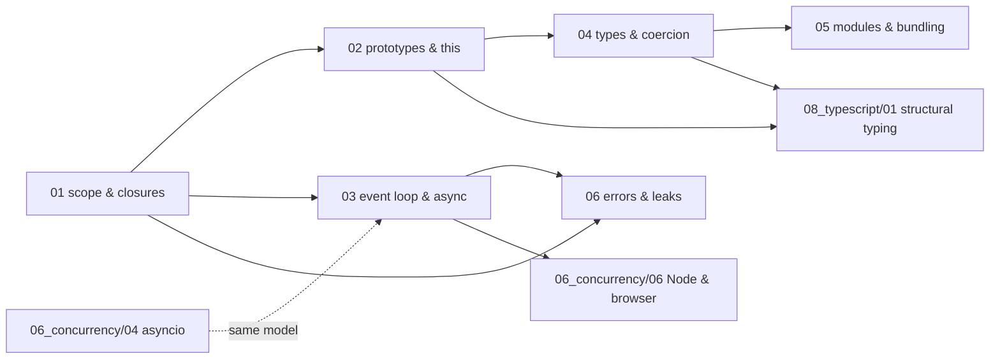

# JavaScript — syllabus

**Modules:** 6 · **Target length:** ~42,000 words · **Ladder target:** L4 across, L5 on the event loop and the object model
**Feeds:** [`08_typescript/`](08_typescript_00_syllabus.md) — all five TypeScript modules assume modules 01, 02 and 04 here
**Measurement status:** fully measurable on `ENV-A` — Node v20.20.2 plus a browser, including heap snapshots and CPU profiles
**Roles:** Fullstack SWE ●●● · Data Engineer ●○○ · Data Analyst ○○○

---

## 1. Competencies

Twenty-six competencies. Modules 01 through 03 are the interview core; 04 through 06 defend against the second hour.

| ID | Competency | L | Probe | Tell | Roles | Module |
|---|---|---|---|---|---|---|
| `JS-01` | Explain the creation and execution phases of an execution context | L4 | "What is hoisting?" | Shallow: *"declarations move to the top."* Senior: nothing moves — the environment record is populated during the creation phase before any line runs, so `function` declarations are fully initialised, `var` is initialised to `undefined`, and `let`/`const` are recorded but uninitialised | FS ●● | `01` |
| `JS-02` | Explain the temporal dead zone and why it exists | L4 | "Why does accessing a `let` before its declaration throw, when `var` gives `undefined`?" | Shallow: *"`let` isn't hoisted."* Senior: it is recorded but uninitialised; the TDZ is the window between context creation and the declaration executing, and it exists to turn a silent `undefined` bug into a loud `ReferenceError` | FS ●● | `01` |
| `JS-03` | Explain closures as cells over an environment record | L4 | "What is a closure?" | Shallow: *"a function that remembers its scope."* Senior: the function keeps a reference to the environment record it was created in, so the *variable* stays alive rather than a copy of its value — and names the direct parallel to Python's `__closure__` cells | FS ●●● | `01` |
| `JS-04` | Reproduce and explain the `var`-in-a-loop classic | L3 | "Why do all three callbacks log 3?" | Shallow: *"asynchronous timing."* Senior: `var` is function-scoped so all three closures share one binding that ends at 3, while `let` creates a fresh binding per iteration — quotes the measured **3 3 3** versus **0 1 2** and connects it to Python's late-binding bug | FS ●●● | `01` |
| `JS-05` | Diagnose a stale closure in a React hook | L5 | "The counter in my `setInterval` is frozen at zero." | Shallow: *"add it to the dependency array."* Senior: the effect closed over the first render's `count`, so the interval callback keeps reading a value that will never change; names the three fixes — functional updater, ref, or correct dependencies — and says which is right when the interval must not be recreated | FS ●●● | `01` |
| `JS-06` | Identify closures as a memory-retention source | L4 | "How can a closure leak memory?" | Shallow: *"closures don't leak."* Senior: a retained closure keeps its entire environment record alive, so one small callback can pin a large object; demonstrates it in a heap snapshot and names the common shapes — event listeners never removed, and timers never cleared | FS ●● | `01` |
| `JS-07` | Explain the prototype chain and the `__proto__` versus `.prototype` distinction | L4 | "What is `.prototype`?" | Shallow: *"where methods live."* Senior: `.prototype` is a property of *constructor functions* that becomes the `[[Prototype]]` of instances they create; `__proto__` is the instance's actual link — and traces a failed lookup walking the chain to `Object.prototype` and then to `null` | FS ●●● | `02` |
| `JS-08` | Explain what `class` desugars to | L4 | "Is `class` real inheritance or syntactic sugar?" | Shallow: *"sugar over functions."* Senior: mostly sugar over prototypes, but not entirely — class bodies are strict mode, methods are non-enumerable, the constructor cannot be called without `new`, and `extends` sets up both the prototype chain and the constructor chain, which is why `super()` must run before `this` | FS ●● | `02` |
| `JS-09` | State the `this` binding rules in precedence order | L4 | "What is `this`?" | Shallow: *"the current object."* Senior: determined by the **call site**, not the definition — `new`, then explicit `bind`/`call`/`apply`, then method call, then default; arrow functions have no binding of their own and take the enclosing lexical one, which is why a detached method loses `this` and an arrow callback does not | FS ●●● | `02` |
| `JS-10` | Use `Object.defineProperty`, `Proxy` and `Reflect` appropriately | L4 | "How would you intercept property access on an object?" | Shallow: *"getters and setters."* Senior: `defineProperty` for a known property, `Proxy` for the unknown or dynamic case with the full trap set, `Reflect` to invoke default behaviour from inside a trap — and names Vue's reactivity as the production example | FS ●● | `02` |
| `JS-11` | Explain V8 hidden classes and inline caches | L5 | "Why is adding a property to an object after creation slow?" | Shallow: *"it isn't."* Senior: V8 assigns a hidden class per shape and transitions on each new property, so objects built in different property orders get different shapes and the call site's inline cache goes polymorphic then megamorphic — connects it directly to Python's 3.11 specialising interpreter as the same idea | FS ●● | `02` |
| `JS-12` | State the full ordering of sync code, microtasks and macrotasks | L4 | "What logs first?" | Shallow: guesses from experience. Senior: synchronous first, then `process.nextTick`, then the microtask queue **drained to exhaustion**, then one macrotask — and notes the microtask queue is drained fully between each macrotask, which is why a microtask chain can starve a timer | FS ●●● DE ● | `03` |
| `JS-13` | Explain the promise state machine and what `then` actually schedules | L4 | "What does `.then` do?" | Shallow: *"runs after the promise resolves."* Senior: registers a reaction; on settlement the reaction is enqueued as a **microtask**, not run inline — which is why a resolved promise's `then` still runs after the rest of the current synchronous block | FS ●●● | `03` |
| `JS-14` | Desugar `async`/`await` into promise scheduling | L5 | "What does `await` compile to?" | Shallow: *"it pauses the function."* Senior: the function suspends and its continuation is scheduled as a microtask when the awaited value settles; the frame is preserved and resumes on the same line — the same model as a Python coroutine, except calling an async function in JS runs the body up to the first `await` while Python runs nothing | FS ●●● DE ● | `03` |
| `JS-15` | Diagnose a blocked event loop | L4 | "All our endpoints got slow at once." | Shallow: *"the server is overloaded."* Senior: simultaneous degradation of unrelated endpoints is the signature of a blocked loop rather than a slow dependency — quotes the measured **0 ms timer firing at 1002 ms** and reaches for `--cpu-prof` to find the synchronous culprit | FS ●●● DE ● | `03` |
| `JS-16` | Choose between sequential `await`, `Promise.all` and `allSettled`, and bound concurrency | L4 | "You need to call an API a thousand times." | Shallow: `await` in a loop. Senior: quotes the measured **5052 ms versus 503 ms**, then immediately bounds it — unbounded `Promise.all` on a thousand items exhausts sockets and gets rate-limited — and picks `allSettled` when partial failure is acceptable | FS ●●● DE ●● | `03` |
| `JS-17` | Handle rejections correctly across environments | L4 | "What happens to an unhandled rejection?" | Shallow: *"it's logged."* Senior: Node ≥ 15 **terminates the process with exit code 1**; a browser fires `unhandledrejection` and the page survives — and notes that a rejection handled late still counts as unhandled at the moment of settlement | FS ●● | `03` |
| `JS-18` | Explain the `==` coercion algorithm well enough to predict edge cases | L4 | "Why is `[] == false` true?" | Shallow: *"always use `===`."* Senior: gives the rule — `===` by default, but explains the algorithm: the array is converted to a primitive, the empty string, then both sides to numbers, both zero; and notes `null == undefined` is true while neither equals anything else | FS ●● | `04` |
| `JS-19` | Explain IEEE-754 consequences and how to handle money | L4 | "Why is `0.1 + 0.2` not `0.3`?" | Shallow: *"floating point."* Senior: quotes **`0.30000000000000004`** and the nastier **`(1.005).toFixed(2) === "1.00"`**, then gives the fix — integer minor units or a decimal library — and connects it to choosing `NUMERIC` over `FLOAT` in SQL | FS ●● DE ● | `04` |
| `JS-20` | Distinguish `Map`, plain object and `WeakMap` | L3 | "When would you use a `Map` over an object?" | Shallow: *"they're about the same."* Senior: `Map` takes any key type, preserves insertion order, has a real `size`, and has no prototype-key collisions; `WeakMap` holds keys weakly so entries vanish when the key is collected, which is the leak-free metadata sidecar | FS ●● | `04` |
| `JS-21` | Explain iteration protocols and generators | L4 | "How does `for…of` work, and how is it different from `for…in`?" | Shallow: *"one is for arrays."* Senior: `for…of` consumes `Symbol.iterator`, `for…in` walks enumerable string keys **including inherited ones**; and generators implement the iterator protocol with a suspendable frame, the same machinery as Python's | FS ●● | `04` |
| `JS-22` | Distinguish CommonJS from ESM including the live-binding difference | L4 | "What actually changes between `require` and `import`?" | Shallow: *"syntax."* Senior: CommonJS is synchronous and copies the value at require time; ESM is statically analysable with **live bindings**, so a reassignment in the exporting module is visible to importers — which is why circular imports behave differently in each, and why the dual-package hazard produces two copies of one module | FS ●● | `05` |
| `JS-23` | Explain tree shaking and why it fails | L4 | "Why didn't tree shaking remove this?" | Shallow: *"the bundler decides."* Senior: it needs static ESM structure and a guarantee of no side effects; a module without `"sideEffects": false`, or one with top-level effects, is kept wholesale — and CommonJS interop defeats it entirely | FS ●● | `05` |
| `JS-24` | Trace Node module resolution and the `exports` map | L4 | "Why can't I import this subpath any more?" | Shallow: *"wrong path."* Senior: the `exports` field is an encapsulation boundary — anything not listed is unreachable regardless of what exists on disk, which is the deliberate breaking change many packages made when adopting it | FS ●● | `05` |
| `JS-25` | Find a memory leak from a heap snapshot | L5 | "Node memory grows until the process is killed." | Shallow: *"restart it more often."* Senior: takes two snapshots and diffs retained size, names the three usual sources — listeners never removed, timers never cleared, and closures pinning large scopes — and identifies the retainer path rather than guessing | FS ●● DE ● | `06` |
| `JS-26` | Handle errors across async boundaries and understand stack traces | L4 | "Why does my stack trace stop at the async boundary?" | Shallow: *"async traces are bad."* Senior: each await resumption is a fresh tick, so the synchronous stack is gone; Node reconstructs async traces where it can, custom error classes must restore `prototype` after `super`, and a `try/catch` around a non-awaited promise catches nothing | FS ●●● | `06` |

---

## 2. Prerequisite graph

Module 01 is the root and the highest-value single file in the topic, because closures explain the stale-closure bug, the loop-variable classic, and a whole class of memory leak. Module 03 is the Phase 4 core module.

---

## 3. Module manifest

| # | File | Scope | Words | Competencies | Status | Measurement |
|---|---|---|---|---|---|---|
| 01 | `01_execution_context_scope_and_closures.md` | Creation and execution phases, hoisting and the TDZ, `var`/`let`/`const`, closures as cells over an environment record, the loop-variable classic, closures as a measured retention source, and the stale-closure bug in React hooks — which is code he has actually shipped | ~7,500 | `JS-01`–`JS-06` | planned | measured |
| 02 | `02_the_object_model_prototypes_and_this.md` | `[[Prototype]]`, `__proto__` versus `.prototype`, the lookup walk, what `class` and `extends` desugar to, the five `this` rules, arrow functions, `bind`/`call`/`apply`, `Object.defineProperty`, `Proxy`/`Reflect`, V8 hidden classes and inline caches. *Diagram: prototype chain walk for one failed lookup* | ~7,500 | `JS-07`–`JS-11` | planned | measured |
| 03 | [`03_the_event_loop_microtasks_and_async.md`](../../07_javascript/03_the_event_loop_microtasks_and_async.md) | Stack, task queue, microtask queue; browser render steps versus Node phases; `process.nextTick` priority; the promise state machine; `async`/`await` desugared; unhandled rejections; `await` in a loop versus `Promise.all`; `AbortController`. *Diagram: interleave for a mixed sync/micro/macro program* | ~7,500 | `JS-12`–`JS-17` | ✅ **written** | `measured` — 5 IDs (`JS-LOOP-*`) |
| 04 | `04_types_coercion_and_the_standard_library.md` | Primitives versus objects and boxing, the `==` algorithm step by step, `Object.is` and NaN, IEEE-754 and money, `BigInt`, `Symbol`, iteration protocols, generators, `structuredClone`, `Date`/`Intl`/Temporal, `Map` versus object versus `WeakMap` | ~6,500 | `JS-18`–`JS-21` | planned | measured |
| 05 | `05_modules_bundling_and_the_runtime_boundary.md` | CommonJS versus ESM and live bindings, the dual-package hazard, import hoisting, tree shaking and `sideEffects`, dynamic import, Node resolution and the `exports` map, what a bundler actually does, source maps, the browser/Node global split | ~6,500 | `JS-22`–`JS-24` | planned | measured |
| 06 | `06_errors_leaks_and_production_debugging.md` | Error objects and stack traces, async stack traces, custom error classes, try/catch across async boundaries, rejection handling in an Express or Fastify layer, the three leak sources found in a **measured heap snapshot**, `--cpu-prof`, EventEmitter semantics and back-pressure | ~7,000 | `JS-25`–`JS-26` | planned | measured |

Module 03 is the single Phase 4 core module, chosen because the event loop is the most-asked JavaScript topic at senior level and because it completes the cross-language concurrency story started in `06_concurrency/`.

---

## 4. Measurement plan

Everything in this topic is measurable with the installed Node and a browser. No setup, no approval needed.

| Module | Measured | Method |
|---|---|---|
| 01 | The `var`/`let` loop divergence (**`JS-LOOP-06`**, environment-independent); a closure pinning a large object shown as retained size in a heap snapshot; a stale-closure interval frozen at its initial value, then each of the three fixes |`node`, Chrome DevTools heap snapshots |
| 02 | Property-access speed for objects built in the same versus different property order, showing the hidden-class transition cost; a prototype lookup traced with `Object.getPrototypeOf` until `null` | `perf_hooks`, `--allow-natives-syntax` for shape inspection |
| 03 | Sequential `await` versus `Promise.all` (**re-run of `JS-LOOP-01`**); a 0 ms timer delayed behind a blocking loop (**re-run of `JS-LOOP-02`**); a microtask chain starving a timer (**re-run of `JS-LOOP-04`**); `nextTick` beating promise callbacks | `perf_hooks.performance.now()` |
| 04 | The IEEE-754 pair (**`JS-LOOP-05`**); `==` coercion results tabulated from actual evaluation rather than from memory | `node -p` |
| 05 | A live binding mutating after import under ESM and *not* under CommonJS; bundle size with and without `sideEffects: false` | two small packages, `esbuild --bundle` |
| 06 | A leak grown deliberately from an unremoved listener, then located by diffing two heap snapshots; `--cpu-prof` output identifying a synchronous hot function | Chrome DevTools, `node --cpu-prof` |

**Nothing in this topic is unmeasurable.** The only environment caveat is that `JS-LOOP-01` through `JS-LOOP-04` were archived on Node v22.22.3 while `ENV-A` runs v20.20.2 — a *downgrade*, so any behaviour that depends on a v22 default must be rechecked rather than assumed.

---

← [repo index](../../../README.md) · [measurement ledger](../../MEASUREMENTS.md) · [writing contract](../../AGENTS.md)
