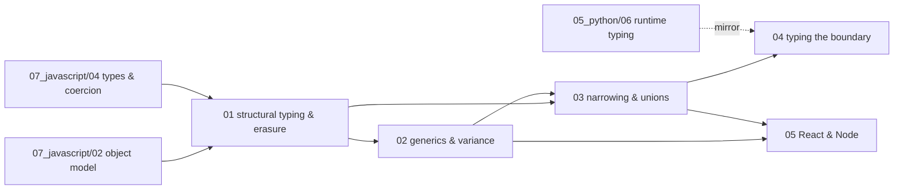

# TypeScript — syllabus

**Modules:** 5 · **Target length:** ~38,000 words · **Ladder target:** L4 across, L5 on inference and on the boundary
**Prerequisites:** hard — [`07_javascript/01`](07_javascript_00_syllabus.md), [`02`](07_javascript_00_syllabus.md) and [`04`](07_javascript_00_syllabus.md). TypeScript describes the shape of JavaScript's object model, and the structural-typing argument in module 01 is incoherent without it
**Feeds:** nothing downstream; this is a leaf topic
**Measurement status:** fully measurable via `npx tsc` — no global install needed
**Roles:** Fullstack SWE ●●● · Data Engineer ●●○ · Data Analyst ○○○

---

## 1. Competencies

Twenty-two competencies.

| ID | Competency | L | Probe | Tell | Roles | Module |
|---|---|---|---|---|---|---|
| `TS-01` | Explain structural typing and demonstrate the assignability it permits | L4 | "Are two types with the same shape the same type?" | Shallow: *"no, they're different types."* Senior: yes — TypeScript is structural, so `AccountId` and `UserId` both shaped `{ id: string }` are freely interchangeable and the compiler will not save you from passing one where the other is meant | FS ●●● | `01` |
| `TS-02` | Simulate nominal typing with branded types | L5 | "How do you stop a user ID being passed where an account ID is expected?" | Shallow: *"use different interfaces."* Senior: brands the type with a phantom property, so the shapes stop being compatible; notes the cost — construction now needs a cast or a factory — and that this is the same problem Python solves with `NewType` | FS ●●● DE ● | `01` |
| `TS-03` | State exactly what survives compilation | L4 | "What does TypeScript emit?" | Shallow: *"JavaScript."* Senior: types are **erased entirely** — `interface` and `type` emit nothing at all, while `enum` emits a real runtime object and `class` emits a real class; which is why you cannot check a type at runtime and why `typeof SomeInterface` is not valid | FS ●●● | `01` |
| `TS-04` | Choose between `interface` and `type` on real grounds | L3 | "`interface` or `type`?" | Shallow: *"they're the same, pick one."* Senior: interfaces support declaration merging and are the right choice for public API surfaces meant to be augmented; type aliases can express unions, intersections and conditional types, which interfaces cannot — the difference is capability, not style | FS ●● | `01` |
| `TS-05` | Explain when the excess-property check fires and when it silently does not | L4 | "Why does this object literal error but the same object via a variable doesn't?" | Shallow: *"a compiler quirk."* Senior: excess-property checking is a special freshness rule applied only to object literals assigned directly; via a variable, ordinary structural assignability applies and the extra property is legal — deliberate, and a real source of surprise | FS ●● | `01` |
| `TS-06` | Explain what `tsc` guarantees and what it does not | L5 | "What does the compiler actually promise you?" | Shallow: *"type safety."* Senior: **internal consistency with the types you declared** — not soundness (the type system is deliberately unsound in places) and not validation (nothing checks incoming data at runtime); which is exactly why a validation library is not optional at the boundary | FS ●●● DE ●● | `01` |
| `TS-07` | Explain inference sites and why a type widened unexpectedly | L4 | "Why is this inferred as `string` and not the literal?" | Shallow: *"add an annotation."* Senior: mutable locations widen literal types by default because they could be reassigned; `as const` or a `const` type parameter preserves literals, and `satisfies` gets the check without the widening | FS ●●● | `02` |
| `TS-08` | Write a generic function with a constraint and explain what the constraint buys | L4 | "Write a typed `pick(obj, keys)`." | Shallow: uses `any` for the keys. Senior: constrains the key parameter with `K extends keyof T` and returns `Pick<T, K>`, so both invalid keys and the shape of the result are checked | FS ●●● DE ●● | `02` |
| `TS-09` | Use `infer` in a conditional type | L5 | "Extract the element type of an array type." | Shallow: stalls. Senior: writes the conditional with `infer` and explains that it introduces a type variable bound during matching — the same mechanism behind `ReturnType` and `Awaited` | FS ●● | `02` |
| `TS-10` | Explain variance in parameters and returns | L5 | "Is a function taking `Animal` assignable to one taking `Dog`?" | Shallow: guesses. Senior: parameters are contravariant and returns covariant, so a handler accepting the *wider* type is the safe substitution — and notes this is checked only under `strictFunctionTypes`, and never for methods, which stay bivariant for legacy reasons | FS ●● | `02` |
| `TS-11` | Explain array covariance as a deliberate unsoundness | L5 | "Is TypeScript's type system sound?" | Shallow: *"yes."* Senior: no, deliberately — arrays are covariant, so a `Dog[]` is assignable to `Animal[]` and you can then push a `Cat` into it; quotes the runtime failure with **zero compile errors**, and explains the trade was made for usability | FS ●● | `02` |
| `TS-12` | Diagnose why inference failed and choose the minimal fix | L5 | "The generic collapsed to `unknown`. What now?" | Shallow: annotates everything explicitly. Senior: identifies which inference site failed, then picks the smallest fix — reordering parameters, adding a constraint, or a `const` type parameter — rather than annotating away the generic | FS ●● | `02` |
| `TS-13` | Use discriminated unions and control-flow narrowing | L4 | "Model a request that is loading, loaded or failed." | Shallow: one interface with optional fields everywhere. Senior: a discriminated union on a literal tag, so accessing `data` in the error branch is a compile error rather than a runtime `undefined` — and the impossible states stop being representable | FS ●●● DE ●● | `03` |
| `TS-14` | Write type predicates and assertion functions correctly | L4 | "How do you narrow an `unknown`?" | Shallow: casts with `as`. Senior: a user-defined type guard returning `x is T`, and notes the danger — the compiler trusts the predicate absolutely, so a wrong guard is a lie it will never catch | FS ●●● | `03` |
| `TS-15` | Use `never` for exhaustiveness checking | L4 | "How do you make sure you handled every case?" | Shallow: *"add a default."* Senior: assigns the narrowed value to `never` in the default branch, so adding a union member becomes a **compile error at every switch** — turning an omission into a build failure rather than a runtime surprise | FS ●●● | `03` |
| `TS-16` | Explain `satisfies` and when it beats an annotation | L4 | "What does `satisfies` do?" | Shallow: *"it's like `as`."* Senior: checks conformance while preserving the narrower inferred type, so you get validation without widening — unlike an annotation, which widens, and unlike `as`, which checks nothing | FS ●● | `03` |
| `TS-17` | Build a mapped or template-literal type and know when to stop | L5 | "Type an object whose keys are `on` plus each event name." | Shallow: writes them out by hand. Senior: uses key remapping with a template literal type, and then states the boundary honestly — type-level programming past a certain point produces errors nobody can read and compile times nobody wants, so the maintenance cost is real | FS ●● | `03` |
| `TS-18` | Explain why `unknown` belongs at every system boundary | L5 | "What type is the response from `fetch`?" | Shallow: *"whatever I annotate it as."* Senior: `any` by default and therefore a lie — the correct move is `unknown` and then parse, because an annotation on a network response is a belief rather than a fact | FS ●●● DE ●●● | `04` |
| `TS-19` | Contrast Zod with Pydantic and state the direction of travel | L5 | "How do you validate an API response?" | Shallow: *"cast it to the interface."* Senior: parses with a schema and derives the type *from* the schema, then makes the comparison — Python keeps annotations at runtime so Pydantic reads types to build validation; TypeScript erases them, so Zod infers types from validators. **Same destination, opposite direction of travel** | FS ●●● DE ●●● | `04` |
| `TS-20` | Explain how `any` leaks through a declaration file | L4 | "Everything type-checks but it broke in production." | Shallow: *"a bad test."* Senior: an untyped dependency or a `.d.ts` returning `any` unchecks the entire subtree downstream silently; `noImplicitAny` catches the declaration but not the propagation, which is why `unknown` at the boundary matters more than strictness flags | FS ●●● | `04` |
| `TS-21` | Name each `strict` sub-flag and what it catches | L4 | "What does `strict: true` turn on?" | Shallow: *"strict type checking."* Senior: names them individually — `strictNullChecks` as by far the highest value, `noImplicitAny`, `strictFunctionTypes` for parameter variance, `strictPropertyInitialization`, `useUnknownInCatchVariables` — and explains that migrating flag by flag is how you adopt strict on an existing codebase | FS ●●● | `04` |
| `TS-22` | Type React hooks correctly | L4 | "Type a `useReducer` with several action types." | Shallow: types the action as `any`. Senior: a discriminated union of actions so the reducer narrows per case and exhaustiveness is checkable; and knows the three `useRef` overloads differ in whether the ref is mutable and whether `null` is permitted | FS ●●● | `05` |

---

## 2. Prerequisite graph

The dotted edge from `05_python/06` into module 04 is the topic's payoff. It is not a prerequisite in the ordering sense — module 04 stands alone — but the Pydantic-versus-Zod comparison is the strongest answer available in this topic and it comes from the Python side.

---

## 3. Module manifest

| # | File | Scope | Words | Competencies | Status | Measurement |
|---|---|---|---|---|---|---|
| 01 | `01_structural_typing_and_erasure.md` | Structural versus nominal assignability, exactly what survives to runtime, `interface` versus `type`, excess-property checks and when they silently do not fire, declaration files, `tsc` as a linter that emits, branded types to simulate nominality | ~7,500 | `TS-01`–`TS-06` | planned | measured |
| 02 | [`02_generics_inference_and_variance.md`](../../08_typescript/02_generics_inference_and_variance.md) | Inference sites and priority, `extends` constraints, `infer`, defaults, variance in parameters and returns, `strictFunctionTypes` and method bivariance, `const` type parameters, and a catalogue of real inference failures each with its minimal fix | ~8,000 | `TS-07`–`TS-12` | ✅ **written** | `measured` — 6 IDs (`TS-VAR-*`) |
| 03 | `03_narrowing_unions_and_type_level_programming.md` | Discriminated unions, control-flow narrowing, type predicates and assertion functions, `never` for exhaustiveness, `satisfies`, mapped/conditional/template-literal types, key remapping, utility types rebuilt by hand, and an honest section on when type-level programming becomes a liability | ~8,000 | `TS-13`–`TS-17` | planned | measured |
| 04 | `04_typing_the_boundary.md` | The data-engineering module: `unknown` at every edge, Zod and inferred schemas, generated types from OpenAPI and from a **BigQuery schema**, typing an API response honestly, how `any` leaks through a `.d.ts`, each `strict` sub-flag, and a migration strategy for an untyped codebase — which is his React Native modernisation story | ~7,500 | `TS-18`–`TS-21` | planned | measured |
| 05 | `05_typescript_in_react_and_node.md` | Props, children and generic components, hooks typing (`useState` inference, `useReducer` with discriminated actions, the three `useRef` overloads), context, event types, `@types/node` and typed config, one `tsconfig` per target, project references, build-time cost measured | ~7,000 | `TS-22` | planned | measured |

Module 02 is the single Phase 4 core module. Generics and variance are where TypeScript interviews separate people, and the material is the least guessable from JavaScript experience alone.

---

## 4. Measurement plan

An unusual topic to measure, because the output is compiler behaviour rather than timings. That is still measurement: a compiler error message pasted verbatim is real terminal output, and a claim about what `tsc` accepts is falsifiable in seconds.

| Module | Measured | Method |
|---|---|---|
| 01 | Two identically shaped named types assigned to each other with no error (**`TS-SYS-01`**); the emitted `.js` for an `interface`, a `type` and an `enum` side by side, showing two produce nothing (**`TS-SYS-02`**); the excess-property check firing on a literal and passing via a variable (**`TS-SYS-03`**) | `npx tsc --noEmit`, then `npx tsc` and read the output |
| 02 | Array covariance producing `dogs[1].bark is not a function` at runtime with a clean compile (**`TS-SYS-05`**); parameter contravariance passing without `strictFunctionTypes` and failing with it (**`TS-SYS-06`**); a catalogue of inference failures with the exact error text |`npx tsc` under two configs |
| 03 | Exhaustiveness: adding a union member and capturing the resulting error at every switch site; `satisfies` preserving a narrow type where an annotation widens it, shown via hover types in emitted declarations | `npx tsc --declaration` |
| 04 | `as` claiming a shape and then failing at runtime (**`TS-SYS-04`**); a Zod schema's inferred type compared against a hand-written interface; `any` from an untyped module propagating through three call sites undetected | `npx tsc`, `node` |
| 05 | `tsc` build time on a small project with and without `incremental` and project references; `--generateTrace` output identifying the slowest type instantiation | `npx tsc --generateTrace` |

**Nothing here is unmeasurable and nothing needs installing** — `npx` fetches the compiler on demand. The six `TS-SYS-*` figures carried from the archive are trivially re-verifiable and should be re-run rather than quoted, since they cost seconds.

---

← [repo index](../../../README.md) · [measurement ledger](../../MEASUREMENTS.md) · [writing contract](../../AGENTS.md)
