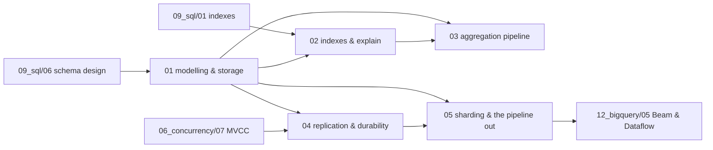

# MongoDB — syllabus

**Modules:** 5 · **Target length:** ~39,000 words · **Ladder target:** L4 across, L5 on modelling and on the pipeline boundary
**Prerequisites:** [`09_sql/01`](09_sql_00_syllabus.md) for module 02 — the index discussion is far shorter when B-trees are already understood; [`09_sql/06`](09_sql_00_syllabus.md) for the modelling contrast in module 01
**Feeds:** [`12_bigquery/05`](12_bigquery_00_syllabus.md) directly — module 05 ends where the BigQuery module begins
**Measurement status:** was v1's one honesty gap; **closes once the Docker daemon starts** and `mongo:8` runs
**Roles:** Data Engineer ●●● · Fullstack SWE ●●○ · Data Analyst ●○○

---

## 1. Competencies

| ID | Competency | L | Probe | Tell | Roles | Module |
|---|---|---|---|---|---|---|
| `MDB-01` | Explain BSON, the 16 MB limit, and what breaks long before you reach it | L4 | "What's the document size limit?" | Shallow: *"16 megabytes."* Senior: gives the number, then says it is the wrong thing to worry about — quotes the measured **~90 bytes per embedded transaction, ~186,000 before the ceiling** — and names what degrades first: read amplification, working-set eviction, and rewriting the whole document on every small update | DE ●●● FS ●● | `01` |
| `MDB-02` | Give a decision procedure for embedding versus referencing | L5 | "Embed or reference?" | Shallow: *"embed if it's read together."* Senior: embed when the relationship is **bounded by the domain** and read as a unit; reference when growth is unbounded or the child is queried independently — and notes that the deciding question is whether anything in the domain caps the count, not whether it is small today | DE ●●● FS ●●● | `01` |
| `MDB-03` | Name and apply the standard modelling patterns | L4 | "Store five years of sensor readings per device." | Shallow: an array on the device document. Senior: the **bucket pattern**, one document per device per time window, and can also name subset, extended reference, computed and schema-versioning with the problem each solves | DE ●●● | `01` |
| `MDB-04` | Identify the unbounded-array anti-pattern and its symptoms | L4 | "What's the most common MongoDB mistake?" | Shallow: *"not using indexes."* Senior: unbounded array growth — the document is rewritten and relocated as it grows, indexes on the array become multikey and enormous, and the failure is gradual degradation rather than an error | DE ●●● | `01` |
| `MDB-05` | Explain WiredTiger's concurrency and durability model | L4 | "How does MongoDB handle two writers on one document?" | Shallow: *"a database lock."* Senior: document-level concurrency control with MVCC snapshots, checkpoints roughly every sixty seconds, and a journal for durability between them — so an unacknowledged write can be lost, which is what write concern exists to control | DE ●● | `01` |
| `MDB-06` | Explain why the working set rather than total data size determines RAM needs | L5 | "How much memory does this deployment need?" | Shallow: *"as much as the data."* Senior: the working set — indexes plus frequently accessed documents — is what must fit; when it stops fitting, page faults appear as a sudden latency cliff rather than a gradual slope | DE ●● | `01` |
| `MDB-07` | Name the index families and choose correctly | L4 | "What index types does MongoDB have?" | Shallow: *"single and compound."* Senior: single, compound, multikey (automatic on array fields, and it forbids two arrays in one compound index), partial, sparse, TTL, text, wildcard, geospatial — and picks partial over sparse for a filtered subset because it is strictly more general | DE ●●● | `02` |
| `MDB-08` | **Derive** the ESR rule rather than reciting it | L5 | "How do you order fields in a compound index?" | Shallow: *"equality, sort, range — I memorised it."* Senior: derives it from sortedness — equality fixes a contiguous section, sort then reads in order for free, and a range **scatters everything ordered after it**, which is why range must come last; then shows the `explain` output proving it | DE ●●● | `02` |
| `MDB-09` | Read `explain("executionStats")` and identify the diagnostic ratio | L4 | "How do you know if an index is being used?" | Shallow: *"check for COLLSCAN."* Senior: compares **`totalDocsExamined` to `nReturned`** — a ratio near one is a good index, a ratio in the thousands means it is scanning and filtering; and checks whether the winning plan was chosen from cache or by a real trial | DE ●●● | `02` |
| `MDB-10` | Explain plan caching and what invalidates a cached plan | L5 | "The same query is fast sometimes and slow others." | Shallow: *"caching."* Senior: the planner races candidate plans and caches the winner per query shape; the cache is invalidated by index changes, restarts, and a large enough change in collection statistics — so a plan chosen against a small collection can persist past the point where it is right | DE ●● | `02` |
| `MDB-11` | Explain covered queries and why they need the projection to cooperate | L4 | "Can a query be answered from the index alone?" | Shallow: *"no, Mongo always reads the document."* Senior: yes, if every field in the filter *and* the projection is in the index — and `_id` must be explicitly excluded, which is the step everyone forgets | DE ●● | `02` |
| `MDB-12` | Explain type-sensitivity of index keys | L3 | "Query returns nothing but the document is clearly there." | Shallow: *"a typo."* Senior: BSON types participate in the key, so `"123"` and `123` are different keys and different sort positions — the classic failure after ingesting data whose types drifted across writers | DE ●●● | `02` |
| `MDB-13` | Explain aggregation stage semantics and ordering | L4 | "Does stage order matter in an aggregation?" | Shallow: *"not really."* Senior: enormously — `$match` and `$sort` early can use an index and shrink the stream, while the same stages after `$group` cannot, because the stream is synthetic by then and no index describes it | DE ●●● DA ●● | `03` |
| `MDB-14` | Explain `$lookup` mechanics and cost | L5 | "Is `$lookup` a join?" | Shallow: *"yes, it's Mongo's join."* Senior: it executes **per input document**, so without an index on the foreign field it is the N+1 shape wearing a different costume — and links it to the same shape as an ORM lazy load and a correlated subquery | DE ●●● | `03` |
| `MDB-15` | Predict `$unwind` cardinality effects | L4 | "What does `$unwind` do to your row count?" | Shallow: *"flattens the array."* Senior: multiplies documents by array length, so an unwind before a match can explode a small result into millions of intermediate documents — and `preserveNullAndEmptyArrays` is what stops it silently dropping documents with empty arrays | DE ●●● DA ●● | `03` |
| `MDB-16` | Handle the stage memory limit | L4 | "Your aggregation failed with a memory error." | Shallow: *"add `allowDiskUse`."* Senior: names the 100 MB per-stage limit, adds `allowDiskUse` as the immediate fix, then treats it as a signal — a blocking stage is processing more than it should, and an earlier `$match` or a supporting index is the real answer | DE ●●● | `03` |
| `MDB-17` | Explain replica set roles, the oplog and elections | L4 | "What happens when the primary dies?" | Shallow: *"a secondary takes over."* Senior: secondaries replicate the oplog, a majority election promotes a new primary, and writes that had not replicated can be **rolled back** — which is why write concern `majority` exists and why it costs latency | DE ●● | `04` |
| `MDB-18` | Explain write concern and read concern precisely | L5 | "What does `w: majority` guarantee?" | Shallow: *"the write succeeded."* Senior: acknowledged by a majority of voting members, so it survives a failover; `j: true` additionally means it reached the journal on disk; and read concern is the separate question of what you are permitted to *see*, from `local` through `majority` to `snapshot` | DE ●●● | `04` |
| `MDB-19` | Explain read preference and the staleness it buys | L4 | "Can we read from secondaries to spread load?" | Shallow: *"yes, it's free scaling."* Senior: yes, at the price of replication lag — a read-your-own-writes violation appears immediately unless you use causal consistency; and notes that secondaries carry the same write load, so it scales reads only | DE ●● FS ●● | `04` |
| `MDB-20` | Explain multi-document transactions and why they cost what they cost | L5 | "MongoDB has transactions now — should you use them?" | Shallow: *"yes, it's like SQL."* Senior: yes since 4.0, but they hold snapshots and have a default sixty-second limit, and needing them frequently is usually evidence the documents were modelled wrong — the design goal is that one document is the atomic unit | DE ●● | `04` |
| `MDB-21` | Select a shard key and justify it on three axes | L5 | "How do you choose a shard key?" | Shallow: *"something unique."* Senior: cardinality, frequency and **monotonicity** — a timestamp or increasing `_id` sends every write to one chunk and creates a hot shard; hashed fixes distribution but destroys range-query targeting, so the choice is bought with query patterns; and notes it is nearly a one-way door | DE ●●● | `05` |
| `MDB-22` | Describe the schema decisions forced at the Mongo-to-warehouse boundary | L5 | "You moved Mongo data into BigQuery. What was hard?" | Shallow: *"writing the pipeline."* Senior: **schema inference from a schemaless source** — the same field with different BSON types across years of writes, arrays needing to become `REPEATED` or be flattened, documents that never had a field at all versus documents where it is explicitly null, and choosing between a rigid typed schema that rejects rows and a permissive JSON column that pushes the problem downstream | DE ●●● | `05` |

---

## 2. Prerequisite graph

---

## 3. Module manifest

| # | File | Scope | Words | Competencies | Status | Measurement |
|---|---|---|---|---|---|---|
| 01 | `01_document_modelling_and_the_storage_engine.md` | BSON and the 16 MB limit, embed versus reference as a decision procedure, the six modelling patterns, unbounded arrays as the signature anti-pattern, and WiredTiger underneath — document-level concurrency, snapshots, checkpoints, compression, working set versus RAM | ~8,000 | `MDB-01`–`MDB-06` | planned | measured |
| 02 | `02_indexes_the_planner_and_explain.md` | Single, compound, multikey, partial, sparse, TTL, text and wildcard indexes; the ESR rule **derived from `explain` output rather than asserted**; plan cache and its invalidations; covered queries; index intersection; collation; type-sensitivity | ~8,000 | `MDB-07`–`MDB-12` | **planned** — Phase 3 | measured — closes v1's gap |
| 03 | `03_the_aggregation_pipeline.md` | Stage semantics and ordering, `$match`/`$sort` pushdown and index eligibility, `$group` versus `$bucket`, `$lookup` mechanics and cost, `$unwind` cardinality explosion, `$facet`, the 100 MB stage limit and `allowDiskUse`, `$merge`/`$out`, aggregation versus application-side join measured both ways | ~7,500 | `MDB-13`–`MDB-16` | planned | measured |
| 04 | `04_replication_transactions_and_durability.md` | Replica set roles and the oplog, elections and majority, write concern `w`/`j`/`wtimeout`, read concern from `local` to `snapshot`, read preference and staleness, causal consistency, multi-document transactions, retryable writes, change streams. *Diagram: election and failover sequence* | ~7,500 | `MDB-17`–`MDB-20` | planned | reproduced-small |

Module 02 is the single Phase 3 core module, chosen deliberately: it is the module v1 could not measure, and measuring it is what closes the repo's only stated honesty gap.

---

## 4. Measurement plan

**This topic is where v1 failed, and it failed for a stated reason.** The archived module carries this header: *"the query plans and timings below are not measured — they are stated from documented behaviour."* Its §4 contains descriptions where every other module contains terminal output, and its own README records the remedy: reproduce against a local `mongod` and replace the descriptions with measured plans.

Docker is installed on `ENV-A`. `mongo:8` is one approval away. That is the whole fix.

| Module | Measured | Method | Setup needed |
|---|---|---|---|
| 01 | BSON size per document across shapes (**re-run of `MONGO-01`**); document relocation cost as an array grows; working-set eviction shown as a latency cliff when data exceeds the configured cache | `bsonsize`, `db.serverStatus().wiredTiger` | **Docker + `mongo:8`** |
| 02 | **The ESR rule derived from real `explain("executionStats")` output** rather than asserted (**`MONGO-04`**, currently `documented`); `totalDocsExamined` versus `nReturned` across good and bad indexes; a covered query confirmed by `totalDocsExamined: 0`; string-versus-number key mismatch returning nothing (**`MONGO-07`**) | `explain("executionStats")`, seeded collection | **Docker + `mongo:8`** |
| 03 | `$lookup` with and without an index on the foreign field, timed; `$unwind` cardinality explosion counted; the 100 MB stage limit hit deliberately and then fixed by an earlier `$match` rather than by `allowDiskUse` | `explain`, `$collStats` | Docker |
| 04 | A three-node replica set in Docker: a real election observed after killing the primary, and a rollback demonstrated by writing with `w: 1` during a partition | `rs.status()`, `docker compose` | Docker · **`reproduced-small`** — the mechanism transfers, the timings do not |
| 05 | Chunk distribution under a monotonic shard key versus a hashed one, on a toy cluster; BSON type collisions across a deliberately dirty collection, and what each candidate BigQuery schema does with them | toy sharded cluster | Docker · **`reproduced-small`** and `documented` |

**What stays `documented` permanently:** production-scale sharding behaviour, resharding, and anything about the Dataflow side of module 05. A three-shard Docker cluster demonstrates the mechanism correctly and its numbers are noise, so module 04 and half of module 05 carry `reproduced-small` and their interview answers say *"I reproduced the behaviour locally; the numbers wouldn't transfer."*

The rule inherited from v1 and now made repo policy: **never say "I measured" about a Mongo plan until this topic's Docker work is actually done.**

---

← [repo index](../../../README.md) · [measurement ledger](../../MEASUREMENTS.md) · [writing contract](../../AGENTS.md)
