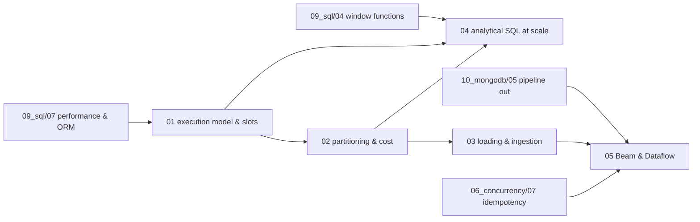

# BigQuery — syllabus

**Modules:** 5 · **Target length:** ~39,000 words · **Ladder target:** L4 across, L5 on cost control and on the Beam boundary
**Prerequisites:** [`09_sql/04`](09_sql_00_syllabus.md) for module 04 — window functions transfer directly; [`10_mongodb/05`](10_mongodb_00_syllabus.md) for module 05, which continues the same pipeline from the other side
**Feeds:** nothing downstream; this is the terminus of the data-engineering path
**Measurement status:** **partially measurable at zero cost** — `bq query --dry_run` returns real bytes-processed and the sandbox is free. Needs `gcloud`/`bq` installed
**Roles:** Data Engineer ●●● · Data Analyst ●●● · Fullstack SWE ○○○

---

## 1. Competencies

| ID | Competency | L | Probe | Tell | Roles | Module |
|---|---|---|---|---|---|---|
| `BQ-01` | Explain columnar storage and why it changes which queries are cheap | L4 | "Why is BigQuery fast on huge tables?" | Shallow: *"it's distributed."* Senior: Capacitor stores column-wise, so a query reads only the columns it names and compresses far better on homogeneous data — which is the direct reason `SELECT *` is the most expensive habit in the product and why adding a column to a query has a visible price | DE ●●● DA ●●● | `01` |
| `BQ-02` | Describe the Dremel execution tree and the slot model | L5 | "What is a slot?" | Shallow: *"a unit of compute."* Senior: a unit of parallel execution allocated to stages of a query tree; the query decomposes into stages that fan out across slots and aggregate back up, so a stage that cannot parallelise becomes the wall-clock floor no matter how many slots are free | DE ●●● | `01` |
| `BQ-03` | Read a query execution graph and identify a shuffle bottleneck | L5 | "One stage of this query takes ninety percent of the time." | Shallow: *"it's a big table."* Senior: reads stage timings from `INFORMATION_SCHEMA.JOBS`, compares max to average slot time within the stage to detect **skew**, and names the usual cause — a join key with a dominant value sending most rows to one worker | DE ●●● | `01` |
| `BQ-04` | Distinguish broadcast from shuffle joins and know what triggers each | L4 | "How does BigQuery join two large tables?" | Shallow: *"like any database."* Senior: a small side gets broadcast to every worker; two large sides require a shuffle, redistributing both by the join key — so join key cardinality and side size drive the plan, and a shuffle is where skew becomes visible | DE ●●● | `01` |
| `BQ-05` | Explain on-demand versus capacity pricing and when each wins | L4 | "How does BigQuery pricing work?" | Shallow: *"you pay per query."* Senior: on-demand bills bytes **scanned** with no concurrency guarantee; Editions reservations buy slots with autoscaling and predictable spend; the crossover is when spend becomes both large and steady — spiky workloads are usually cheaper on demand | DE ●●● DA ●● | `01` |
| `BQ-06` | Explain why bytes scanned is the only cost metric that matters on demand | L4 | "How do you make a BigQuery query cheaper?" | Shallow: *"add a `LIMIT`."* Senior: **`LIMIT` does not reduce bytes scanned** — it limits output, not input, which is the single most common misconception; cost falls only by touching fewer columns and fewer partitions | DE ●●● DA ●●● | `02` |
| `BQ-07` | Choose a partitioning strategy and know the three kinds | L5 | "How would you partition this table?" | Shallow: *"by date."* Senior: names ingestion-time, column-based (date/timestamp) and integer-range partitioning, picks by how queries filter rather than by how data arrives, and notes the roughly four-thousand partition ceiling that makes hourly partitioning a trap on long histories | DE ●●● | `02` |
| `BQ-08` | Use `require_partition_filter` and explain what it prevents | L4 | "How do you stop someone running a full-table scan by accident?" | Shallow: *"code review."* Senior: `require_partition_filter` makes an unfiltered query **fail** rather than succeed expensively, which converts a silent four-figure invoice into an error message — plus `maximum_bytes_billed` as the second guard | DE ●●● | `02` |
| `BQ-09` | Explain clustering and how it differs from partitioning | L5 | "What's the difference between partitioning and clustering?" | Shallow: *"both make queries faster."* Senior: partitioning physically separates data with hard pruning boundaries; clustering sorts within partitions so blocks can be skipped, giving soft pruning that improves with filter selectivity and degrades as new data arrives until re-clustering catches up | DE ●●● DA ●● | `02` |
| `BQ-10` | Use a dry run to price a query before running it | L4 | "How do you know what a query will cost before you run it?" | Shallow: *"you don't."* Senior: `--dry_run` returns exact bytes that would be processed, costs nothing, and belongs in CI as a budget check — the cheapest cost control available and the one nobody uses | DE ●●● DA ●●● | `02` |
| `BQ-11` | Explain materialised views, BI Engine and cached results | L4 | "The dashboard hits the same query all day." | Shallow: *"cache it in the app."* Senior: BigQuery caches identical query results free for 24 hours, materialised views maintain incremental precomputation that the optimiser can substitute automatically, and BI Engine holds an in-memory layer for dashboards — three different tools with three different staleness contracts | DE ●●● DA ●●● | `02` |
| `BQ-12` | Attribute cost back to a team or pipeline | L4 | "Which pipeline is spending the money?" | Shallow: *"check the billing console."* Senior: labels on jobs plus `INFORMATION_SCHEMA.JOBS` gives per-query bytes and slot-ms attributable by user, label and destination — and notes this is the artefact that makes a cost conversation possible at all | DE ●●● | `02` |
| `BQ-13` | Choose between load jobs, the Storage Write API and streaming inserts | L5 | "How do you get data in?" | Shallow: *"stream it."* Senior: batch **load jobs are free** and should be the default; the Storage Write API is the modern streaming path with exactly-once semantics per stream; legacy streaming inserts cost per row and land in a buffer — so the real question is whether the freshness requirement justifies paying for ingestion at all | DE ●●● | `03` |
| `BQ-14` | Explain the streaming buffer and its DML restrictions | L4 | "You streamed bad rows and need to delete them." | Shallow: `DELETE FROM …`. Senior: rows in the streaming buffer cannot be modified by DML until they flush, so the delete fails or silently misses them — which is a strong argument for making the pipeline idempotent rather than planning to clean up afterwards | DE ●●● | `03` |
| `BQ-15` | Design deduplication for an at-least-once pipeline | L5 | "Your pipeline redelivered a batch." | Shallow: *"we'd deduplicate afterwards."* Senior: a deterministic business key plus `MERGE` on load, or `insertId` for the legacy streaming path with its limited window — and states the principle that the sink must be idempotent because the runner cannot promise exactly-once alone | DE ●●● | `03` |
| `BQ-16` | Handle schema evolution and name the one-way doors | L4 | "The source added a field." | Shallow: *"recreate the table."* Senior: adding a `NULLABLE` column and relaxing `REQUIRED` to `NULLABLE` are permitted in place; narrowing a type or renaming is not, and requires a rewrite — so `REQUIRED` is a decision you cannot cheaply reverse and should be used sparingly | DE ●●● | `03` |
| `BQ-17` | Choose between native tables, external tables and BigLake | L4 | "The data is already in GCS." | Shallow: *"load it."* Senior: external tables query in place with no storage cost but no partitioning benefits and slower scans; native tables cost storage and give full performance; BigLake adds governance over the external case — and the decision is query frequency versus data volume | DE ●●● | `03` |
| `BQ-18` | Model with `STRUCT` and `ARRAY` and query with `UNNEST` | L5 | "Why doesn't BigQuery need as many joins?" | Shallow: *"it does, same as SQL."* Senior: nested and repeated fields let one row hold a whole document, so the join is pre-materialised at write time and `UNNEST` flattens on read — which is exactly why a MongoDB document maps onto it more naturally than onto a normalised relational schema | DE ●●● DA ●●● | `04` |
| `BQ-19` | Use `QUALIFY` and window functions at warehouse scale | L4 | "Latest row per entity across a billion rows." | Shallow: a self-join on max timestamp. Senior: `ROW_NUMBER` partitioned, filtered with `QUALIFY` in a single pass without a subquery — and notes that the partition step is a shuffle, so skew in the partition key is what will make it slow | DA ●●● DE ●●● | `04` |
| `BQ-20` | Judge when approximate aggregation is professionally defensible | L5 | "`COUNT(DISTINCT)` on two billion rows is slow." | Shallow: *"let it run."* Senior: `APPROX_COUNT_DISTINCT` uses HyperLogLog++ with roughly one percent error at a fraction of the cost, and HLL sketches can be stored and merged incrementally — then makes the judgment call: fine for a trend line, not for a financial reconciliation | DA ●●● DE ●●● | `04` |
| `BQ-21` | Use `MERGE` for incremental models and understand its cost | L4 | "Update the warehouse table with today's changes." | Shallow: delete and reinsert everything. Senior: `MERGE` on a business key, with the source restricted to the affected partitions so the statement does not scan history — and notes that an unrestricted `MERGE` scans both sides in full | DE ●●● | `04` |
| `BQ-22` | Explain the Beam model: PCollection, windowing, watermarks and triggers | L5 | "How does Beam handle late data?" | Shallow: *"it processes it."* Senior: the watermark is the runner's estimate of event-time completeness; windows close when it passes their end, triggers decide when to emit, and allowed lateness governs what happens to stragglers — panes being the accumulating or discarding record of successive emissions | DE ●●● | `05` |
| `BQ-23` | Explain Dataflow autoscaling and fusion | L5 | "Your Dataflow job is slow and adding workers doesn't help." | Shallow: *"increase the machine size."* Senior: fusion merges adjacent steps into one stage, so a low-parallelism step can bottleneck everything fused to it; a reshuffle breaks fusion deliberately, and autoscaling cannot help when the constraint is a single non-parallel source | DE ●●● | `05` |
| `BQ-24` | Argue when Beam is the wrong tool | L5 | "Would you use Beam again for this?" | Shallow: *"yes, it worked."* Senior: names the alternatives honestly — Datastream or the Data Transfer Service for a straight managed sync, a scheduled query for in-warehouse transformation, dbt for modelling, a plain Cloud Run job for something small — and reserves Beam for genuine streaming with event-time semantics, because its operational cost is real | DE ●●● | `05` |

---

## 2. Prerequisite graph

Module 02 is the hub: cost control is the through-line of the whole product, and every other module refers back to bytes scanned.

---

## 3. Module manifest

| # | File | Scope | Words | Competencies | Status | Measurement |
|---|---|---|---|---|---|---|
| 01 | `01_the_execution_model_slots_and_shuffle.md` | Capacitor columnar storage, the Dremel execution tree, stages/slots/shuffle, reading the execution graph from `INFORMATION_SCHEMA.JOBS`, why skew presents as one long stage, broadcast versus shuffle joins, on-demand versus Editions with autoscaling. *Diagram: query stage DAG across a shuffle boundary* | ~7,500 | `BQ-01`–`BQ-05` | planned | documented → measured with sandbox |
| 02 | `02_partitioning_clustering_and_cost_control.md` | Bytes scanned as the bill; the three partitioning kinds; `require_partition_filter`; clustering and block pruning; why `SELECT *` and `LIMIT` mislead; dry runs; `maximum_bytes_billed`; materialised views, BI Engine and result caching; cost attribution by label | ~8,000 | `BQ-06`–`BQ-12` | **planned** — Phase 3 | **measured free via `--dry_run`** |
| 03 | `03_loading_streaming_and_the_ingestion_boundary.md` | Load jobs versus the Storage Write API versus legacy streaming inserts versus external and BigLake tables; batch versus streaming semantics; the streaming buffer and its DML restrictions; deduplication and idempotency keys; schema evolution and the `REQUIRED` one-way door; federated queries; Datastream and the Data Transfer Service | ~7,500 | `BQ-13`–`BQ-17` | planned | documented |
| 04 | `04_analytical_sql_at_scale.md` | `STRUCT`/`ARRAY` and `UNNEST` as the denormalisation model that replaces joins; window functions and `QUALIFY`; approximate aggregates and when approximation is defensible; `ARRAY_AGG` patterns; the `JSON` type; `MERGE` and incremental models; table clones, snapshots and time travel | ~8,000 | `BQ-18`–`BQ-21` | planned | measured with sandbox |
| 05 | `05_beam_dataflow_and_the_warehouse_contract.md` | The flagship-bullet module: the Beam model (PCollection, PTransform, windowing, watermarks, triggers, panes), runners and portability, Dataflow autoscaling and fusion, the Mongo-to-BigQuery pipeline end to end, `FILE_LOADS` versus `STREAMING_INSERTS` sinks, dead-letter patterns, reprocessing and idempotency, pipeline cost — and an honest section on when Beam is the wrong tool | ~8,000 | `BQ-22`–`BQ-24` | planned | documented + `reproduced-small` via DirectRunner |

---

## 4. Measurement plan

This topic has the worst starting position and a better path out of it than "we cannot measure the cloud."

**Three facts make BigQuery genuinely measurable without spending money.**

`bq query --dry_run` costs nothing and returns real bytes-processed. That makes the entire cost-control argument in module 02 a before-and-after measurement rather than an assertion: `SELECT *` versus named columns, with and without a partition filter, before and after clustering. Those are the module's central claims and they can carry the `measured` tag.

The BigQuery sandbox is free and needs no credit card, with a monthly free query allowance and a free storage tier, and `bigquery-public-data` provides genuinely large public tables to run against — so module 04's analytical SQL can be executed on real data at real scale.

`INFORMATION_SCHEMA.JOBS` returns `total_slot_ms` and per-stage timings for queries already run, which makes part of module 01's slot and shuffle discussion measurable too.

| Module | Measurable | Method | Setup needed |
|---|---|---|---|
| 01 | Stage timings and slot-ms for a public-dataset query; skew visible as max-versus-average slot time within a stage | `INFORMATION_SCHEMA.JOBS` | **install `gcloud`/`bq`** + free sandbox |
| 02 | **Bytes scanned before and after** each of: naming columns instead of `SELECT *`, adding a partition filter, adding a clustering key; and `LIMIT` shown to change bytes scanned **not at all** | `bq query --dry_run` — **zero cost** | install `gcloud`/`bq` |
| 03 | Schema relaxation accepted in place versus a narrowing change rejected; a streaming-buffer DML failure | sandbox, small table | sandbox |
| 04 | `UNNEST` against nested public data; `APPROX_COUNT_DISTINCT` error rate versus exact on a large public table; `MERGE` bytes with and without a partition restriction | public datasets | sandbox |
| 05 | A Beam pipeline run on the **DirectRunner locally** — windowing, triggers and a dead-letter path demonstrated end to end without Dataflow | `apache-beam[gcp]` locally | pip install |

**What remains genuinely unmeasurable, permanently tagged `documented`:** Dataflow autoscaling and fusion under real load, watermark behaviour at volume, slot contention under a reservation, and anything about a multi-terabyte production pipeline. Module 05 carries the tag in its front matter and repeats it in prose at each point of use.

---

← [repo index](../../../README.md) · [measurement ledger](../../MEASUREMENTS.md) · [writing contract](../../AGENTS.md)
