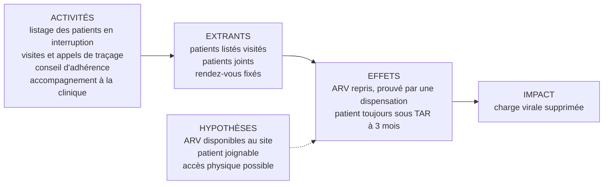
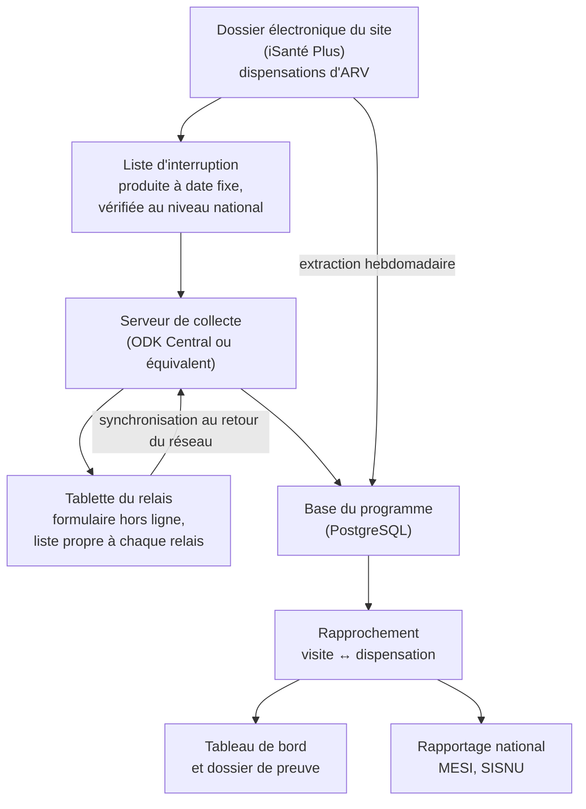

# La chaîne MEL de bout en bout : du cadre au tableau de bord

*Module 2. C'est la démonstration que tu veux faire demain : montrer que tu sais monter toute la
chaîne, du cadre MEL jusqu'au tableau de bord, en passant par la numérisation de la collecte, et
vite. On construit une seule chose, du début à la fin : le système de suivi du mandat que
l'Institut porte déjà dans EpiC, le **traçage et le retour en soins des patients en interruption
de traitement**. Les chiffres de ce module sortent d'un jeu de données **fictif** fourni dans
[`exercices/`](exercices/). Pour les régénérer : `python3 generer_donnees.py`, puis
`sqlite3 panos_iit.db < requetes.sql`. En entretien, dis « sur un jeu de données d'exercice »,
jamais « dans un programme ».*

---

## 1. Le problème : un programme qui mesure ce que ses relais racontent

Voici comment fonctionne, dans beaucoup d'organisations, le suivi d'un programme de traçage. Le
site imprime une liste de patients qui ne sont pas venus chercher leurs ARV. Les relais
communautaires partent avec la liste, visitent, et notent le résultat sur une fiche papier. Les
fiches sont photographiées et envoyées par WhatsApp au superviseur, qui les recopie dans un
classeur Excel. À la fin du mois, quelqu'un additionne les colonnes et écrit dans le rapport :
« 41 patients sont revenus en soins sur 105 listés, soit 39 % ».

Ce chiffre a quatre défauts, et aucun n'est visible dans le rapport. Certains codes patients ont
été mal recopiés, et leur visite ne se rattache à personne. Deux relais ont parfois visité le même
patient. « Revenu » veut dire que le patient a promis de passer. Et une partie des patients
« perdus » ne l'étaient pas : ils prenaient leurs ARV sur un autre site.

Sur le jeu de données d'exercice, quand on corrige les quatre défauts, **39 % de retours
déclarés deviennent 29,3 % de retours vérifiés.** Dans un programme payé sur jalons, ces dix
points sont la différence entre un paiement et une retenue. Le reste du module construit, étape
par étape, le système qui produit le second chiffre plutôt que le premier.

L'analogie bancaire du module 01 tient toujours : la fiche du relais est le **bon de commande**, la
dispensation d'ARV dans le dossier électronique est la **facture acquittée**, et le rapprochement
des deux est le **rapprochement bancaire**. On ne comptabilise pas une vente sur un bon de
commande.

---

## 2. Étape 1 : la théorie du changement, en une page

Tout commence par une phrase qui dit pourquoi les activités devraient produire le résultat. Si on
retrouve les patients qui ont interrompu leur traitement, qu'on comprend pourquoi ils ont
interrompu, qu'on lève l'obstacle et qu'on les accompagne jusqu'à la clinique, une partie d'entre
eux reprendra ses ARV ; s'ils sont soutenus dans les semaines suivantes, ils resteront sous
traitement ; et s'ils restent sous traitement, leur charge virale sera supprimée.

Cette phrase contient une chaîne de résultats, et surtout des **hypothèses** : que les ARV soient
disponibles au site, que le patient soit joignable, que la route soit praticable. En Haïti en
2026, la troisième n'a rien de théorique. Une théorie du changement qui n'écrit pas ses hypothèses
ne permet pas de distinguer un échec du programme d'un échec du contexte, et c'est pourtant la
première question que posera le Chief of Party quand un chiffre baissera.



La méthode générale (théorie du changement, chaîne de résultats, cadre logique) est écrite dans
[`../assitant_pmel/01_meal_processus.md`](../assitant_pmel/01_meal_processus.md) § 2. Ici, seul
compte ce qu'on en tire pour les indicateurs.

---

## 3. Étape 2 : le cadre de résultats et les indicateurs

Chaque case de la chaîne reçoit ses indicateurs. Le tableau est court à dessein : un programme de
six mois qui suit quarante indicateurs n'en suit réellement aucun.

| Niveau | Indicateur | Source | Fréquence |
|---|---|---|---|
| Impact | Taux de suppression virale des patients revenus, avec sa couverture | Résultats de charge virale (dossier électronique, laboratoire) | Trimestrielle |
| Effet, payant | Proportion des patients en interruption vérifiée listés qui ont repris leurs ARV (fiche complète au module 01 § 4) | Liste, fiches de traçage, dispensations | Mensuelle, jalon trimestriel |
| Effet | Proportion des rendez-vous manqués rattrapés avant 28 jours | Liste des rendez-vous manqués, dispensations | Mensuelle |
| Effet | Proportion des patients revenus toujours sous traitement trois mois après | Dispensations | Mensuelle, en cohorte |
| Extrant | Proportion des patients listés visités dans les 14 jours | Fiches de traçage | Hebdomadaire |
| Extrant | Proportion des patients visités effectivement joints | Fiches de traçage | Hebdomadaire |
| Qualité des données | Facteur de vérification des retours ; taux de codes orphelins ; délai entre visite et synchronisation | Base du programme | Mensuelle |

Deux choix méritent d'être expliqués à voix haute, parce qu'ils montrent la réflexion. Le premier
est l'indicateur de **rétention après le retour** : un patient qui revient une fois et disparaît de
nouveau le mois suivant n'est pas un succès, et un jalon qui ne regarde que le retour récompense
les retours d'un jour. Le second est la ligne **qualité des données**, qui fait du facteur de
vérification un indicateur de gestion, suivi chaque mois, et non une découverte du vérificateur.

---

## 4. Étape 3 : le chemin de la donnée

Avant de choisir un outil, on dessine qui enregistre quoi, où et quand. C'est l'étape que tout le
monde saute, et c'est celle qui décide de la qualité de tout le reste.



**Suivons une patiente d'un bout à l'autre**, appelons-la Madame J. Le 1er juin, la liste
d'interruption de son site la fait apparaître : ses ARV devaient s'épuiser le 20 avril, et aucune
dispensation n'a été enregistrée depuis. Avant d'aller plus loin, le système vérifie qu'aucun autre
site ne l'a servie : c'est le contrôle qui écarte les faux interrompus. Madame J. est bien en
interruption, et elle est ajoutée à la liste du relais de son quartier, qui la reçoit sur sa
tablette à la synchronisation suivante.

Le 9 juin, le relais la retrouve. Il n'a pas de réseau, et ce n'est pas un problème : le formulaire
fonctionne hors ligne. Il choisit Madame J. dans **sa** liste plutôt que de taper son code, note
qu'elle a été jointe, qu'elle a arrêté parce qu'elle avait déménagé chez sa sœur, et qu'un
rendez-vous a été fixé au site le plus proche pour le 12 juin. La fiche part au serveur le soir,
quand la tablette retrouve le réseau.

Le 12 juin, Madame J. reprend ses ARV. La dispensation est saisie dans le dossier électronique du
site. Le lundi suivant, l'extraction hebdomadaire l'amène dans la base du programme, où la
requête de rapprochement trouve une dispensation dans les 30 jours qui suivent la visite : le
retour est **vérifié**. Madame J. compte désormais au numérateur du jalon, avec trois pièces qui la
prouvent (la ligne de la liste, la fiche de visite, la dispensation), et elle entrera dans
l'indicateur de rétention si elle revient chercher ses ARV à l'échéance suivante.

Nulle part dans ce parcours le relais n'a eu à écrire « revenu ». C'est volontaire, et l'étape
suivante explique pourquoi.

---

## 5. Étape 4 : numériser la collecte

### D'abord, casser la version naïve

La version naïve du formulaire numérique reproduit la fiche papier : un champ texte « code
patient », un choix « résultat », une case « le patient est revenu ». Voici ce que produit le champ
texte sur le jeu d'exercice (étape 2 de `requetes.sql`) :

```
code_patient_saisi  agent  date_visite
------------------  -----  -----------
ch03-00098          R05    2026-06-20
LM04-0008           R12    2026-06-15
```

Deux visites ne se rattachent à aucun patient listé. La première est en minuscules, et une
normalisation (passer en majuscules, remplacer l'espace par un tiret) la récupère. La seconde a
perdu un chiffre : `LM04-0008` peut être `LM04-00008`, `LM04-00080` ou `LM04-00800`, et aucune
règle ne permet de décider. **Cette visite est perdue** tant que quelqu'un ne rappelle pas le
relais, et si le patient est revenu, son retour ne comptera pas. Sur un jalon, une visite perdue
est un retour non payé.

La case « revenu » est pire, parce qu'elle a l'air de fonctionner. Elle enregistre une promesse, et
la section 6 montre ce que vaut cette promesse une fois confrontée aux dispensations.

### Ensuite, le formulaire qui rend ces erreurs impossibles

Le principe, développé dans
[`../cmmb_meal_officer/06_hmis_et_qualite_donnees.md`](../cmmb_meal_officer/06_hmis_et_qualite_donnees.md)
§ 4, est de **déplacer le contrôle vers l'amont** : une erreur rendue impossible à la saisie n'a
pas besoin d'être nettoyée. Voici la feuille `survey` du formulaire XLSForm, en version courte.

| type | name | label | required | constraint | relevant | choice_filter |
|---|---|---|---|---|---|---|
| start | debut | | | | | |
| end | fin | | | | | |
| deviceid | appareil | | | | | |
| select_one agents | agent | Relais | yes | | | |
| select_one_from_file liste_iit.csv | patient | Patient à visiter | yes | | | `agent=${agent}` |
| text | code_carte | Code lu sur la carte du patient | yes | `. = ${patient}` | `${resultat}='joint'` | |
| date | date_visite | Date de la visite | yes | `. <= today() and . >= date('2026-06-01')` | | |
| select_one resultat | resultat | Résultat de la visite | yes | | | |
| select_one motifs | motif | Motif principal de l'interruption | yes | | `${resultat}='joint'` | |
| select_one oui_non | rdv_fixe | Rendez-vous fixé à la clinique ? | yes | | `${resultat}='joint'` | |
| date | date_rdv | Date du rendez-vous | yes | `. >= ${date_visite}` | `${rdv_fixe}='oui'` | |
| note | recap | Vous enregistrez : ${patient}, ${resultat} | | | | |

Chaque ligne répond à un des défauts. Le patient se **choisit dans une liste** (`select_one_from_file`
sur un fichier CSV joint au formulaire), et le `choice_filter` ne montre au relais que **ses**
patients : il ne peut ni taper un code faux, ni visiter le patient d'un collègue, ce qui supprime
à la source la plupart des doublons. Le **code lu sur la carte** doit être égal au patient
sélectionné, ce qui empêche d'enregistrer la visite sur la mauvaise ligne de la liste. La date ne
peut être ni dans le futur ni avant le début de la période. Le **récapitulatif** affiché avant
validation laisse au relais une dernière chance de voir son erreur, sur place, pendant que la
vérité est encore vérifiable.

Et surtout, **le formulaire ne demande plus si le patient est revenu.** Il demande si un
rendez-vous a été fixé, et quand. Le retour, lui, sera établi par la dispensation. C'est la
correction de la dérive de définition du module 01 § 5 : le relais témoigne de ce qu'il a fait et
vu, le dossier électronique témoigne de ce que le patient a fait.

Deux lignes manquent volontairement, et il faut savoir dire pourquoi. Il n'y a **pas de point GPS** :
la position d'un domicile, associée à un code de patient VIH, identifie une personne vivant avec le
VIH, et le programme n'en a pas besoin pour prouver quoi que ce soit. Et il n'y a **ni nom ni
adresse** dans les soumissions : le relais en a besoin pour trouver le patient, donc ils sont dans
le fichier de liste sur la tablette, mais la fiche remonte avec le code seul.

**La protection des appareils**, parce qu'une tablette qui contient une liste de PVVIH avec leurs
adresses est l'objet le plus sensible du programme. Le formulaire est **chiffré** (ODK permet de
chiffrer les soumissions avec une clé publique, de sorte que le serveur lui-même ne les lit pas en
clair), la tablette est protégée par code, chaque relais ne reçoit que sa liste, et la liste est
remplacée à chaque cycle. Le sujet de fond est traité dans
[`../acted_bdd/04_securite_protection_donnees.md`](../acted_bdd/04_securite_protection_donnees.md).

Une précision d'outil, à dire avec prudence : les versions récentes d'ODK Central proposent des
**entités**, des listes de suivi qu'on met à jour à partir des soumissions elles-mêmes, pensées pour
exactement ce genre de suivi longitudinal. Si l'Institut utilise déjà CommCare ou un outil fourni
par EpiC, on garde le leur : la bonne réponse n'est jamais « changeons d'outil », c'est « voici les
contrôles que l'outil doit porter ».

---

## 6. Étape 5 : la base et les requêtes, pour faire parler les données

Le jeu d'exercice contient quatre tables : les `patients` (900, sur six sites fictifs du Nord, de
l'Ouest et du Sud), les `dispensations` façon iSanté Plus (6 682 lignes, avec dispensation
multi-mois), la `liste_iit` produite par chaque site au 1er juin 2026, et les `visites_tracage`
saisies par douze relais. Trois défauts y sont injectés exprès : des codes mal saisis, des visites
en double, et des patients servis sur un autre site que le leur.

**La cascade naïve** d'abord, qui compte les lignes comme elles arrivent :

```
listes  visites  joints  retours_declares
------  -------  ------  ----------------
105     92       52      41
```

C'est le « 41 sur 105, soit 39 % » du rapport de la section 1.

**Les doublons.** Un regroupement par code normalisé montre trois patients visités deux fois, par
deux relais différents (`CH03-00043`, `CH03-00119`, `PV01-00011`). La requête qui garde une seule
visite par patient utilise une fonction de fenêtre :

```sql
ROW_NUMBER() OVER (
    PARTITION BY UPPER(REPLACE(TRIM(code_patient_saisi), ' ', '-'))
    ORDER BY date_visite, visite_id) AS rang
```

Ce que fait la machine, en mots : elle normalise chaque code saisi, regroupe les visites qui
partagent le même code normalisé, les trie par date, et numérote chaque groupe à partir de 1. On
garde ensuite `rang = 1`, c'est-à-dire la première visite de chaque patient. Les 92 lignes
deviennent 88 visites uniques : trois doublons retirés, et la visite au code irrécupérable qui ne
se rattache à personne.

**Le retour vérifié.** Pour chaque patient visité, on cherche une dispensation dans les 30 jours qui
suivent la visite, sur n'importe quel site :

```sql
COALESCE((
    SELECT 1 FROM dispensations d
    WHERE d.code_patient = l.code_patient
      AND julianday(d.date_dispensation) >  julianday(v.date_visite)
      AND julianday(d.date_dispensation) <= julianday(v.date_visite) + 30
), 0) AS retour_verifie
```

Le résultat, étape 4 du fichier :

```
listes  visites_uniques  joints  retours_declares  retours_verifies  declares_et_verifies  facteur_verification
------  ---------------  ------  ----------------  ----------------  --------------------  --------------------
105     88               51      40                34                31                    0.78
```

Sur les 40 retours déclarés, 31 sont confirmés par une dispensation : le **facteur de
vérification est de 0,78**. Et un détail doit arrêter l'œil : 34 retours sont vérifiés, soit plus
que les 31 déclarés et vérifiés. Trois patients ont donc une dispensation sans que le relais ait
déclaré de retour. Tant mieux pour eux, mais c'est suspect pour le système : qui sont-ils ?

**Les faux interrompus.** La réponse est dans le contrôle d'identité nationale. On marque comme
« faux IIT » tout patient listé qu'une dispensation d'un **autre** site couvrait à la date de la
liste :

```sql
EXISTS (
    SELECT 1 FROM dispensations d
    WHERE d.code_patient = l.code_patient
      AND d.site_dispensation <> l.site
      AND d.date_dispensation < l.date_listage
      AND julianday(d.date_dispensation) + d.jours_fournis + 28
          >= julianday(l.date_listage)
) AS faux_iit
```

En mots : pour un patient listé, la machine cherche une dispensation faite ailleurs avant la date
de la liste, ajoute les jours d'ARV fournis et le délai de grâce de 28 jours, et regarde si l'on
arrive au-delà de la date de la liste. Si oui, le patient n'a jamais été en interruption : il avait
simplement changé de site.

```
faux_iit  listes  pct_liste  faux_retours_verifies  faux_retours_declares
--------  ------  ---------  ---------------------  ---------------------
13        105     12.4       7                      4
```

Treize patients sur 105, **12,4 % de la liste**, n'avaient jamais interrompu. C'est le même ordre de
grandeur que les 14 % mesurés à l'échelle nationale sur SALVH par l'étude de 2025. Et sept d'entre
eux passaient pour des « retours vérifiés », puisqu'ils continuaient de retirer leurs ARV sur leur
nouveau site. **Un retour vérifié pour quelqu'un qui n'est jamais parti** : c'est exactement ce
qu'un vérificateur attentif trouvera, et c'est pourquoi le contrôle d'identité se fait avant la
vérification des retours, et non après.

**La cascade propre**, enfin, où les faux interrompus sortent du dénominateur et du numérateur :

```
vrais_iit  visites  joints  retours_declares  retours_verifies  facteur_verification  pct_revenus
---------  -------  ------  ----------------  ----------------  --------------------  -----------
92         78       46      36                27                0.75                  29.3
```

**27 retours vérifiés sur 92 patients réellement en interruption, soit 29,3 %.** C'est le chiffre
qu'on peut présenter à un vérificateur, et il est dix points en dessous du chiffre naïf. Ce n'est
pas une mauvaise nouvelle : c'est le premier chiffre du programme sur lequel on peut piloter.

---

## 7. Étape 6 : le tableau de bord

La dernière requête du fichier produit le tableau par site qui alimente le tableau de bord :

```
site  listes  faux_iit  vrais_iit  visites  declares  verifies  pct_revenus
----  ------  --------  ---------  -------  --------  --------  -----------
CH03  23      1         22         18       7         6         27.3
CY05  21      5         16         13       7         5         31.3
DL02  14      0         14         13       5         4         28.6
LM04  19      4         15         15       7         6         40.0
PV01  15      2         13         10       4         3         23.1
TO06  13      1         12         9        6         3         25.0
```

Ce tableau raconte déjà trois histoires différentes, et c'est à cela qu'on reconnaît un bon
tableau de bord : il pose des questions précises. **TO06** déclare six retours et n'en voit que trois
confirmés, un facteur de 0,5, le plus bas du programme : ses relais notent probablement une
promesse comme un retour, et c'est un sujet d'accompagnement, pas de sanction. **CY05** a cinq faux
interrompus sur vingt et un listés, près d'un quart : ses patients partent vers d'autres sites, et
sa liste doit être vérifiée au niveau national avant d'être envoyée aux relais. **PV01** n'a visité
que dix de ses treize patients : c'est un problème de couverture du traçage, pas de qualité.

**Un tableau de bord par public, pas un pour tous.** Le **Chief of Party** a besoin d'une page :
l'état de chaque jalon, la trajectoire par rapport à la cible, le facteur de vérification du mois,
et les sites qui menacent le jalon. Le **MSPP et les directions départementales** ont besoin des
sites, de la complétude et du rapport de réconciliation avec les systèmes nationaux. Les
**superviseurs de terrain** n'ont pas besoin de pourcentages : ils ont besoin de la liste des
patients à visiter cette semaine, par relais, et de ceux dont la visite n'a pas été synchronisée.

**Les règles de construction**, qui valent quel que soit l'outil. Aucun taux ne s'affiche sans son
dénominateur à côté, parce que 40 % de 15 et 40 % de 150 ne sont pas le même résultat. Le taux de
complétude et la date de la dernière extraction figurent sur chaque page. Les seuils de couleur
(vert, orange, rouge) sont écrits dans la fiche d'indicateur, pas choisis à l'œil. Et le taux d'un
département se calcule en **rapportant la somme des numérateurs à la somme des dénominateurs**,
jamais en faisant la moyenne des taux des sites ; le module
[`04_analyse_et_tableaux_de_bord.md`](04_analyse_et_tableaux_de_bord.md) § 3 montre l'erreur et sa
correction dans Power BI.

**La contrainte haïtienne**, enfin : un tableau de bord qui n'existe qu'en ligne ne sert à rien le
jour où la connexion tombe. Une version PDF datée, envoyée chaque mois, reste la forme la plus
robuste, et c'est aussi elle qui entre dans le dossier de preuve.

---

## 8. Étape 7 : apprendre et améliorer, le « L » de MEL et l'ACQ

Le titre du poste réunit deux sigles : **MEL**, dont la dernière lettre est l'apprentissage, et
**ACQ**, l'amélioration continue de la qualité. Ils décrivent la même boucle vue de deux endroits :
l'apprentissage répond à des questions de programme, l'amélioration continue corrige des processus
de soin et de service.

**L'ACQ n'arrive pas dans le vide en Haïti.** Le MSPP a lancé en **2007**, avec le financement du
PEPFAR par le CDC, un programme national de gestion de la qualité des soins VIH fondé sur la
méthode **HIVQUAL** du département de la santé de l'État de New York, avec **dix indicateurs de
performance VIH programmés dans iSanté**. Il est devenu **HEALTHQUAL** en 2012, élargi à la santé
maternelle et infantile et à la médecine générale, et couvrait plus de cent établissements en 2017.
Proposer une démarche d'amélioration continue « à côté » de ce dispositif serait une erreur ; la
bonne posture est de s'y adosser.

**Un cycle d'amélioration, sur le cas de TO06.** Le cycle classique s'appelle PDSA, *Plan, Do,
Study, Act* (planifier, faire, étudier, agir). On part du constat : le facteur de vérification de
TO06 est de 0,5. On formule une hypothèse de cause, qu'on vérifie en parlant aux relais : ils
notent le retour au moment de la promesse. On choisit un changement et on le teste petit : pendant
quatre semaines, sur TO06 seulement, chaque rendez-vous fixé est communiqué le jour même au site,
et le superviseur appelle la clinique le vendredi pour savoir qui est venu. On mesure le facteur de
vérification à la fin des quatre semaines. Et on décide : adopter le changement, l'adapter, ou
l'abandonner. Le point à faire passer est la taille du test : on ne change pas une procédure sur
six sites sur la foi d'une intuition.

**Le programme d'apprentissage.** Trois questions suffisent pour six mois, à condition que les
données collectées permettent d'y répondre. **Quels patients reviennent et restent ?** Le motif
d'interruption recueilli par le formulaire, croisé avec la rétention à trois mois, dit si ceux qui
ont déménagé reviennent aussi durablement que ceux qui avaient des effets secondaires. **Quel canal
ramène le plus de patients par heure de relais** : la visite, l'appel, le SMS ? La réponse décide
de l'allocation des relais, et l'Institut a justement une ligne et une plateforme SMS. **Les retours
durent-ils ?** Si la rétention à trois mois des patients revenus est faible, le programme ramène
des gens qu'il perd aussitôt, et le jalon masque un échec. Ces questions se discutent dans une
**revue mensuelle des données** avec les équipes, et dans une pause de réflexion plus longue au
troisième mois, qui est aussi le moment où le programme peut encore changer de cap.

---

## 9. Le plan de six mois

Voici le plan que tu peux dérouler si l'on te demande « par quoi commenceriez-vous ». Il se dit en
une minute, et il est volontairement chargé au début.

| Période | Ce qui est livré |
|---|---|
| Semaines 1 et 2 | Écouter et cartographier : qui enregistre quoi, dans quel outil, avec quelle définition ; inventaire des outils existants (ceux d'EpiC, de l'Institut, du MSPP, dont PLR et Radar) ; premier jet du cadre et des fiches d'indicateurs |
| Semaines 3 et 4 | Cadre et fiches validés avec le Chief of Party et le MSPP ; formulaire construit et testé sur un ou deux sites ; situation de référence tirée des données existantes |
| Mois 2 | Déploiement sur tous les sites, formation des relais, tableau de bord en production, première pré-vérification interne |
| Mois 3 | Premier rapport de réconciliation avec MESI, le SISNU et iSanté Plus ; premier jalon trimestriel ; pause de réflexion et ajustements |
| Mois 4 et 5 | Cibles de performance, cycles d'amélioration sur les sites en difficulté, réponses aux questions d'apprentissage ; les responsables de données départementaux produisent les rapports avec l'équipe |
| Mois 6 | Vérification finale, transfert des outils, des données et de la documentation au MSPP, rapport d'apprentissage |

La première ligne est la plus importante, et il faut la défendre si on te trouve lent : **deux
semaines d'écoute ne sont pas deux semaines perdues**. Un système MEL construit sans avoir compris
les flux existants ajoute un outil de plus à des équipes qui en ont déjà trop, et c'est la raison
la plus fréquente pour laquelle un système n'est pas utilisé. Mais ces deux semaines produisent
déjà un livrable, le premier jet du cadre, ce qui répond à l'objection.

---

## 10. Ce que ton expérience prouve déjà, maillon par maillon

C'est la partie à dire avec le plus d'assurance, parce que chaque maillon renvoie à une ligne de ton
CV.

Le **cadre et les tableaux de suivi des indicateurs** : chez HANWASH, tu as raffiné des plans MEAL
et des tableaux de suivi alignés sur les normes JMP ; chez Anseye Pou Ayiti, tu as défini la
stratégie de collecte et mis en œuvre les indicateurs de performance de trois programmes, de la
définition de l'indicateur jusqu'à sa restitution, entre janvier et mars 2026, c'est-à-dire en trois
mois. La **collecte numérique** : les formulaires XLSForm pour ODK avec logiques de saut et
contraintes de validation, et l'administration du système ODK, chez Anseye ; la mise en place de
CommCare, HIVHaiti et d'une base MySQL intégrée à la Caris Foundation ; les enquêtes géospatiales
sur mWater chez HANWASH. L'**ingénierie des données** : les pipelines ETL vers BigQuery et
l'administration de bases en accès concurrent chez Tekkod, les scripts d'intégration Python sur AWS
chez Anseye. La **qualité des données** : les protocoles DQA établis et supervisés chez Caris, avec
remontée au registre source. Les **tableaux de bord** : Power BI et Quarto sur AWS chez Caris,
mWater et Power BI chez HANWASH, Looker Studio chez Tekkod. Et la **formation** : les guides
techniques et la formation des équipes chez HANWASH, la formation des équipes de terrain chez
Anseye, la supervision des agents de collecte chez Caris.

La phrase qui referme, et qui est honnête :

> « Chacun des maillons de cette chaîne, je l'ai tenu quelque part. Ce que votre poste demande en
> plus, c'est de les tenir tous à la fois, en six mois, sous un mécanisme de paiement. C'est
> précisément pour cela qu'il m'intéresse. »

---

## Angles d'entretien

**« Vous avez six mois. Par quoi commencez-vous ? »**

« Par deux semaines d'écoute, mais qui produisent quelque chose. Je veux comprendre qui enregistre
quoi aujourd'hui, dans quel outil et avec quelle définition : les relais, les sites, les outils
d'EpiC, ce que le MSPP attend dans MESI et le SISNU. En parallèle j'écris le premier jet du cadre et
des fiches d'indicateurs, parce que dans un programme payé sur jalons ce sont des clauses de
contrat, et qu'elles doivent être validées avant le premier jour de collecte. Fin du premier mois,
le cadre est validé avec le Chief of Party et le ministère et le formulaire est testé sur un ou deux
sites. Le deuxième mois, on déploie, on forme, et le tableau de bord tourne. Le troisième mois, je
produis le premier rapport de réconciliation avec les systèmes nationaux, et je fais ma propre
vérification avant le premier jalon. Et les trois derniers mois servent à améliorer ce qui ne
marche pas et à transférer le système au ministère, parce qu'un programme de transition réussi est
un programme dont le ministère sait faire tourner le système sans nous. »

**« Comment numériseriez-vous le traçage des patients en interruption ? »**

« En rendant impossibles à la saisie les erreurs que je passerais sinon mon temps à nettoyer. Le
relais ne tape pas le code du patient, il le choisit dans sa propre liste, et il confirme en lisant
la carte du patient ; ça supprime les codes faux et la plupart des doublons. Le formulaire
fonctionne hors ligne et se synchronise quand le réseau revient. Et surtout, il ne demande pas si
le patient est revenu. Il demande si un rendez-vous a été fixé et à quelle date, parce que le
retour, c'est la dispensation dans le dossier électronique qui le prouve, pas la déclaration du
relais. Sur un jeu de données d'exercice, cette seule distinction fait passer le taux de retour de
39 à 29 %, une fois qu'on ajoute le contrôle des patients qui prenaient en réalité leurs ARV sur un
autre site. Enfin, pas de GPS et pas de nom dans les soumissions, formulaire chiffré, tablette
protégée : une liste de patients VIH avec leurs adresses est la donnée la plus sensible du
programme. »

**« Quel tableau de bord donneriez-vous au Chief of Party ? »**

« Une seule page. L'état de chaque jalon, atteint, en bonne voie ou menacé, avec la trajectoire par
rapport à la cible. Le facteur de vérification du mois, pour qu'il sache si les chiffres qu'il voit
tiendront devant le vérificateur. Et la liste courte des sites qui menacent le jalon, avec une ligne
d'explication pour chacun, parce qu'un site en retard pour un problème de couverture du traçage et
un site dont les relais déclarent des promesses comme des retours n'appellent pas la même décision.
Chaque taux s'affiche avec son dénominateur, et chaque page porte la date de la dernière extraction.
Le détail par site et la réconciliation, c'est une autre page, pour le ministère et pour l'équipe. »
