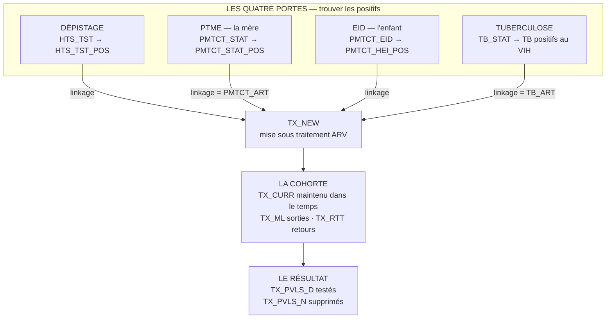
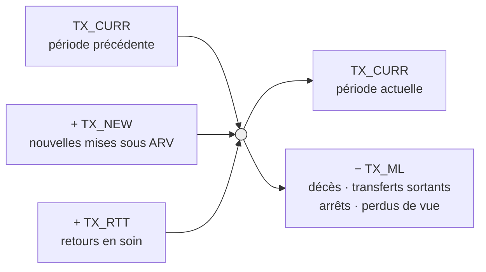
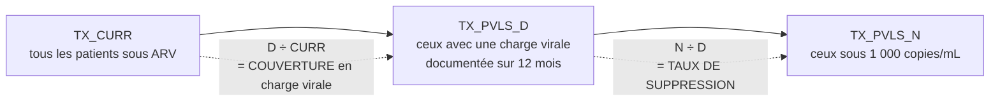
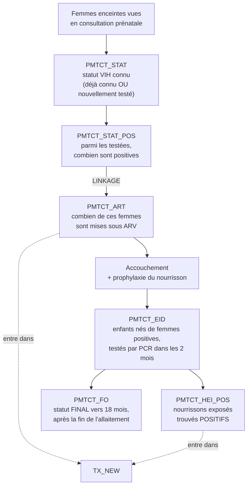
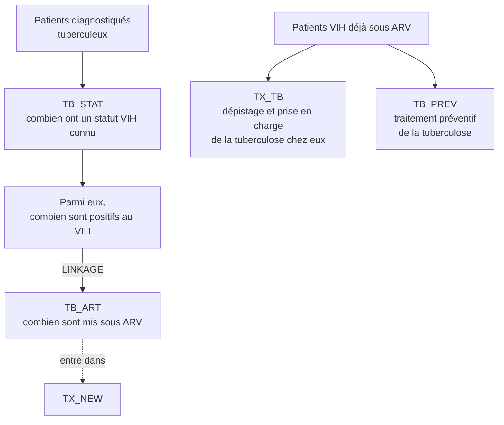

# Les indicateurs MER suivis par CMMB — la revue de trente minutes

*Fiche complémentaire à [`FICHE_SYNTHESE.md`](FICHE_SYNTHESE.md). Construite à partir de la liste
que **ton futur collègue de CMMB** t'a communiquée — c'est-à-dire les indicateurs **réellement
suivis et rapportés**, et non le référentiel complet. Les infographies PEPFAR FY25 Q1/Q2
(MER v2.8.2) fournissent les fréquences et les niveaux. Le référentiel complet des vingt-sept
indicateurs est en annexe, section 9.*

---

## 1. L'idée unique de cette fiche

**Quatre portes identifient des personnes positives. Elles débouchent toutes au même endroit :
`TX_NEW`.** Ensuite, une seule cohorte se gère dans le temps, et un seul indicateur en mesure le
résultat.

C'est tout. Si tu tiens cette phrase, tu tiens l'architecture entière, et tu peux répondre à
n'importe quelle question sur les relations entre chaînes — qui est exactement ce qu'on va te
demander.

**Et le mot qui relie tout s'appelle le *linkage*** : le rapport entre les personnes enrôlées sous
traitement et les personnes trouvées positives. Chaque porte a son linkage. C'est la charnière du
système, et c'est le concept le plus important de cette fiche.

**Trois observations à savoir formuler devant eux.**

Les quatre portes ne trouvent pas les mêmes gens. Le dépistage cherche activement ; la PTME
trouve à l'occasion d'une grossesse ; la tuberculose trouve à l'occasion d'une maladie ; l'EID
trouve un enfant que la prévention n'a pas protégé. **Une porte qui se ferme ne se compense pas
par une autre.**

Il n'y a **qu'un seul point de convergence**, `TX_NEW`. C'est pourquoi un `TX_NEW` qui stagne
n'est pas interprétable sans savoir laquelle des quatre portes a faibli.

Et il n'y a **qu'un seul indicateur de résultat**, `TX_PVLS`. Tout le reste est du processus.

---

## 2. Chaîne 1 — Le dépistage ciblé

**`HTS_TST`** — le nombre de personnes **dépistées et ayant reçu leur résultat**. La seconde
condition fait partie de la définition : un test réalisé dont le résultat n'a pas été rendu ne
compte pas. Se ventile par modalité de dépistage et par résultat.

**`HTS_TST_POS`** — parmi elles, celles dont le résultat est **positif**. C'est la désagrégation
positive de `HTS_TST`, pas un indicateur indépendant.

**Le ratio, à connaître par cœur :**

> **Yield = HTS_TST_POS ÷ HTS_TST**, appelé **taux de positivité** ou **rendement du dépistage**.

**Ce que le yield mesure réellement, et c'est le point à faire valoir : il ne mesure pas
l'épidémie, il mesure la qualité du ciblage.** Un yield qui s'effondre signifie qu'on teste
massivement des personnes à faible risque — beaucoup de tests consommés pour peu de cas trouvés.
Un yield anormalement élevé peut signifier l'inverse : qu'on ne teste pas assez large et qu'on
laisse des cas non diagnostiqués dans la communauté.

**Il n'existe donc pas de « bon » yield dans l'absolu**, et c'est la réponse intelligente si l'on
te demande quel niveau viser. Le yield se lit **par modalité** : le dépistage indexé — tester les
partenaires et les contacts d'une personne diagnostiquée — a structurellement le rendement le plus
élevé, parce qu'on teste des personnes réellement exposées ; le dépistage en consultation externe
a un rendement bas par construction. **Comparer le yield global de deux sites qui n'ont pas le même
mélange de modalités n'a aucun sens** — c'est un effet de composition, exactement le paradoxe de
Simpson décrit dans [`05_statistiques_et_analyse.md`](05_statistiques_et_analyse.md).

**La phrase à dire :** *« Le yield ne se commente pas seul : je le regarde par modalité, parce
qu'un yield global qui baisse peut simplement vouloir dire qu'on a élargi le dépistage
communautaire, ce qui est une bonne nouvelle et pas une mauvaise. »*

---

## 3. La charnière — le *linkage*

C'est le concept que ton collègue a nommé, et c'est le plus important de la fiche.

> **Linkage = personnes enrôlées sous traitement ÷ personnes trouvées positives**

Autrement dit : **sur cent personnes chez qui on a trouvé le virus, combien sont réellement entrées
en traitement ?** Le linkage mesure la marche entre « savoir » et « soigner », et c'est là que les
programmes perdent le plus de monde sans s'en apercevoir, parce que **les deux chiffres vivent
souvent dans deux registres différents**.

**Chaque porte a son linkage**, et le numérateur porte un nom différent selon la porte.

| Porte | Positifs trouvés (dénominateur) | Enrôlés (numérateur) |
|---|---|---|
| Dépistage | `HTS_TST_POS` | `TX_NEW` issu du dépistage |
| PTME — la mère | `PMTCT_STAT_POS` | **`PMTCT_ART`** |
| EID — l'enfant | `PMTCT_HEI_POS` | `TX_NEW` pédiatrique |
| Tuberculose | Patients TB positifs au VIH | **`TB_ART`** |

**Voici l'idée forte, celle qui vaut l'entretien.** `PMTCT_ART` et `TB_ART` **ne sont pas des
indicateurs de traitement au sens ordinaire : ce sont des indicateurs de linkage**. Ils répondent
tous les deux à la même question — parmi les positifs trouvés par cette porte-là, combien ont été
mis sous antirétroviraux ? La seule différence est la porte.

**Pourquoi le linkage se casse**, et il faut pouvoir le dire en trois causes. Premièrement, la
personne est testée à un endroit et doit aller se faire enrôler ailleurs — chaque déplacement est
une occasion de perdre quelqu'un. Deuxièmement, le résultat met du temps à revenir, et pendant ce
délai la personne devient injoignable. Troisièmement — et c'est la plus fréquente en pratique —
**le lien n'est pas cassé, il est seulement non documenté** : la personne est bien sous traitement,
mais son enrôlement a été enregistré dans un autre registre, sous un autre identifiant, sans qu'on
puisse la rattacher au test qui l'a trouvée.

**La conséquence opérationnelle, à formuler telle quelle :** *« Un linkage bas est d'abord une
hypothèse de problème de données avant d'être un constat de problème de service. La première chose
que je vérifie, ce n'est pas si les gens sont perdus, c'est si on sait les retrouver — c'est-à-dire
s'il existe un identifiant qui relie le registre de dépistage au registre de traitement. »*

C'est aussi ce qui relie cette fiche au module système d'information : en Haïti, la déduplication
nationale par empreinte digitale dans **SALVH** existe précisément pour cela — voir
[`06_hmis_et_qualite_donnees.md`](06_hmis_et_qualite_donnees.md).

---

## 4. Chaîne 2 — Le traitement, et la cohorte

Une fois la personne enrôlée, on quitte le monde des événements pour entrer dans celui des
**états maintenus dans le temps**. C'est le changement de nature le plus important de tout le
système.

**`TX_NEW`** — les personnes **nouvellement mises sous traitement antirétroviral** pendant la
période. Un **flux**, un événement qu'on incrémente.

**`TX_CURR`** — les personnes **actuellement sous traitement** à la fin de la période, en créole
*« li toujou sou TAR »*. Un **stock**, une photographie. C'est l'indicateur roi : il porte les
cibles, les budgets, et surtout **les commandes de médicaments** — un `TX_CURR` faux, ce sont des
antirétroviraux commandés en trop ou en trop peu.

**`TX_ML`** — *treatment: missed loss*. Les patients **sortis** de la file active, ventilés par
devenir : décédés, transférés sortants, ayant refusé ou arrêté, et en interruption (plus de
28 jours sans ARV après le dernier contact attendu), les interruptions étant elles-mêmes ventilées
selon le **temps passé sous traitement avant de décrocher**, moins de trois mois ou davantage, et
non selon la durée de l'absence. **La ventilation est l'essentiel** : un décès,
un transfert et une perte de vue ne veulent pas dire la même chose et n'appellent pas la même
action.

**`TX_RTT`** — *return to treatment*. Les patients qui avaient **interrompu** et qui ont
**repris** le traitement. C'est le retour en soin.

**Une précision de vocabulaire à avoir en tête, sans jamais corriger quelqu'un dessus.** On entend
souvent `TX_RTT` glosé comme « la rétention en soin ». Les deux notions sont voisines mais
distinctes : `TX_RTT` **compte les retours** après interruption, tandis que **la rétention est un
taux calculé sur une cohorte** — la proportion des patients enrôlés à une période donnée encore en
soin douze, vingt-quatre ou trente-six mois plus tard. Autrement dit, `TX_CURR`, `TX_ML` et
`TX_RTT` sont les trois indicateurs à partir desquels **on construit** la rétention ; aucun des
trois n'est la rétention. Si ton interlocuteur emploie les deux mots l'un pour l'autre, suis-le et
ne le reprends pas — mais sache faire la distinction si on te la demande.

### L'équation de cohorte

> **TX_CURR final = TX_CURR initial + TX_NEW + TX_RTT − TX_ML**

**C'est le premier contrôle qualité à mettre en place, et le plus révélateur.** Si l'équation ne
tombe pas juste, **il manque des sorties documentées** — et c'est presque toujours le cas.

**Le mécanisme de dégradation, à savoir raconter.** Quand un site est débordé, il continue à saisir
ses **actes** — les nouvelles mises sous traitement, les consultations — et il cesse de documenter
ses **sorties**, qui ne correspondent à aucun acte et que personne ne réclame. Résultat :
`TX_CURR` reste artificiellement haut, `TX_ML` s'effondre, et **le taux de rétention se met à
briller**. C'est le pire cas de figure du métier : **un indicateur qui s'améliore parce que la
qualité des données se dégrade.**

Et la conséquence est très concrète : un `TX_CURR` gonflé de patients fantômes fait commander des
antirétroviraux pour des gens qui ne viennent plus les chercher.

---

## 5. Chaîne 3 — La suppression virale

C'est le seul indicateur de résultat de tout le dispositif, et ton collègue a donné la bonne
notation, celle du terrain : **`TX_PVLS_D`** et **`TX_PVLS_N`**, le dénominateur et le numérateur.

**`TX_PVLS_D`** — les patients sous traitement ayant un **résultat de charge virale documenté au
cours des douze derniers mois**. Ce sont les « tests globaux » de ton collègue : tous ceux qu'on a
effectivement testés.

**`TX_PVLS_N`** — parmi eux, ceux dont la charge virale est **inférieure à 1 000 copies par
millilitre**, donc **supprimée**.

**Deux ratios, et il faut toujours les donner ensemble.**

> **Couverture en charge virale = TX_PVLS_D ÷ TX_CURR**
> **Taux de suppression = TX_PVLS_N ÷ TX_PVLS_D**

**Le piège, qu'on te tendra peut-être.** Le taux de suppression ne dit **rien** sur la couverture.
Un site qui ne teste que ses patients les mieux suivis — ceux qui viennent à tous leurs
rendez-vous — affichera un taux de suppression magnifique sur un dénominateur minuscule.
**On ne commente jamais un taux de suppression sans annoncer sa couverture dans la même phrase.**
Un 98 % sur une couverture de 30 % n'est pas un bon résultat, c'est une information manquante.

**Le seuil**, pour être exact : **moins de 1 000 copies par millilitre = supprimé**, c'est le seuil
de l'OMS et celui de l'indicateur PEPFAR. L'**indétectabilité**, autour de 50 copies, est un seuil
plus bas, celui du message ***U=U*** — indétectable égale intransmissible. Le troisième 95 de la
cible ONUSIDA porte sur la **suppression**, pas sur l'indétectabilité.

**Et pourquoi douze mois** : parce que l'OMS recommande une charge virale à six mois, à douze mois,
puis annuellement. Au-delà d'un an, un résultat ne dit plus rien de l'état actuel du patient.

---

## 6. Chaîne 4 — La PTME et l'EID

C'est la chaîne la plus longue, parce qu'elle suit **deux personnes** et qu'elle s'étale sur
**dix-huit mois**.

**Les définitions rapides, dans l'ordre de la chaîne.**

**`PMTCT_STAT`** — toute femme enceinte vue en consultation prénatale **dont le statut VIH est
connu**, que ce statut ait été établi ce jour-là ou avant. D'où la ventilation obligatoire entre
**statut déjà connu** et **nouvellement testé**. Attention : il compte un **statut connu**, pas un
test.

**`PMTCT_STAT_POS`** — parmi les femmes enceintes dont le statut est connu, **combien sont
positives**. C'est le dénominateur du linkage de cette porte.

**`PMTCT_ART`** — parmi ces femmes positives, **combien sont sous antirétroviraux**, mises ou
maintenues. Le protocole standard s'appelle **Option B+** : toute femme enceinte séropositive est
mise sous traitement **à vie**, indépendamment de son taux de CD4, et non seulement pendant la
grossesse et l'allaitement. **C'est l'indicateur de linkage de la porte PTME.**

**`PMTCT_EID`** — les **enfants nés de femmes positives**, testés par **PCR** dans les deux
premiers mois de vie.

**`PMTCT_HEI_POS`** — parmi ces nourrissons exposés, **ceux qui sont positifs**. C'est le
numérateur du taux de transmission, et l'indicateur qui dit si tout le reste a servi.

**`PMTCT_FO`** — le **statut final** de l'enfant, établi vers **dix-huit mois**, après la fin de
l'exposition, c'est-à-dire après l'allaitement. Il est **rapporté annuellement**, et la raison est
structurelle : un indicateur dont la définition impose un délai de dix-huit mois ne peut pas être
trimestriel.

**Les trois choses à savoir dire sur cette chaîne.**

**Pourquoi un test rapide ne marche pas sur un nourrisson.** Les tests rapides sont
**sérologiques** : ils cherchent les **anticorps**. Or le bébé porte **les anticorps de sa mère**,
transmis passivement pendant la grossesse, jusqu'à dix-huit mois — un test rapide serait positif
chez presque tous ces enfants, y compris ceux qui vont bien. Il faut un test **virologique**, une
**PCR ADN**, qui cherche le matériel génétique du virus lui-même. C'est toute la raison d'être de
`PMTCT_EID`, et c'est aussi pourquoi il faut attendre dix-huit mois pour un statut définitif par
sérologie.

**L'indicateur invisible qui compte le plus : le délai de rendu du résultat.** Le prélèvement part
sur goutte de sang séché vers un laboratoire central, et il peut s'écouler des semaines avant que
le résultat revienne au site puis à la mère. Un nourrisson infecté non traité a une mortalité très
élevée dans sa première année. **Un résultat exact qui arrive trop tard est un échec de programme**,
même si `PMTCT_EID` est excellent.

**Le piège des cohortes décalées.** La cohorte de nourrissons se constitue **neuf mois après** la
cohorte de femmes dépistées. Comparer sur une même période le nombre de femmes traitées et le
nombre d'enfants testés compare **deux populations décalées**, ce qui produit des taux absurdes
sans qu'aucun service ait changé.

---

## 7. Chaîne 5 — La tuberculose

La tuberculose est la **première cause de mortalité chez les personnes vivant avec le VIH**, et
c'est ce qui justifie que les deux programmes se croisent systématiquement.

**`TB_STAT`** — parmi les patients **tuberculeux**, ceux dont le **statut VIH est connu**. Même
logique de suffixe `_STAT` que pour la PTME : un statut connu, pas un test.

**`TB_ART`** — parmi les patients tuberculeux **positifs au VIH**, ceux qui sont **mis sous
antirétroviraux**. **C'est l'indicateur de linkage de la porte tuberculose**, exactement comme
`PMTCT_ART` l'est pour la porte PTME.

**Et les deux autres, qui prennent le problème par l'autre bout.** `TX_TB` compte le dépistage et
la prise en charge de la tuberculose **chez les patients déjà sous traitement VIH**. `TB_PREV`
compte le **traitement préventif** de la tuberculose chez les personnes vivant avec le VIH.

**La distinction à savoir énoncer, parce qu'elle est piégeuse :** `TB_STAT` et `TB_ART` regardent
**depuis le programme tuberculose** — on part d'un patient tuberculeux et on cherche le VIH.
`TX_TB` et `TB_PREV` regardent **depuis le programme VIH** — on part d'un patient VIH et on
cherche ou on prévient la tuberculose. **Quatre indicateurs, deux programmes, un même patient : ce
qui change, c'est le point de vue et donc le dénominateur.**

---

## 8. Le tableau de rappel, et les cinq ratios

### Définition rapide de chaque indicateur

| Code | Ce qu'il compte | Famille |
|---|---|---|
| `HTS_TST` | Personnes dépistées **et ayant reçu leur résultat** | Dépistage |
| `HTS_TST_POS` | Parmi elles, celles dont le résultat est positif | Dépistage |
| `TX_NEW` | Nouvelles mises sous ARV — un **flux** | Traitement |
| `TX_CURR` | Effectif actuellement sous ARV — un **stock** | Traitement |
| `TX_ML` | Sorties de la file active, **ventilées par devenir** | Traitement |
| `TX_RTT` | Patients ayant interrompu puis **repris** | Traitement |
| `TX_PVLS_D` | Patients sous ARV avec une charge virale documentée sur 12 mois | Suppression |
| `TX_PVLS_N` | Parmi eux, ceux **sous 1 000 copies/mL** | Suppression |
| `PMTCT_STAT` | Femmes enceintes au statut VIH **connu** (déjà connu ou nouveau) | PTME |
| `PMTCT_STAT_POS` | Parmi elles, celles qui sont **positives** | PTME |
| `PMTCT_ART` | Parmi les positives, celles **mises sous ARV** — *linkage* | PTME |
| `PMTCT_EID` | Enfants nés de femmes positives, testés par **PCR** avant 2 mois | EID |
| `PMTCT_HEI_POS` | Parmi ces nourrissons exposés, ceux qui sont **positifs** | EID |
| `PMTCT_FO` | **Statut final** de l'enfant vers 18 mois — rapporté annuellement | EID |
| `TB_STAT` | Patients tuberculeux au statut VIH **connu** | Tuberculose |
| `TB_ART` | Parmi les tuberculeux VIH+, ceux **mis sous ARV** — *linkage* | Tuberculose |

### Les cinq ratios qui relient les chaînes

C'est la partie à réviser en dernier, et celle qu'on te demandera le plus probablement.

> **Yield** = `HTS_TST_POS` ÷ `HTS_TST` — la qualité du **ciblage** du dépistage.
>
> **Linkage** = enrôlés ÷ positifs trouvés — la marche entre **savoir** et **soigner**. Se décline
> par porte : `PMTCT_ART` pour la PTME, `TB_ART` pour la tuberculose.
>
> **Équation de cohorte** : `TX_CURR` final = `TX_CURR` initial + `TX_NEW` + `TX_RTT` − `TX_ML` —
> la **cohérence** de la file active.
>
> **Couverture en charge virale** = `TX_PVLS_D` ÷ `TX_CURR` — teste-t-on assez de monde ?
>
> **Taux de suppression** = `TX_PVLS_N` ÷ `TX_PVLS_D` — le **seul indicateur de résultat**.

**Et la lecture d'ensemble, à dire si on te demande comment tu piloterais.** Ces cinq ratios se
lisent **dans l'ordre**, parce que chacun explique le suivant. Un mauvais taux de suppression peut
venir d'un problème de suppression — ou d'une couverture trop basse pour être interprétable, ou
d'une cohorte pleine de patients fantômes, ou d'un linkage qui n'a jamais amené les gens jusqu'au
traitement, ou d'un dépistage qui ne trouve plus personne. **On ne diagnostique jamais le dernier
ratio sans avoir regardé les quatre premiers.**

---

## 9. Annexe — le référentiel complet, et l'indicateur inconnu

Les indicateurs ci-dessus sont ceux qui sont **réellement suivis**. Le référentiel FY25 Q1/Q2 de la
**MER v2.8.2** en compte **vingt-sept**, répartis en cinq familles : **Prevention** (AGYW_PREV,
POST_RESP, OVC_SERV, PrEP_CT, PrEP_NEW, TB_PREV), **Testing** (CXCA_SCRN, HTS_INDEX, HTS_SELF,
HTS_TST, OVC_HIVSTAT, PMTCT_EID, PMTCT_FO, PMTCT_HEI, PMTCT_STAT, TB_STAT), **Treatment**
(CXCA_TX, PMTCT_ART, TB_ART, TX_CURR, TX_ML, TX_NEW, TX_TB, TX_RTT), **Viral Suppression**
(TX_PVLS), **Health Systems** (LAB_PTCQI, SC_ARVDISP).

**Les fréquences.** Les indicateurs du cœur — toute la famille `TX_`, toute la famille `PMTCT_`
sauf `PMTCT_FO`, `HTS_TST`, `TB_STAT` — sont **trimestriels**. `TX_TB`, `TB_PREV`, `OVC_SERV`,
`AGYW_PREV` et `SC_ARVDISP` sont **semestriels**. `PMTCT_FO`, `TB_ART` et `LAB_PTCQI` sont
**annuels**. **La fréquence suit la nature de la mesure** : `TX_CURR` pilote les commandes de
médicaments donc il est trimestriel ; `PMTCT_FO` attend dix-huit mois donc il est annuel.

**Les indicateurs pays hôte** — `DIAGNOSED`, `PMTCT_ART`, `PMTCT_STAT`, `TX_CURR`,
`VL_SUPPRESSION` — sont d'une autre nature : saisis dans DATIM par le personnel du gouvernement
américain, ils couvrent **tout le pays, appui PEPFAR et non-PEPFAR confondus**. C'est pourquoi
**un `TX_CURR` national n'égale jamais la somme des `TX_CURR` des partenaires** : ce n'est pas une
erreur de données, c'est une différence de périmètre.

**Si l'on te lance un code que tu ne connais pas**, la méthode tient en cinq questions : le
**préfixe** donne le domaine (`HTS_` dépistage, `TX_` traitement, `PMTCT_` transmission
mère-enfant, `TB_` tuberculose, `OVC_` enfants vulnérables, `PrEP_` prophylaxie, `LAB_`
laboratoire, `SC_` approvisionnement) ; le **suffixe** donne ce qu'on compte, en gardant à l'esprit
que `_STAT` compte un **statut connu** et non un test ; puis sa **place dans le parcours**, son
**numérateur sur son dénominateur**, et **ce qui le casse**.

**Et la formulation quand tu ne sais pas.** Ne bluffe jamais un numérateur — c'est la seule erreur
dont on ne se relève pas dans un bloc technique.

> « Celui-là, je ne l'ai pas rapporté personnellement, donc je préfère ne pas vous en donner la
> définition exacte de mémoire. Ce que je peux vous dire, c'est où il se situe dans la chaîne :
> [préfixe, suffixe, place]. Et ce que je vérifierais en arrivant, c'est sa fiche dans le guide de
> référence MER, parce que la définition exacte du dénominateur et des désagrégations décide de
> tout le reste. »

**Sur ton expérience**, la règle est inchangée : tu étais **producteur de données** — préparer,
valider, soumettre dans DATIM — **jamais administrateur de la plateforme DHIS2**. Et ton expérience
indicateur porte sur le périmètre de ton projet, `AGYW_PREV` sous DREAMS par exemple, sans
prétendre connaître intimement les vingt-sept. **Ce que tu maîtrises, c'est le processus**, et il
est le même quel que soit l'indicateur.

---

## 10. La révision de trois minutes

**Quatre portes trouvent les positifs — dépistage, PTME, EID, tuberculose — et elles débouchent
toutes dans `TX_NEW`.** Ensuite une seule cohorte se gère, et un seul indicateur mesure le
résultat.

**Yield = HTS_TST_POS ÷ HTS_TST.** Il mesure le **ciblage**, pas l'épidémie, et se lit **par
modalité**.

**Linkage = enrôlés ÷ positifs trouvés.** `PMTCT_ART` et `TB_ART` **sont** des indicateurs de
linkage. Un linkage bas est d'abord une hypothèse de **problème de données** — l'identifiant qui
relie les deux registres — avant d'être un problème de service.

**TX_CURR final = TX_CURR initial + TX_NEW + TX_RTT − TX_ML.** Si ça ne tombe pas juste, **il
manque des sorties documentées** — et alors la rétention **brille** pendant que la qualité se
dégrade.

**Couverture = TX_PVLS_D ÷ TX_CURR. Suppression = TX_PVLS_N ÷ TX_PVLS_D.** On ne commente jamais
l'une sans l'autre.

**PMTCT_STAT → STAT_POS → ART → EID → HEI_POS → FO**, sur dix-huit mois. Pas de test rapide sur un
nourrisson : anticorps maternels, donc **PCR**. Et le **délai de rendu** compte autant que la
couverture.

**TB_STAT → TB_ART**, la porte tuberculose. `TB_STAT` et `TB_ART` regardent depuis le programme
tuberculose ; `TX_TB` et `TB_PREV` depuis le programme VIH.

**Et les cinq ratios se lisent dans l'ordre** — dépistage, linkage, cohorte, couverture,
suppression — parce que chacun explique le suivant.

---

*Liste des indicateurs suivis : communiquée par un futur collègue de CMMB, 2026-09-02. Catégories,
fréquences et niveaux : infographies **PEPFAR FY25 Q1/Q2, MER v2.8.2**. Les définitions de
numérateur et de dénominateur sont l'usage standard du domaine ; **l'autorité est le* MER 2.8
Indicator Reference Guide *publié par le Département d'État**, et c'est lui qu'on cite en entretien
plutôt qu'une mémoire. Voir [`sources.md`](sources.md).*
