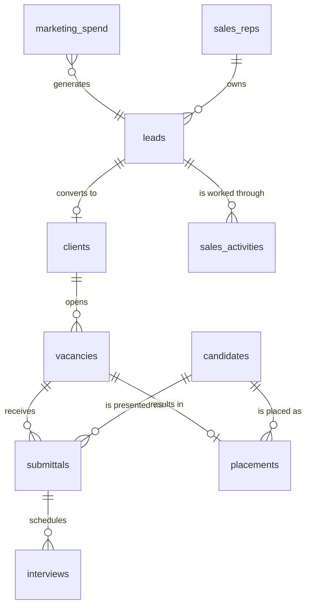

# The business you are being hired to measure

*Remote Leverage — Data Analyst · interview Monday 3 August 2026. Practice dataset: `practice/agency.duckdb` and `practice/csv/`, built by `practice/build_dataset.py`. Every number in this module was produced by running the query shown against that dataset.*

---

## Why this module comes first

You know MEAL metrics cold — coverage rate, FCS, rCSI, beneficiaries reached. None of that vocabulary will be spoken on Monday. The job description names three domains: **sales, vacancies, and marketing performance**. That is the funnel of a placement agency, and it has its own language.

The good news is that the *shape* is identical to what you already do. A recruiting funnel is a beneficiary pipeline: people enter at the top, drop out at each stage for documented reasons, and a fraction reach the outcome. Time-to-fill is a lead-time metric, exactly like the delay between announcement and cash distribution you measured in PDM. Fill rate is a coverage rate. Data reconciliation is data reconciliation.

So this is a translation exercise, not a learning exercise. Learn the words, and every strong answer you already own becomes usable.

---

## 1. What Remote Leverage actually sells

They place English-speaking virtual assistants from Latin America and the Philippines into US businesses, charging the client a **one-time flat fee** instead of an ongoing margin, with the VA paid directly by the client.

That business model determines every metric that matters, and understanding it is what will separate you from a candidate who just knows SQL.

Because the fee is **one-time**, revenue is a function of *placement volume*, not of headcount under management. A staffing firm on a recurring margin cares most about retention and billable hours; Remote Leverage cares most about **how many roles it fills, how fast, and how cheaply it acquires the client**. That is why the job description says "sales, vacancies, and marketing performance" in that order.

Because the VA is paid directly, the constraint on growth is **supply and quality of candidates**, not payroll capacity. English level is not a nice-to-have attribute in their database — it is the product specification. Hold that thought; the data proves it below and it is your best insight to bring to the interview.

And because they advertise a guarantee on placements, **replacements are a cost centre**: a placement that fails inside the guarantee window means doing the work twice for one fee.

---

## 2. The three funnels, and the vocabulary

### 2.1 Marketing and sales — how a client arrives

| Term | Definition | Why it matters here |
|---|---|---|
| Lead | An inbound enquiry from a prospective client | Top of the client funnel |
| MQL / SQL | Marketing-qualified / sales-qualified lead | Stage gate before a sales conversation |
| CPL | Cost per lead = spend ÷ leads | Efficiency of a channel at generating interest |
| CAC | Customer acquisition cost = spend ÷ new clients | Efficiency at generating *revenue*, not interest |
| Conversion rate | Leads → clients, expressed as a percentage | The bridge between CPL and CAC |
| LTV | Lifetime value — total fees a client generates | With one-time fees, driven by repeat requisitions |
| Payback period | How long until a client's fees cover their CAC | Cash-flow question the founder actually asks |
| Churn | Clients who stop sending requisitions | Kills LTV, and therefore CAC tolerance |
| Attribution | Assigning a client to the channel that produced them | First-touch, last-touch, or multi-touch |
| Blended CAC | Total spend ÷ total new clients, all channels | Includes free channels; flatters paid performance |

### 2.2 Recruiting — how a vacancy gets filled

| Term | Definition |
|---|---|
| Requisition / vacancy | An open role a client has asked you to fill |
| Submittal | A candidate presented to the client for that role |
| Submittal-to-interview ratio | Share of submitted candidates the client agrees to interview — a direct measure of shortlist quality |
| Interview-to-offer ratio | Share of completed interviews that produce an offer |
| Offer acceptance rate | Share of offers the candidate accepts |
| Time to fill | Days from vacancy opened to offer accepted |
| Time to first submittal | Days from opened to first candidate presented — the metric the client *feels* |
| Fill rate | Share of vacancies that end up filled rather than cancelled or stalled |
| Aging / open req age | How long currently open vacancies have been open |
| Replacement rate | Placements that fail and must be redone inside the guarantee |
| Source of hire | Channel that produced the placed candidate |
| Requisition load | Open vacancies per recruiter — the capacity metric |

### 2.3 Delivery — what happens after the placement

Retention at 30, 60 and 90 days; replacement rate; client repeat rate, meaning the share of clients who open a second requisition — which is the single strongest signal of satisfaction in a one-time-fee business.

**One vocabulary trap to avoid.** In this industry "sales" usually means *client-side revenue*, and "placements" means *delivery*. If they say "sales dashboard" they mean new clients signed and fees invoiced, not candidates placed. Ask once to confirm; it is a good question, not a naive one.

---

## 3. The data model

Eleven tables, which is roughly what an agency's warehouse looks like once the ATS, the CRM, Stripe, GA4 and the ad platforms have been landed in BigQuery.



| Table | Rows | Grain |
|---|---|---|
| `marketing_spend` | 1 716 | one row per day × paid channel |
| `leads` | 3 933 | one row per inbound enquiry, with owner and deal stage |
| `sales_reps` | 5 | one row per closer, with monthly quota |
| `sales_activities` | 26 564 | one row per call, email or demo |
| `clients` | 327 | one row per converted client |
| `vacancies` | 709 | one row per requisition |
| `candidates` | 4 240 | one row per registered candidate |
| `submittals` | 3 918 | one row per candidate presented to a vacancy |
| `interviews` | 1 835 | one row per interview scheduled |
| `placements` | 347 | one row per successful hire |
| `pipeline_runs` | 3 432 | one row per ETL job execution |

The sales side of the model — reps, deal stages and logged activity — is covered in [module 06](06_sales_lens_and_objections.md); this module stays on marketing acquisition and the recruiting funnel.

**Say the word "grain" in the interview.** Asking "what's the grain of this table?" before writing a query is the single clearest signal that someone has done this professionally. It is also how you avoid the fan-out that doubles your revenue numbers.

---

## 4. The funnel, computed

### 4.1 The trap in the data, and the point to make

`submittals.stage` records the **terminal** stage of each candidate — `hired`, `rejected`, `offer_declined`. A candidate who interviewed and was then rejected shows `rejected`, and the interview disappears. Compute your funnel from that column and you will report a submittal-to-interview ratio of 11 % and an interview-to-offer ratio of 100 %, both nonsense.

The fix is to compute from **events** — the `interviews` table — not from a status column.

```sql
WITH funnel AS (
  SELECT s.submittal_id,
         s.stage,
         MAX(CASE WHEN i.interview_id IS NOT NULL THEN 1 ELSE 0 END) AS reached_interview,
         MAX(CASE WHEN i.completed = 1        THEN 1 ELSE 0 END)     AS completed_interview,
         MAX(CASE WHEN i.outcome  = 'offer'   THEN 1 ELSE 0 END)     AS received_offer
  FROM submittals s
  LEFT JOIN interviews i USING (submittal_id)
  GROUP BY 1, 2
)
SELECT COUNT(*)                                              AS submittals,
       SUM(reached_interview)                                AS interviews_scheduled,
       SUM(completed_interview)                              AS interviews_completed,
       SUM(received_offer)                                   AS offers,
       COUNT(*) FILTER (WHERE stage = 'hired')               AS hires,
       ROUND(100.0 * SUM(reached_interview) / COUNT(*), 1)   AS submittal_to_interview_pct,
       ROUND(100.0 * SUM(received_offer)
             / NULLIF(SUM(completed_interview), 0), 1)       AS interview_to_offer_pct,
       ROUND(100.0 * COUNT(*) FILTER (WHERE stage = 'hired')
             / NULLIF(SUM(received_offer), 0), 1)            AS offer_acceptance_pct
FROM funnel;
```

| submittals | scheduled | completed | offers | hires | submittal→interview | interview→offer | offer acceptance |
|---|---|---|---|---|---|---|---|
| 3 918 | 1 835 | 1 719 | 482 | 362 | 46,8 % | 28,0 % | 75,1 % |

Read it as a business story. Just under half of presented candidates earn an interview, which is decent shortlist quality. Under a third of completed interviews produce an offer. Three out of four offers are accepted, which is acceptable — below about 70 % you would suspect a rate-expectation problem, and [module 05](05_sql_drills_with_answers.md) shows that this headline hides a sharp split by English level.

**This is a story worth telling on Monday**, because it demonstrates three things at once: you know the funnel vocabulary, you check the grain before trusting a column, and you know that status fields overwrite history while event tables preserve it.

`COUNT(*) FILTER (WHERE ...)` is standard SQL and works in BigQuery and DuckDB. If you are ever in a dialect that lacks it, `SUM(CASE WHEN ... THEN 1 ELSE 0 END)` is the portable equivalent — mention that you know both.

### 4.2 Where candidates drop out

```sql
SELECT reject_reason, COUNT(*) AS n,
       ROUND(100.0 * COUNT(*) / SUM(COUNT(*)) OVER (), 1) AS pct
FROM submittals
WHERE reject_reason <> ''
GROUP BY 1 ORDER BY n DESC;
```

| reject_reason | n | pct |
|---|---|---|
| Candidate withdrew | 592 | 16,9 |
| Client cancelled | 507 | 14,5 |
| English level | 494 | 14,1 |
| Rate expectation | 488 | 14,0 |

Note the window function inside an aggregate: `SUM(COUNT(*)) OVER ()` gives the grand total without a second pass or a subquery. It is a small thing that looks fluent.

The read: candidate withdrawal is the largest single loss at 16,9 %, which points at speed. A candidate who withdraws has usually taken another offer, so this is a time-to-fill problem disguised as a candidate problem. Client cancellation, second at 14,5 %, is a different animal entirely — it is a qualification problem at intake, not a sourcing problem.

---

## 5. Time to fill, and the mistake almost everyone makes

```sql
SELECT role_family,
       COUNT(*)                                                  AS filled,
       ROUND(AVG(DATE_DIFF('day', opened_date, filled_date)), 1) AS avg_days,
       MEDIAN(DATE_DIFF('day', opened_date, filled_date))        AS median_days
FROM vacancies
WHERE status = 'filled'
  AND filled_date IS NOT NULL
  AND filled_date >= opened_date        -- excludes 6 corrupt rows, see section 7
GROUP BY 1
ORDER BY median_days DESC;
```

| role_family | filled | avg_days | median_days |
|---|---|---|---|
| Technical | 49 | 26,4 | 28,0 |
| Bookkeeping | 53 | 23,7 | 22,0 |
| Executive VA | 59 | 20,3 | 19,0 |
| Marketing VA | 51 | 18,9 | 18,0 |
| Sales VA | 65 | 18,3 | 18,0 |
| Customer Support | 67 | 17,6 | 17,0 |

Technical roles take **eleven days longer** than customer support roles — 28 against 17 at the median. That is an operational fact with a commercial consequence: either you start sourcing technical candidates before the requisition opens, or you set the client's expectation at four weeks instead of two.

Notice also that Technical is the only family where the median exceeds the mean, which tells you the distribution is left-skewed there — a cluster of slow fills rather than a few extreme outliers.

Report the **median** alongside the mean. Time-to-fill distributions have a long right tail — a handful of roles that took four months drag the average up and describe nobody's actual experience.

### The censoring trap

Now the mistake that will impress them if you catch it unprompted.

```sql
SELECT DATE_TRUNC('month', opened_date) AS cohort_month,
       COUNT(*)                                    AS opened,
       COUNT(*) FILTER (WHERE status = 'filled')   AS filled,
       ROUND(100.0 * COUNT(*) FILTER (WHERE status = 'filled') / COUNT(*), 1) AS fill_rate_pct
FROM vacancies
GROUP BY 1 ORDER BY 1 DESC LIMIT 6;
```

| cohort_month | opened | filled | fill_rate_pct |
|---|---|---|---|
| 2026-07 | 101 | 12 | 11,9 |
| 2026-06 | 104 | 56 | 53,8 |
| 2026-05 | 72 | 43 | 59,7 |
| 2026-04 | 55 | 30 | 54,5 |
| 2026-03 | 50 | 23 | 46,0 |
| 2026-02 | 33 | 20 | 60,6 |

July's fill rate looks catastrophic — 12 % against a band that otherwise sits around 50 to 60 %. **Nothing is wrong.** July's vacancies are on average younger than the median time-to-fill, so most of them simply have not had time to close yet. This is **right-censoring**, and a dashboard that plots this trend without handling it will trigger a panic meeting every single month.

Three ways to handle it, and knowing all three is the mark of an analyst rather than a report-writer. You can exclude cohorts younger than your 90th-percentile time-to-fill. You can report a fixed-window rate — "share filled within 30 days of opening" — which is comparable across cohorts by construction. Or you can plot the metric with the incomplete cohort visibly greyed out and labelled.

**Bring this one to the interview.** It is the highest-value sentence in this module: *"I'd never trend fill rate on the current month without handling censoring, because the newest cohort always looks broken."*

---

## 6. The insight to walk in with

```sql
WITH f AS (
  SELECT s.english_level, s.submittal_id, s.stage,
         MAX(CASE WHEN i.interview_id IS NOT NULL THEN 1 ELSE 0 END) AS reached_interview
  FROM submittals s LEFT JOIN interviews i USING (submittal_id)
  GROUP BY 1, 2, 3
)
SELECT english_level,
       COUNT(*)                                                     AS submittals,
       ROUND(100.0 * SUM(reached_interview) / COUNT(*), 1)          AS to_interview_pct,
       ROUND(100.0 * COUNT(*) FILTER (WHERE stage = 'hired')
             / COUNT(*), 1)                                          AS hire_rate_pct
FROM f GROUP BY 1 ORDER BY 1;
```

| english_level | submittals | to_interview_pct | hire_rate_pct |
|---|---|---|---|
| B1 | 725 | 28,7 | 2,9 |
| B2 | 1 598 | 45,4 | 7,9 |
| C1 | 1 171 | 55,9 | 13,4 |
| C2 | 424 | 58,3 | 13,4 |

English level is the strongest single driver of placement success in the whole dataset: a C1 candidate is **more than four times** more likely to be hired than a B1, and the effect rises steadily across the levels before flattening between C1 and C2.

That is not a curiosity — it is the company's entire value proposition ("English-speaking VAs") expressed as a number. And it converts directly into a recommendation with a dollar sign attached: if B1 candidates convert at 3,5 %, every B1 submittal consumes recruiter time and client goodwill for almost no return. Either raise the screening bar to B2 minimum, or invest in English assessment earlier in sourcing.

**Careful with the causal claim, and say so out loud.** English level is correlated with hire rate; it may also be correlated with experience, with role family, and with which recruiter handled the file. The honest phrasing is: *"English level is strongly associated with hire rate — more than four-fold between B1 and C1. Before acting on it I'd check whether it holds within role family and seniority, because it could partly be a proxy."* That sentence is worth more in an interview than the finding itself.

And there is a twist that makes the story better: the same variable **reverses** at the offer stage, where stronger candidates decline more often because they hold competing offers. [Module 05](05_sql_drills_with_answers.md) drill D7 has the numbers.

---

## 7. Acquisition economics

```sql
WITH spend AS (
  SELECT channel, SUM(spend_usd) AS spend FROM marketing_spend GROUP BY 1
),
lead_counts AS (
  SELECT channel, COUNT(*) AS leads, SUM(converted) AS clients FROM leads GROUP BY 1
)
SELECT l.channel, l.leads, l.clients,
       ROUND(100.0 * l.clients / l.leads, 1)              AS lead_to_client_pct,
       ROUND(COALESCE(s.spend, 0), 0)                     AS spend_usd,
       ROUND(COALESCE(s.spend, 0) / NULLIF(l.leads, 0), 2)   AS cpl_usd,
       ROUND(COALESCE(s.spend, 0) / NULLIF(l.clients, 0), 0) AS cac_usd
FROM lead_counts l LEFT JOIN spend s USING (channel)
ORDER BY clients DESC;
```

| channel | leads | clients | lead→client | spend | CPL | CAC |
|---|---|---|---|---|---|---|
| Paid Search | 1 554 | 133 | 8,6 % | $181 124 | $116,55 | $1 362 |
| Referral | 345 | 77 | 22,3 % | $0 | $0 | $0 |
| Organic | 632 | 48 | 7,6 % | $0 | $0 | $0 |
| Paid Social | 917 | 37 | 4,0 % | $134 127 | $146,27 | $3 625 |
| Outbound | 485 | 32 | 6,6 % | $40 633 | $83,78 | $1 270 |

Three readings, in increasing order of usefulness.

**CPL ranks the channels wrongly.** Outbound has the cheapest leads at $83,78 and Paid Social the most expensive at $146,27 — a gap of 75 %. But look at conversion: Paid Social converts at 4,0 % against Paid Search's 8,6 %, so Paid Social's CAC is **$3 625 against $1 362**, nearly three times as much. *Optimising for CPL buys you cheap leads that never become clients.* This is the classic marketing-analytics trap and being able to state it cleanly is worth a lot.

**Referral is the best channel and has no CAC line.** It converts at 22,3 %, more than two and a half times Paid Search, at zero recorded spend. That "zero" is an artefact of the data, not of reality — referral programmes have costs (incentives, account-management time) that simply are not in the ad-spend table. The honest statement is that referral's *recorded* CAC is zero and its true CAC is unknown but low, and the actionable question is not "how do we spend less on ads" but **"what would it take to double referral volume?"**

**Distinguish paid CAC from blended CAC.** Paid CAC divides paid spend by clients from paid channels. Blended CAC divides total spend by *all* new clients, including free ones, which flatters the number. Founders quote blended; analysts must label which one they are showing. Say this if CAC comes up — it is a two-second answer that signals real experience.

Now close the loop to revenue, because CAC without revenue is half an argument.

```sql
SELECT c.acquisition_channel AS channel,
       COUNT(DISTINCT c.client_id)      AS clients,
       COUNT(p.placement_id)            AS placements,
       CAST(SUM(p.placement_fee_usd) AS INT) AS fee_revenue_usd
FROM clients c
LEFT JOIN placements p USING (client_id)
GROUP BY 1 ORDER BY fee_revenue_usd DESC;
```

| channel | clients | placements | fee_revenue_usd |
|---|---|---|---|
| Paid Search | 133 | 149 | $325 109 |
| Referral | 77 | 89 | $198 434 |
| Organic | 48 | 44 | $101 303 |
| Paid Social | 37 | 35 | $80 027 |
| Outbound | 32 | 30 | $70 404 |

Paid Social spent $134 127 to generate $80 027 in fees. **It loses money.** Paid Search spent $181 124 to generate $325 109 — profitable before overhead. Referral generated $198 434 from 77 clients at essentially no acquisition cost, and produces 1,16 placements per client, the highest ratio of any channel.

If they ask what you would do first with their data, that is your answer: reallocate Paid Social budget toward Paid Search and build a referral engine, then verify with a proper payback analysis rather than a single-period comparison.

---

## 8. Vacancy aging — the operations dashboard

```sql
SELECT role_family,
       COUNT(*) AS open_now,
       CAST(ROUND(AVG(DATE_DIFF('day', opened_date, DATE '2026-07-26'))) AS INT) AS avg_age_days,
       COUNT(*) FILTER (WHERE DATE_DIFF('day', opened_date, DATE '2026-07-26') > 30) AS older_than_30d
FROM vacancies WHERE status = 'open'
GROUP BY 1 ORDER BY open_now DESC;
```

| role_family | open_now | avg_age_days | older_than_30d |
|---|---|---|---|
| Technical | 30 | 49 | 14 |
| Executive VA | 28 | 35 | 9 |
| Bookkeeping | 26 | 35 | 9 |
| Customer Support | 22 | 21 | 4 |
| Marketing VA | 19 | 47 | 4 |
| Sales VA | 18 | 14 | 2 |

Technical roles are both the slowest to fill and the largest open bucket, with fourteen of them past thirty days — well beyond the 28-day median, and an average age of 49 days. Those fourteen are the ones a delivery lead needs on a Monday morning screen, sorted by age descending with the client name attached. **That is the dashboard, not a chart of averages.**

An operations dashboard answers "what do I do today", which means it lists rows and sorts by urgency. An executive dashboard answers "how are we doing", which means it aggregates and trends. Building one when they asked for the other is the most common dashboard failure, and naming the distinction out loud is a strong move.

---

## 9. Data quality — your home turf

The job description's fifth responsibility is "ensure data quality through thorough validation and reconciliation processes". You have done exactly this for years; here it is in their language.

```sql
SELECT 'DQ1 filled vacancy with no placement'    AS check_name, COUNT(*) AS anomalies
FROM vacancies v LEFT JOIN placements p USING (vacancy_id)
WHERE v.status = 'filled' AND p.placement_id IS NULL
UNION ALL SELECT 'DQ2 placement on a non-filled vacancy', COUNT(*)
FROM placements p JOIN vacancies v USING (vacancy_id) WHERE v.status <> 'filled'
UNION ALL SELECT 'DQ3 filled_date before opened_date', COUNT(*)
FROM vacancies WHERE filled_date IS NOT NULL AND filled_date < opened_date
UNION ALL SELECT 'DQ4 non-positive monthly rate', COUNT(*)
FROM placements WHERE monthly_rate_usd <= 0
UNION ALL SELECT 'DQ5 duplicate submittals', COUNT(*) FROM (
  SELECT vacancy_id, candidate_id, submitted_date FROM submittals
  GROUP BY 1,2,3 HAVING COUNT(*) > 1)
UNION ALL SELECT 'DQ6 duplicate candidate emails', COUNT(*) FROM (
  SELECT email FROM candidates GROUP BY 1 HAVING COUNT(*) > 1)
UNION ALL SELECT 'DQ7 ad spend with no campaign', COUNT(*)
FROM marketing_spend WHERE campaign IS NULL OR campaign = '';
```

| check_name | anomalies |
|---|---|
| DQ1 filled vacancy with no placement | 12 |
| DQ2 placement on a non-filled vacancy | 9 |
| DQ3 filled_date before opened_date | 6 |
| DQ4 non-positive monthly rate | 7 |
| DQ5 duplicate submittals | 15 |
| DQ6 duplicate candidate emails | 40 |
| DQ7 ad spend with no campaign | 42 |

Each line is a different *kind* of problem, and saying which kind is the skill.

DQ1 and DQ2 are **reconciliation failures between two systems** — the ATS says filled, the billing table disagrees. Twelve filled vacancies with no placement means twelve fees potentially never invoiced. That is a revenue-leak finding, and it is the one to lead with, because it converts a data problem into a money problem.

DQ3 and DQ4 are **impossible values** that a constraint should have prevented at write time. A fill date before an open date cannot happen in the physical world.

DQ5 and DQ6 are **duplicates**, and they need different treatment. Duplicate submittals inflate the denominator of every funnel ratio. Duplicate candidate emails inflate the candidate pool and, worse, can cause the same person to be presented twice to the same client, which is embarrassing in front of a customer.

DQ7 is **missing dimension data**, which silently breaks attribution: forty-two days of spend that cannot be assigned to a campaign.

The framing to use out loud is one you already own from your humanitarian work: *"Constraints prevent what can be prevented; checks detect what cannot. I run the check suite before every reporting cycle and every line must return zero — anything that does not is either a fix or a documented exception."*

---

## 10. Pipeline health

"Monitor the health of data pipelines and troubleshoot any failures" is responsibility number four.

```sql
SELECT pipeline_name,
       COUNT(*)                                    AS runs,
       COUNT(*) FILTER (WHERE status = 'failed')   AS failures,
       ROUND(100.0 * COUNT(*) FILTER (WHERE status = 'success') / COUNT(*), 2) AS success_pct,
       CAST(ROUND(AVG(duration_seconds)) AS INT)   AS avg_seconds
FROM pipeline_runs GROUP BY 1 ORDER BY success_pct;
```

| pipeline_name | runs | failures | success_pct | avg_seconds |
|---|---|---|---|---|
| ads_spend | 572 | 58 | 89,86 | 217 |
| hubspot_leads | 572 | 23 | 95,98 | 214 |
| ga4_sessions | 572 | 13 | 97,73 | 680 |
| ats_submittals | 572 | 11 | 98,08 | 210 |
| ats_vacancies | 572 | 6 | 98,95 | 210 |
| stripe_invoices | 572 | 6 | 98,95 | 207 |

`ads_spend` fails roughly one day in ten, and its dominant error is *"Schema drift: new column"* — the ad platform changed its export format and the loader was not tolerant of it. `ga4_sessions` runs three times longer than everything else, which is a cost and a lateness risk rather than a failure.

The connection to make explicit: **`ads_spend` is the least reliable pipeline and it feeds the CAC analysis in section 7.** A marketing dashboard is only as trustworthy as its worst upstream job, which is why a pipeline-health tile belongs *on* the dashboard — a small freshness indicator saying "spend data last loaded successfully on X" — rather than in a separate monitoring tool nobody opens.

Three things to say about monitoring, because "I check if it failed" is a weak answer. You watch **freshness** (when did this table last update successfully), **volume** (row counts against the same weekday last week — a job that succeeds with zero rows is worse than one that fails loudly), and **schema drift** (new or vanished columns). And you distinguish alerting from monitoring: alerts must be actionable and rare, or people stop reading them.

---

## 11. Exercises

Work these against `practice/agency.duckdb` before Monday. Doing four of them is worth more than reading this module twice.

Compute submittal-to-interview ratio **by recruiter-facing dimension** — by `role_family` and by `priority` — and say which combination has the weakest shortlist quality.

Build a monthly cohort table of vacancies opened, with the share filled within 30 days of opening, and explain why that metric is comparable across months when raw fill rate is not.

Calculate CAC by channel **and by quarter**, then say whether Paid Social has always lost money or only recently.

Find the clients who opened a second requisition, compute the repeat rate by acquisition channel, and connect it to the referral finding in section 7.

Write the query that lists the twelve DQ1 anomalies with client name, role title and fill date, formatted as the list you would email to operations.

Compute placement retention: the share of placements still active at 30, 60 and 90 days after start, excluding placements too recent to have reached each milestone. This one is the censoring lesson applied a second time.

Produce a single "Monday morning" query: every open vacancy older than 30 days, with client, role family, days open, and number of candidates submitted so far, sorted by age descending.

---

## Interview angles

**"What metrics would you track for a staffing business like ours?"**

I'd organise them into three funnels, because the levers are different in each. On the acquisition side: leads by channel, cost per lead, conversion rate from lead to client, and customer acquisition cost — and I'd be explicit about whether I'm quoting paid CAC or blended CAC, because the blended number includes free channels and flatters paid performance. The one thing I'd insist on there is not optimising for cost per lead in isolation. In the dataset I've been practising on, the cheapest leads come from outbound at eighty-four dollars, but paid social generates leads at a hundred and forty-six dollars that convert at four percent instead of paid search's nine, so its acquisition cost per client is nearly three times higher. Cheap leads that don't convert are expensive. On the recruiting side: time to fill and, just as important, time to first submittal, because that's the metric the client actually experiences; then the funnel ratios — submittal to interview, interview to offer, offer acceptance — and fill rate, and aging on open requisitions. On delivery: retention at thirty, sixty and ninety days, replacement rate inside the guarantee window, and client repeat rate, which in a one-time-fee model is the closest thing you have to a satisfaction score. And I'd track one thing that isn't a business metric: pipeline freshness, because a marketing dashboard is only as good as its least reliable upstream job.

**"How would you investigate a drop in fill rate?"**

My first move is to check whether the drop is real, because the most common cause is measurement rather than performance. Fill rate on recent cohorts is right-censored: requisitions opened this month haven't had time to close, so the current month always looks terrible. In the dataset I've been working with, July shows a twelve percent fill rate against a band that otherwise sits between fifty and sixty, and nothing is wrong at all — most of July's requisitions are younger than the median time to fill. So I'd either restrict to cohorts old enough to have closed, or switch to a fixed-window metric like "filled within thirty days", which is comparable by construction. If the drop survives that test, I decompose it. I'd cut by role family first, because mix shifts explain a lot — technical roles take eleven days longer than customer support roles in this data, so a month with more technical requisitions will look slower without anything having changed. Then I'd walk the funnel stage by stage to find where the leak is: if submittal-to-interview fell, it's a shortlist quality or sourcing problem; if interview-to-offer fell, it's a screening or client-expectation problem; if offer acceptance fell, it's usually rate expectations or speed, and I'd look at candidate withdrawal, which is already the largest single loss reason here at nearly seventeen percent. Only then would I look at people and process — recruiter load, a new client with unusual requirements, a change in the intake form. And before presenting any of it I'd run the reconciliation checks, because I've found twelve vacancies marked filled with no placement record, and that kind of gap moves the numerator on its own.

**"You have access to our data on day one. What do you look at first?"**

Before any analysis, I'd want to understand the grain and the lineage of each table — what one row means, which source system it comes from, and how fresh it is. That takes a morning and it prevents most of the mistakes people make in their first month. Then I'd run a reconciliation suite rather than building a dashboard, because I'd rather find the problems before someone else finds them in my chart. The checks I'd write immediately are cross-system ones: does every vacancy marked filled have a placement, does every placement have an invoice, does the sum of channel spend match the platform totals. On the practice dataset I built, that suite surfaces twelve filled vacancies with no placement record, which isn't a data curiosity — it's potentially twelve fees that were never invoiced. That's the kind of finding that pays for the hire in week one, and it's the conversation I'd want to have with you first rather than showing you a prettier version of a chart you already have.

---

*Next: [BigQuery for analysts](02_bigquery_for_analysts.md) · [Tableau in five days](03_tableau_in_five_days.md) · [Positioning and mock interview](04_positioning_and_mock_interview.md) · [Plan and cheat sheet](00_prep_plan_and_cheatsheet.md)*
