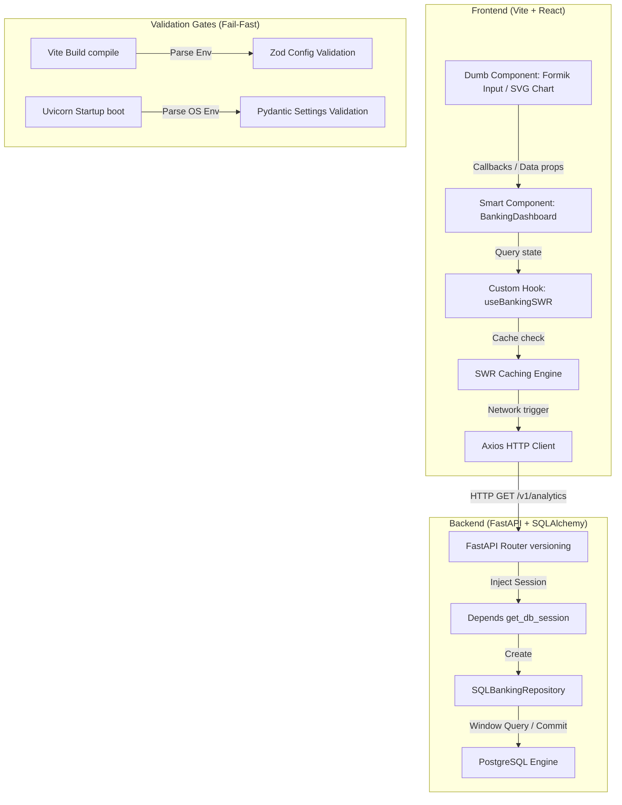

# Incremental Build Guide: Virtual Banking Dashboard

A step-by-step masterclass demonstrating how to build a modern, high-performance fullstack banking application from scratch. This guide covers the architectural decisions, tooling choices, and code implementation phases.

---

## 1. Architectural Blueprint & Target Flow

To build a secure, real-time banking dashboard, the application is divided into logical layers:
* **The Config Layer**: Validates settings on boot (Pydantic) or build compilation (Zod) to prevent runtime crashes.
* **The Data Model Layer**: Defines database tables (Accounts, Transactions) with strict loading triggers to prevent N+1 queries.
* **The Repository Layer**: Abstract SQL queries from API controllers to facilitate independent testing.
* **The API Layer**: Versioned routes processing database window aggregations.
* **The Client Hooks Layer**: Custom React hooks handling HTTP caching (SWR) and data memoization.
* **The Component Layer**: Separating smart containers (handling state and actions) from dumb presentational charts and forms.



---

## 2. Incremental Build Steps

### Phase 1: Local Orchestration & Validation Gates
**Goal**: Configure container environments and establish fail-fast validation configuration schemes.

* **Step 1.1: Docker Compose Configuration**
  * Configure [docker-compose.yml](file:///Users/ad0791/Desktop/theCrest/interviewprep/virtual_banking_dashboard/docker-compose.yml) to map PostgreSQL, Redis, backend (port 8000), and React (port 80) containers. Include database health checks to prevent backend boot crashes during initialization.
* **Step 1.2: Backend Settings Validator**
  * Use `pydantic-settings` to define [backend/app/core/config.py](file:///Users/ad0791/Desktop/theCrest/interviewprep/virtual_banking_dashboard/backend/app/core/config.py). Verify the database connection string scheme, forcing async drivers (`postgresql+asyncpg://` or `sqlite+aiosqlite://`).
* **Step 1.3: Frontend Environment Schema**
  * Define [frontend/src/config/env.ts](file:///Users/ad0791/Desktop/theCrest/interviewprep/virtual_banking_dashboard/frontend/src/config/env.ts). Parse `import.meta.env` against a Zod schema containing fallback defaults. This breaks compilation during CI/CD builds if critical variables are missing.

---

### Phase 2: Core Database Modeling & ORM Strategy
**Goal**: Design database models that represent accounts and transactions, avoiding performance bugs.

* **Step 2.1: Model Schema Definition**
  * Create [backend/app/models/banking.py](file:///Users/ad0791/Desktop/theCrest/interviewprep/virtual_banking_dashboard/backend/app/models/banking.py). Declare a one-to-many relationship from `Account` to `Transaction`.
* **Step 2.2: Lazy-Load Safeguards**
  * Explicitly set `lazy="raise"` on the accounts-to-transactions mapping.
  * **Why**: By default, accessing `account.transactions` triggers a new SQL query behind the scenes (Lazy Loading). If you loop over 100 accounts, this triggers 100 queries (the N+1 query issue). `lazy="raise"` causes the application to raise an error immediately in development if you forget to eagerly load relations (via `selectinload`), forcing efficient queries.

---

### Phase 3: Decoupled Data Access (Repository Pattern)
**Goal**: Keep SQL queries separated from API endpoints.

* **Step 3.1: Define repository interfaces**
  * Define a `BankingRepository` Protocol (interface) and its database implementation `SQLBankingRepository` in [backend/app/repositories/banking.py](file:///Users/ad0791/Desktop/theCrest/interviewprep/virtual_banking_dashboard/backend/app/repositories/banking.py).
* **Step 3.2: Implement SQL Window aggregates**
  * Inside `SQLBankingRepository`, write the window aggregation query to fetch cumulative volume over time:
    ```python
    # SQL equivalent executed:
    # SELECT sales_date, daily_volume, SUM(daily_volume) OVER (ORDER BY sales_date) ...
    ```
* **Step 3.3: Implement Unit of Work transactions**
  * When posting a transaction, the repository must write the transaction record AND adjust the account balance within the same database transaction, rolling back automatically if the account has insufficient funds.

---

### Phase 4: API routing versioning & Dependency Injection
**Goal**: Configure endpoints that version routing and inject database sessions dynamically.

* **Step 4.1: Configure Dependency injection**
  * Establish `get_db_session()` in [backend/app/core/database.py](file:///Users/ad0791/Desktop/theCrest/interviewprep/virtual_banking_dashboard/backend/app/core/database.py). It yields a SQLAlchemy session context, automatically committing on route success or rolling back on route exception.
* **Step 4.2: Build versioned routers**
  * Set up endpoints inside [backend/app/api/v1/endpoints/banking.py](file:///Users/ad0791/Desktop/theCrest/interviewprep/virtual_banking_dashboard/backend/app/api/v1/endpoints/banking.py). Mount them onto a centralized v1 router, which in turn mounts onto a master router under `/api` at [backend/app/main.py](file:///Users/ad0791/Desktop/theCrest/interviewprep/virtual_banking_dashboard/backend/app/main.py).
* **Step 4.3: Configure Performance Middleware**
  * Add `GZipMiddleware` to compress large transaction histories, and `CORSMiddleware` with `max_age=600` to cache browser preflight requests.

---

### Phase 5: Frontend HTTP Client & Caching Hooks
**Goal**: Configure React data fetching layers.

* **Step 5.1: Configure Axios Client**
  * Create [frontend/src/config/httpClient.ts](file:///Users/ad0791/Desktop/theCrest/interviewprep/virtual_banking_dashboard/frontend/src/config/httpClient.ts) with timeout limits and target baseURL configs.
* **Step 5.2: Configure SWR Caching Hook**
  * Create [frontend/src/features/banking/hooks/useBankingSWR.ts](file:///Users/ad0791/Desktop/theCrest/interviewprep/virtual_banking_dashboard/frontend/src/features/banking/hooks/useBankingSWR.ts).
* **Step 5.3: Cache Revalidation**
  * When a user creates a new account or posts a transaction:
    1. Send the POST request to the API.
    2. Call SWR's `mutate('/v1/accounts')` and `mutate('/v1/analytics/cumulative-volume')` to trigger background refetches. SWR updates the UI instantly once the API responds.
* **Step 5.4: Memoize UI Calculations**
  * Wrap calculations (e.g. calculating total deposits across all accounts) in a React `useMemo` block to prevent recalculations on unrelated page events (such as expanding/collapsing sidebars).

---

### Phase 6: UI Component Integration & Form Validation
**Goal**: Implement a responsive dark-mode dashboard with validated input forms.

* **Step 6.1: Build Presentational Canvas Layout**
  * Create [frontend/src/features/banking/components/BankingDashboard.tsx](file:///Users/ad0791/Desktop/theCrest/interviewprep/virtual_banking_dashboard/frontend/src/features/banking/components/BankingDashboard.tsx). Implement dark-themed layouts using Tailwind classes.
* **Step 6.2: Integrate Formik + Zod validation**
  * Configure registration forms. Use Formik’s `useFormik` hook. Bridge its `validate` event to compile inputs against a Zod schema, returning validation messages (e.g. enforcing valid account numbers) before submitting to the backend.
* **Step 6.3: Render SVG Telemetry Area Charts**
  * Map timeseries transaction data dynamically to SVG path strings:
    ```typescript
    const maxVal = Math.max(...metrics.map(x => x.running_cumulative_volume));
    const points = metrics.map((m, idx) => `${(idx / metrics.length) * 1000},${200 - (m.running_cumulative_volume / maxVal) * 160}`);
    ```
    This renders high-performance, responsive charts natively without the overhead of heavy third-party plotting libraries.

---

### Phase 7: Testing & Verification
**Goal**: Establish unit tests for database isolation and endpoints.

* **Step 7.1: Write Async Test Fixtures**
  * Create [backend/tests/conftest.py](file:///Users/ad0791/Desktop/theCrest/interviewprep/virtual_banking_dashboard/backend/tests/conftest.py). Set up an in-memory SQLite database (`sqlite+aiosqlite:///:memory:`). Override FastAPI's database session dependency to run tests in complete isolation.
* **Step 7.2: Write API Assertions**
  * Create [backend/tests/test_banking.py](file:///Users/ad0791/Desktop/theCrest/interviewprep/virtual_banking_dashboard/backend/tests/test_banking.py). Write tests to seed dummy accounts, post transactions, and assert response schemas and transaction status codes using an async HTTP client (`httpx`).
